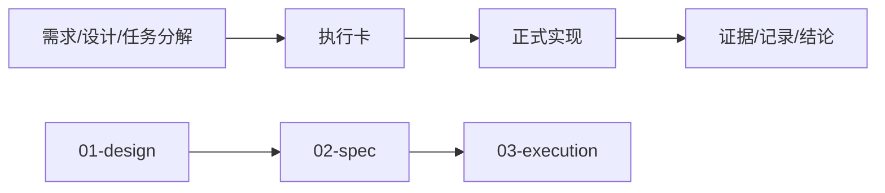

# 仓库布局与文档流规格

日期：`2026-04-09`
状态：`生效`

## 正式文档分层

本仓库使用四层文档结构：

1. `01-design`
2. `02-spec`
3. `03-execution`
4. `04-reference`

## 分层语义

- `01-design`
  - 解释为什么这样设计、正式边界是什么
- `02-spec`
  - 解释正式契约和实现门槛
- `03-execution`
  - 解释当前执行什么、如何收口
- `04-reference`
  - 存放旧系统笔记和外部输入

## 正式任务入口规则

正式实现任务只有在具备以下文档后，才能进入系统：

1. 需求
2. 设计
3. 任务分解

满足后，任务才可以领取正式执行卡。

## 正式任务退出规则

正式实现任务只有在补齐以下文档后，才能正式退出：

1. 证据
2. 记录
3. 结论

## 流程图

