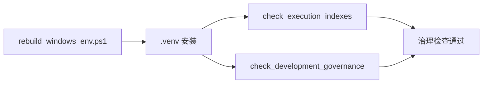

# 治理工具与环境重建规格

日期：`2026-04-09`
状态：`生效中`

## 需求

1. 新仓必须具备最小执行索引生成与检查能力。
2. 新仓必须具备最小开发治理检查能力。
3. 新仓必须具备一键进入仓库与一键重建 `.venv` 的入口。
4. 所有脚本默认服务 `H:\lifespan-0.01` 五根目录契约。

## 交付物

1. `.codex` 执行纪律技能
2. `scripts/setup` 环境脚本
3. `scripts/system` 治理检查脚本
4. `docs/03-execution` 索引账本与本轮执行卡

## 最小行为约束

### 执行索引工具

1. 能按模板生成 `card / evidence / record / conclusion`
2. 能把新文件回填进结论目录、证据目录、卡目录
3. 能同步“当前待施工卡”和“当前下一锤”

### 执行索引检查

1. 检查结论目录、证据目录、卡目录是否遗漏回填
2. 检查 `reading-order` 是否提及当前待施工卡
3. 检查 `completion-ledger` 是否与卡目录一致

### 开发治理检查

1. 文件长度检查
2. 中文化检查
3. 仓库卫生检查

### 环境脚本

1. 默认使用 `D:\miniconda310\python.exe`
2. 可重建 `.venv`
3. 安装 `.[dev]`
4. 执行最小导入冒烟
5. 可选执行治理检查与单元测试

## 验收标准

1. `python .codex/skills/lifespan-execution-discipline/scripts/check_execution_indexes.py` 可运行
2. `python scripts/system/check_development_governance.py` 可运行
3. `powershell -File scripts/setup/rebuild_windows_env.ps1` 可完成环境安装
4. `python -m pytest tests/unit/core/test_paths.py -q` 通过

## 流程图

