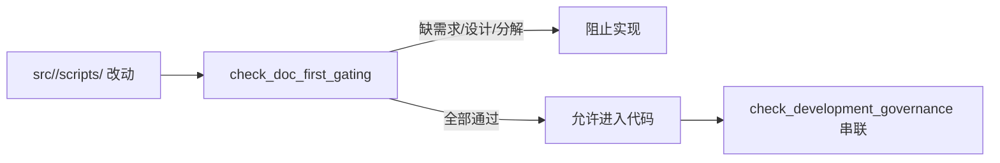

# 文档先行硬门禁检查器规格

日期：`2026-04-09`
状态：`生效中`

## 目标

冻结 `doc-first gating` 检查器在本仓库内的正式行为。

## 检查对象

检查器权威入口为：

- `scripts/system/check_doc_first_gating_governance.py`

当前待施工卡来源为：

- `docs/03-execution/B-card-catalog-20260409.md`

## 触发范围

当本次改动包含以下路径前缀时，必须触发严格文档先行门禁：

1. `src/`
2. `scripts/`
3. `.codex/`

未命中这些路径前缀时，检查器可以只报告当前不触发严格门禁。

## 必须通过的卡片条件

当前待施工卡至少必须满足以下条件：

1. 卡片文件存在
2. `## 需求` 章节存在
3. `问题 / 目标结果 / 为什么现在做` 三项都已经填写，并且不是模板占位
4. `## 设计输入` 章节存在
5. 至少链接一个 `docs/01-design/` 下的正式设计文档
6. 至少链接一个 `docs/02-spec/` 下的正式规格文档
7. 设计与规格链接指向的文件实际存在
8. `## 任务分解` 章节存在
9. 至少存在一个非占位任务项

## 占位内容识别

以下内容应视为未完成而不是正式输入：

1. 空白值
2. `<...>` 形式的模板占位
3. `切片 1 / 切片 2 / 切片 3`
4. `问题：`、`目标结果：`、`为什么现在做：` 之后没有实际内容

## 与治理链路的关系

`check_development_governance.py` 必须串联本检查器。

这意味着：

1. 全仓治理检查时，至少要能验证当前待施工卡本身是非模板态
2. 按改动范围运行治理检查时，只要命中严格触发路径，就必须执行完整门禁

## 与入口新鲜度治理的关系

以下改动默认视为影响仓库正式口径，必须同步刷新：

1. `scripts/`
2. `.codex/`
3. `docs/01-design/`
4. `docs/02-spec/`
5. `src/mlq/core/paths.py`

同步刷新对象为：

1. `AGENTS.md`
2. `README.md`
3. `pyproject.toml`

## 输出要求

检查器输出必须：

1. 使用中文
2. 明确指出缺失章节或缺失链接
3. 在通过时说明当前待施工卡和触发状态

## 当前结论

本规格不要求一次性解决所有历史执行卡质量问题，但要求从当前卡开始，正式代码实现必须经过 `doc-first gating` 硬门禁。

## 流程图

