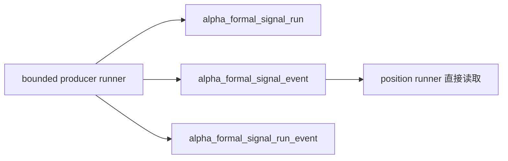

# alpha formal signal 正式出口与最小 producer 规格
日期：`2026-04-09`
状态：`生效中`

## 适用范围

本规格用于冻结新仓 `alpha` 模块的最小正式出口合同。
当前只覆盖三张表与一个最小 producer runner：

1. `alpha_formal_signal_run`
2. `alpha_formal_signal_event`
3. `alpha_formal_signal_run_event`
4. `run_alpha_formal_signal_build(...)` 与脚本入口

本规格不代表 `alpha` 内部五表族已经全部正式完成，也不代表 `structure / filter` 已经全链闭环。

## 正式输入

`alpha formal signal producer` 当前正式输入固定为四类：

1. `alpha` 官方上游触发事实
   - 至少提供 `source_trigger_event_nk / instrument / signal_date / asof_date / trigger_family / trigger_type / pattern_code`
2. 官方 `filter_snapshot`
   - 至少提供 `instrument / signal_date / asof_date / trigger_admissible / structure_snapshot_nk`
3. 官方 `structure_snapshot`
   - 至少提供 `structure_snapshot_nk / malf_context_4 / lifecycle_rank_high / lifecycle_rank_total`
4. producer 自身的 run 元数据
   - 包括 `run_id / source_contract_version / source table identity / bounded window`

硬约束：

1. 不允许直接消费 research-only sidecar。
2. 不允许让下游 `position` 继续把兼容表当长期官方上游。
3. 不允许反向回写 trigger 发生事实。

## 正式输出

`alpha` 的正式落点固定为模块级历史账本 `alpha`。

当前 `v1` 最小正式表族固定为：

1. `alpha_formal_signal_run`
2. `alpha_formal_signal_event`
3. `alpha_formal_signal_run_event`

### 1. `alpha_formal_signal_run`

用途：

1. 记录一次 `formal signal` producer 的 bounded 运行
2. 固定输入来源、版本、窗口、批次与摘要

最小字段：

1. `run_id`
2. `producer_name`
3. `producer_version`
4. `run_status`
5. `signal_start_date`
6. `signal_end_date`
7. `bounded_instrument_count`
8. `source_trigger_table`
9. `source_context_table`
10. `signal_contract_version`
11. `started_at`
12. `completed_at`
13. `summary_json`

状态枚举：

1. `pending`
2. `running`
3. `completed`
4. `failed`

规则：

1. `run_id` 只做审计，不做事实主语义。
2. 非 `completed` run 不得被下游默认视为正式事实层。
3. bounded summary 必须能回答本次处理了多少输入、产出了多少 admitted/blocked/deferred 信号。

### 2. `alpha_formal_signal_event`

用途：

1. 保存 `alpha` 对下游的正式信号事实
2. 成为 `position` 的官方消费表

最小字段：

1. `signal_nk`
2. `instrument`
3. `signal_date`
4. `asof_date`
5. `trigger_family`
6. `trigger_type`
7. `pattern_code`
8. `formal_signal_status`
9. `trigger_admissible`
10. `malf_context_4`
11. `lifecycle_rank_high`
12. `lifecycle_rank_total`
13. `source_trigger_event_nk`
14. `signal_contract_version`
15. `first_seen_run_id`
16. `last_materialized_run_id`

状态枚举：

1. `admitted`
2. `blocked`
3. `deferred`

`signal_nk` 规则：

`v1` 固定由下面语义字段拼出稳定自然键：

1. `instrument`
2. `signal_date`
3. `asof_date`
4. `trigger_family`
5. `trigger_type`
6. `pattern_code`
7. `source_trigger_event_nk`
8. `signal_contract_version`

补充规则：

1. `signal_nk` 一旦生成，不得因为 `run_id` 变化而变化。
2. `first_seen_run_id` 记录首次物化该事实的 run。
3. `last_materialized_run_id` 记录最近一次复物化该事实的 run。
4. `position` 当前只允许消费这张正式表，不允许偷读 producer 中间态。

### 3. `alpha_formal_signal_run_event`

用途：

1. 桥接一次 `run` 与本次触达的 `formal signal` 事实
2. 支持审计、resume、复物化与 bounded readout

最小字段：

1. `run_id`
2. `signal_nk`
3. `materialization_action`
4. `formal_signal_status`
5. `source_trigger_event_nk`
6. `recorded_at`

动作枚举：

1. `inserted`
2. `reused`
3. `rematerialized`

规则：

1. `run_event` 是桥接表，不是新的事实主表。
2. 同一 `run_id + signal_nk` 不得重复写入多行。
3. `run_event` 必须能支持 bounded summary 中的新增数、复用数、重物化数统计。

## 消费侧对齐规则

`alpha_formal_signal_event` 的最小字段合同必须与当前 `position` 已冻结消费合同对齐，至少保证：

1. `docs/02-spec/modules/position/02-alpha-to-position-formal-signal-bridge-spec-20260409.md` 中的字段组可直接从官方表读取。
2. `scripts/position/run_position_formal_signal_materialization.py` 的默认读取表可以直接切到这张官方表。
3. 旧兼容列名仅作为短期迁移兜底，不再是新仓正式合同。

## 增量与断点续跑规则

1. producer runner 必须支持 bounded 窗口执行。
2. producer runner 必须支持按 `instrument` 分批。
3. 同一批次重复执行时，命中既有 `signal_nk` 应优先复用事实层，而不是删除重写。
4. `run_event` 必须显式记录本次是新增、复用还是重物化。
5. 不允许为了一次 bounded smoke 方便而清空正式历史事实。

## Producer Runner 合同

### Python 入口

正式 Python 入口固定命名为：

`run_alpha_formal_signal_build(...)`

### 脚本入口

正式脚本入口固定命名为：

`scripts/alpha/run_alpha_formal_signal_build.py`

### 最小参数

1. `run_id`
2. `signal_start_date`
3. `signal_end_date`
4. `instrument` 或 bounded instrument 列表
5. `limit`
6. `batch_size`
7. `source_trigger_table`
8. `source_filter_table`
9. `source_structure_table`
10. `fallback_context_table`
11. `summary_path`

补充说明：

1. `fallback_context_table` 默认关闭，不再默认指向 `pas_context_snapshot`。
2. 若显式启用该参数，它只承担 legacy 兼容兜底，不得重新变成长期正式上游。

### 最小职责

1. 从官方 `alpha trigger + filter_snapshot + structure_snapshot` 读取 bounded 样本
2. 产出 `alpha_formal_signal_event`
3. 写入 `alpha_formal_signal_run`
4. 写入 `alpha_formal_signal_run_event`
5. 输出 summary JSON

### 明确禁止

1. 自动调用 `position` runner
2. 自动写 `trade / system`
3. 默认回退到旧 `malf` 兼容准入字段当长期上游
4. 直接消费 research 表替代正式上游
5. 在 producer 内部夹带 `position` sizing 逻辑

## Bounded Evidence 要求

本卡完成时至少要留下：

1. 单元测试
   - 覆盖 `run / event / run_event` 三表写入
   - 覆盖 admitted / blocked / deferred 的状态物化
2. bounded smoke 命令
   - 证明 producer 可以从官方上游样本生成正式 `alpha_formal_signal_event`
3. bounded readout
   - 至少给出 `run_id`
   - 至少给出 `materialized_event_count`
   - 至少给出 admitted / blocked / deferred 分布
4. position 对接证据
   - 证明 `run_position_formal_signal_materialization.py` 可直接读 `alpha_formal_signal_event`

## 当前明确不做

1. `alpha` 全历史 full backfill
2. `trade / system` 正式 runner
3. `position` 新增更多 family 表
4. 为了治理脚本去硬拆 `bootstrap.py`

## 一句话收口

`alpha` 当前最小正式出口不是一张临时兼容表，而是 `run / event / run_event` 三表加一个 bounded producer runner；它先把新仓官方 `formal signal` 事实层站稳，再让 `position` 真正切到这个官方上游。

## 流程图

