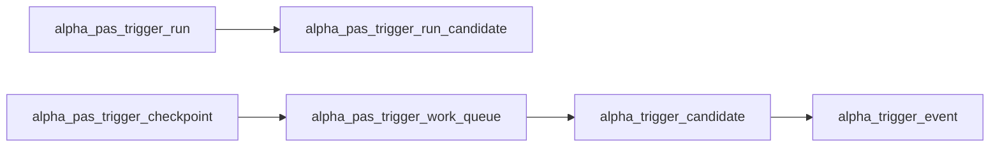

# alpha PAS 五触发 canonical detector 规格
日期：`2026-04-13`
状态：`生效`

## 范围

本规格落实 `04-alpha-pas-five-trigger-canonical-detector-charter-20260413.md`，冻结 `41` 的正式实现范围：

1. 官方 `alpha_trigger_candidate` 生产者
2. 五触发 detector 合同
3. 与现有 `trigger / family / formal signal` 的衔接方式

## 正式脚本入口

新增正式 bounded runner：

`scripts/alpha/run_alpha_pas_five_trigger_build.py`

默认职责：

1. 读取官方 `filter_snapshot`
2. 读取官方 `structure_snapshot`
3. 读取官方 `market_base.stock_daily_adjusted(adjust_method='backward')`
4. 物化 `alpha_trigger_candidate` 及对应 `run / queue / checkpoint / run_candidate`

## 正式表族

`alpha` 库新增 `PAS detector` 表族：

1. `alpha_pas_trigger_run`
2. `alpha_pas_trigger_work_queue`
3. `alpha_pas_trigger_checkpoint`
4. `alpha_trigger_candidate`
5. `alpha_pas_trigger_run_candidate`

## alpha_trigger_candidate 正式列

### 必需列

1. `candidate_nk TEXT PRIMARY KEY`
2. `instrument TEXT NOT NULL`
3. `signal_date DATE NOT NULL`
4. `asof_date DATE NOT NULL`
5. `trigger_family TEXT NOT NULL`
6. `trigger_type TEXT NOT NULL`
7. `pattern_code TEXT NOT NULL`
8. `family_code TEXT NOT NULL`
9. `trigger_strength DOUBLE NOT NULL`
10. `detect_reason TEXT NOT NULL`
11. `skip_reason TEXT`
12. `price_context_json TEXT NOT NULL`
13. `structure_context_json TEXT NOT NULL`
14. `detector_trace_json TEXT NOT NULL`
15. `source_filter_snapshot_nk TEXT NOT NULL`
16. `source_structure_snapshot_nk TEXT NOT NULL`
17. `source_price_fingerprint TEXT NOT NULL`
18. `detector_contract_version TEXT NOT NULL`
19. `first_seen_run_id TEXT NOT NULL`
20. `last_materialized_run_id TEXT NOT NULL`
21. `created_at TIMESTAMP NOT NULL DEFAULT CURRENT_TIMESTAMP`
22. `updated_at TIMESTAMP NOT NULL DEFAULT CURRENT_TIMESTAMP`

### 兼容要求

以下旧列必须继续保留，以便现有 `trigger_runner` 无缝消费：

1. `instrument`
2. `signal_date`
3. `asof_date`
4. `trigger_family`
5. `trigger_type`
6. `pattern_code`

## candidate_nk

`candidate_nk` 计算规则：

`instrument | signal_date | asof_date | trigger_family | trigger_type | pattern_code | detector_contract_version`

## detector 合同版本

本卡冻结：

`alpha-pas-detector-v1`

## detector 输入合同

### filter 输入

仅消费：

1. `filter_snapshot_nk`
2. `structure_snapshot_nk`
3. `instrument`
4. `signal_date`
5. `asof_date`
6. `trigger_admissible`
7. `daily / weekly / monthly` 官方上下文列
8. `break_confirmation_status / break_confirmation_ref`
9. `exhaustion_risk_bucket / reversal_probability_bucket`

### structure 输入

至少消费：

1. `structure_snapshot_nk`
2. `major_state`
3. `trend_direction`
4. `reversal_stage`
5. `wave_id`
6. `current_hh_count`
7. `current_ll_count`
8. `break_confirmation_status`
9. `break_confirmation_ref`

### market_base 输入

仅消费：

`market_base.stock_daily_adjusted(adjust_method='backward')`

最小列集：

1. `code`
2. `trade_date`
3. `open_price`
4. `high_price`
5. `low_price`
6. `close_price`
7. `volume`

## 五触发要求

### BOF

1. 必须跌破关键低点
2. 必须当日收回关键位之上
3. 收盘位置不能过弱
4. 成交量确认不能缺失

### TST

1. 必须存在结构支撑位测试
2. 测试距离不能过远
3. 需要反弹确认或拒绝形态确认
4. 支撑失守则不得触发

### PB

1. 只允许在已成立趋势后的第一回调窗口触发
2. 回调深度必须受控
3. 反弹确认必须清楚
4. 不得把普通延续回调泛化成 `pb`

### CPB

1. 必须区分复杂回撤与普通压缩突破
2. 必须识别多腿或长时长重置
3. 没有复杂度 subtype 时不得触发
4. 默认允许进入候选，但不在本卡直接升级为强 admitted 主线

### BPB

1. 保留检测
2. 保留审计 trace
3. 在 `family` 与 `formal signal` 中默认按警戒型形态处理

## 运行模式

### bounded 模式

显式给定：

1. `signal_start_date / signal_end_date`
2. `instruments`
3. `limit`

### queue 模式

不传窗口时默认：

1. 从 `filter_checkpoint(timeframe='D')` 读取 dirty scope
2. 生成 `alpha_pas_trigger_work_queue`
3. claim 后按 scope 回放
4. 完成后回写 `alpha_pas_trigger_checkpoint`

## 输出与下游耦合

### trigger_runner

继续使用 `alpha_trigger_candidate` 作为输入表，但从本卡开始它由官方 detector 负责生成。

### family_runner

允许从 `alpha_trigger_candidate` 扩展列中读取：

1. `family_code`
2. `trigger_strength`
3. `detector_trace_json`
4. `structure_context_json`

### formal_signal_runner

本卡不强制新增 `formal signal` 字段；`100` 前只做最小兼容升级，不冻结 trade 锚点。

## 测试要求

至少覆盖：

1. 五触发各一个正样本
2. 五触发各一个负样本
3. queue/checkpoint 基本续跑
4. `alpha_trigger_candidate -> alpha_trigger_event` 正式衔接
5. `alpha_trigger_candidate` 扩展列变更触发 `family` rematerialized

## 非目标

本卡明确不做：

1. `signal_low / last_higher_low` 正式冻结
2. `trade` 执行锚点定义
3. `position` sizing 规则改写
4. `system orchestration`
