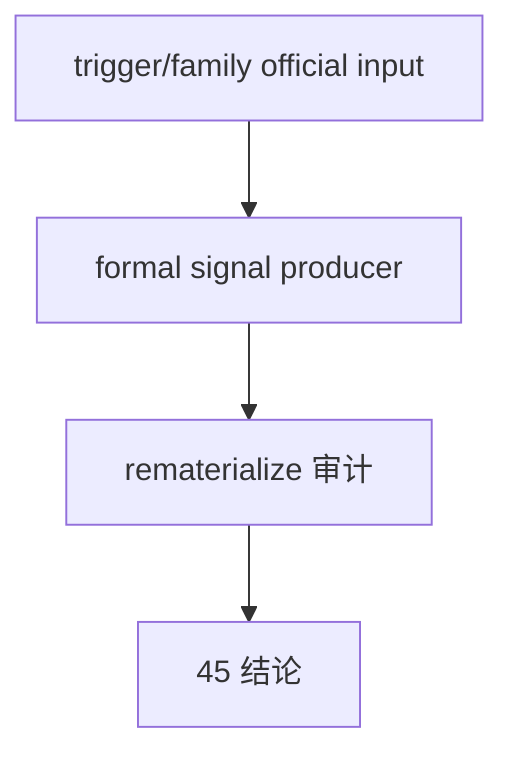

# alpha formal signal producer 在进入 position 前硬化规格

日期：`2026-04-13`
状态：`生效`

本规格适用于 `45-alpha-formal-signal-producer-hardening-before-position-card-20260413.md` 及其后续 evidence / record / conclusion。

## 目标

在进入 `position` 之前，明确 `alpha formal signal` 是否已经达到稳定 producer 标准。

## 必答问题

1. `alpha formal signal` 当前正式输入是什么
2. family 正式解释键是否已物理进入 formal signal
3. 哪些列是进入 `position` 的正式合同
4. 哪些列仍是 compat-only 过渡字段
5. replay / rematerialize 是否能够解释 producer 级变化

## 六条历史账本约束

1. 实体锚点：`asset_type + code + timeframe='D'`
2. 业务自然键：`formal_signal_event_nk + contract version + source_context_fingerprint`
3. 批量建仓：bounded bootstrap / historical backfill
4. 增量更新：由 `alpha trigger checkpoint` 与上游 fingerprint 驱动
5. 断点续跑：`queue + checkpoint + rematerialize`
6. 审计账本：`alpha_formal_signal_run / event / run_event`

## 验收

1. `45` conclusion 必须明确 `alpha formal signal` 是否已达到进入 `position` 的稳定 producer 标准
2. 若通过，允许进入 `46`
3. 若不通过，必须列出阻断字段或阻断语义

## 流程图

