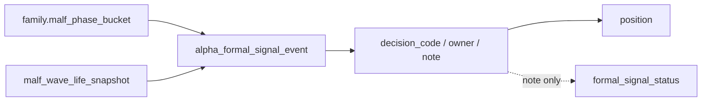

# alpha stage percentile decision matrix 规格

日期：`2026-04-15`
状态：`生效`

本规格适用于 `64-alpha-stage-percentile-decision-matrix-integration-card-20260415.md` 及其后续 evidence / record / conclusion。

## 目标

冻结 `stage × percentile -> action` 在 `alpha -> position` 主链中的正式接入层、字段边界与责任划分。

## 必答问题

1. `stage` 由谁提供
2. `percentile` 由谁提供
3. 哪一层允许首次融合这两个轴
4. 哪些 action 只能保留为 note / sidecar
5. 哪些 action 明确归 `position`

## 正式输入

1. `alpha_family_event.malf_phase_bucket`
2. `malf_wave_life_snapshot`
   - `source_state_snapshot_nk`
   - `wave_life_percentile`
   - `remaining_life_bars_p50`
   - `remaining_life_bars_p75`
   - `termination_risk_bucket`
3. `alpha_formal_signal` 既有官方上下文

## 正式融合层

`alpha_formal_signal_event` 是本卡唯一允许正式融合 `stage × percentile` 的账本层。

本卡冻结的最小新增字段组为：

1. `wave_life_percentile`
2. `remaining_life_bars_p50`
3. `remaining_life_bars_p75`
4. `termination_risk_bucket`
5. `stage_percentile_decision_code`
6. `stage_percentile_action_owner`
7. `stage_percentile_note`
8. `stage_percentile_contract_version`

## decision matrix 责任规则

1. `detector / trigger`
   - 不消费 `wave_life_percentile`
   - 不因寿命分位改写 trigger existence
2. `family`
   - 只提供 `malf_phase_bucket`
   - 不持有 `blocked / admitted / trim` verdict
3. `formal signal`
   - 允许融合 `malf_phase_bucket × wave_life_percentile`
   - 当前只允许产出解释性 decision code，不得在 `64` 内直接改写 `formal_signal_status`
4. `position`
   - 只从官方 `alpha formal signal` 读取上述字段
   - 是当前唯一允许把 `trim_bias` 变成真实 sizing / trim 动作的层

## decision code 冻结

本卡冻结以下最小 decision code：

1. `observe_only`
   - 默认无动作，只保留解释字段
2. `alpha_caution_note`
   - 仍保持 note-only，不改变 `admitted / blocked`
3. `position_trim_bias`
   - 明确归属 `position`

对应 `stage_percentile_action_owner` 只允许取值：

1. `none`
2. `alpha_note`
3. `position`

## 六条历史账本约束

1. 实体锚点：`asset_type + code + signal_date + trigger_code`
2. 业务自然键：`signal_nk / source_trigger_event_nk / source_family_event_nk`
3. 批量建仓：允许按窗口重物化 `trigger -> family -> formal signal`
4. 增量更新：沿既有 `checkpoint / queue / replay` bounded 链续跑
5. 断点续跑：不得把临时矩阵结果写成 `run_id` 主语义
6. 审计账本：`alpha_formal_signal_run / event / run_event` 与 `64-* evidence / record / conclusion`

## 验收

1. `64` conclusion 必须明确 `stage × percentile` 的正式接入层
2. `64` conclusion 必须明确 `trim_bias` 归 `position`
3. `65` 才允许继续讨论 admission authority 如何使用这些 sidecar

## 流程图

