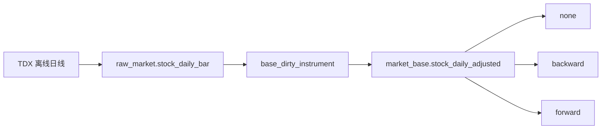

# data 模块 TDX 离线行情进入 raw_market / market_base 规格

日期：`2026-04-10`
状态：`生效中`

## 适用范围

本规格冻结新仓 `data` 模块的最小正式主线合同，当前覆盖：

1. `raw_market` 的 TDX 离线股票日线 ingest
2. `market_base.stock_daily_adjusted`
3. `run_tdx_stock_raw_ingest(...)`
4. `run_market_base_build(...)`
5. 对应脚本入口

## 正式来源

当前正式来源固定为：

`H:\tdx_offline_Data\stock\{Backward-Adjusted,Forward-Adjusted,Non-Adjusted}\*.txt`

文件编码固定按 `gbk` 解析。

## 正式输出

### 1. `raw_market.stock_file_registry`

用途：

1. 记录每个离线文件是否已经 ingest
2. 支持未变化文件跳过
3. 作为断点续跑的最小文件级检查点

最小字段：

1. `file_nk`
2. `asset_type`
3. `adjust_method`
4. `code`
5. `name`
6. `source_path`
7. `source_size_bytes`
8. `source_mtime_utc`
9. `source_line_count`
10. `source_header`
11. `last_ingested_run_id`
12. `last_ingested_at`

自然键规则：

`file_nk = asset_type + adjust_method + code + name + source_path`

### 2. `raw_market.stock_daily_bar`

用途：

1. 保存股票日线原始镜像
2. 保留 `code + name` 主语与文件来源

最小字段：

1. `bar_nk`
2. `asset_type`
3. `code`
4. `name`
5. `trade_date`
6. `adjust_method`
7. `open`
8. `high`
9. `low`
10. `close`
11. `volume`
12. `amount`
13. `source_path`
14. `source_mtime_utc`
15. `first_seen_run_id`
16. `last_ingested_run_id`

自然键规则：

`bar_nk = code + name + trade_date + adjust_method`

### 3. `market_base.stock_daily_adjusted`

用途：

1. 作为 `malf / position / trade` 的正式股票日线依赖层
2. 提供按复权方式区分的稳定价格事实

最小字段：

1. `daily_bar_nk`
2. `code`
3. `name`
4. `trade_date`
5. `adjust_method`
6. `open`
7. `high`
8. `low`
9. `close`
10. `volume`
11. `amount`
12. `source_bar_nk`
13. `first_seen_run_id`
14. `last_materialized_run_id`

自然键规则：

`daily_bar_nk = code + name + trade_date + adjust_method`

## 复权合同

`market_base.stock_daily_adjusted` 必须同时允许并长期保存：

1. `adjust_method = none`
2. `adjust_method = backward`
3. `adjust_method = forward`

当前官方消费分工冻结为：

1. `malf -> structure -> filter -> alpha` 默认读取 `backward`
2. `position -> trade` 默认读取 `none`
3. `forward` 当前只作为研究与展示保留

## runner 合同

### Python 入口

1. `run_tdx_stock_raw_ingest(...)`
2. `run_market_base_build(...)`

### 脚本入口

1. `scripts/data/run_tdx_stock_raw_ingest.py`
2. `scripts/data/run_market_base_build.py`

### 最小参数

`run_tdx_stock_raw_ingest(...)`

1. `source_root`
2. `adjust_method`
3. `instruments`
4. `limit`
5. `run_id`
6. `summary_path`

`run_market_base_build(...)`

1. `adjust_method`
2. `instruments`
3. `start_date`
4. `end_date`
5. `limit`
6. `run_id`
7. `summary_path`

## 增量规则

1. `raw_market` 必须优先按 `source_path + size + mtime` 判断文件是否变化。
2. 未变化文件必须允许直接跳过。
3. 已变化文件允许整文件重读，但落表必须按自然键 upsert。
4. `market_base` 必须按 `daily_bar_nk` 做 `inserted / reused / rematerialized`。

## 当前明确不做

1. 指数与板块正式基准表
2. 日线之外的更高频行情
3. 网络行情同步

## 一句话收口

`data` 当前最小正式合同是：把 TDX 离线股票日线稳定变成可增量续跑的 `raw_market` 镜像与 `market_base.stock_daily_adjusted`，并把三种复权口径一次性正式沉淀。

## 流程图

