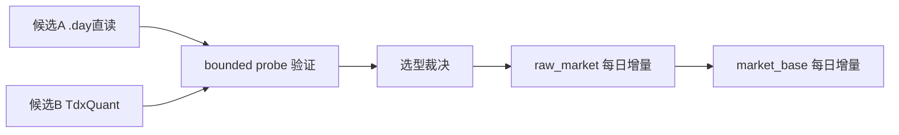

# data 模块 raw/base 每日复权增量更新方案选型规格

日期：`2026-04-10`
状态：`生效中`

## 适用范围

本规格冻结卡 `18` 的正式研究对象、比较维度、门槛与预期产出，覆盖：

1. 候选 A：`vipdoc/*.day` + 可选补源
2. 候选 B：官方 `TdxQuant / tqcenter`
3. `raw/base` 第二阶段每日联动更新
4. 复权、断点续跑、增量更新、市场覆盖与审计适配的正式比较

## 候选定义

### 候选 A：`vipdoc/*.day` 本地二进制直读

最小定义：

1. 主体源头来自本机 `H:\new_tdx64\vipdoc`
2. 日线事实优先从 `.day` 文件解析
3. 如存在极个别缺失，可研究是否允许在线补源
4. 若依赖 `mootdx`，其角色只能是候选补充能力，而不是未经治理直接进入正式主链的黑箱依赖

### 候选 B：官方 `TdxQuant / tqcenter`

最小定义：

1. 数据通过通达信官方 Python 接口获取
2. 运行前允许要求已启动支持 TQ 的通达信终端
3. 研究对象必须覆盖官方 `dividend_type in {none, front, back}` 能力
4. 研究对象必须覆盖 `.BJ` 与 ETF 等市场/品种支持

## 不可变前提

1. 卡 `17` 已生效的 `txt -> raw_market -> market_base` 仍是当前正式入口
2. 卡 `18` 在结论生效前，不得擅自替换现有正式入口
3. 任一候选若不能沉淀为正式 run ledger，就不能直接成为本仓库的 `raw` 主入口
4. 任一候选若不能证明复权口径可审计，就不能直接成为本仓库的 `base` 主入口

## 研究必答问题

### 1. 复权口径

必须明确回答：

1. 候选是否原生提供 `none / backward / forward` 或其等价口径
2. 如果不是原生提供，是否能利用稳定因子在仓库内复算
3. 复权口径在 rerun 时是否稳定复现

### 2. 日更与续跑

必须明确回答：

1. 收盘后是否可自动触发
2. 中途中断后能否只补未完成范围
3. 是否可以只处理新增交易日、新上市标的或少量脏标的

### 3. 市场覆盖

至少要覆盖：

1. A 股沪深
2. 北交所
3. ETF

如果任一候选对这三类覆盖不完整，必须显式记为风险或拒绝项。

### 4. 运维与依赖

必须明确回答：

1. 是否要求 GUI 客户端处于开启状态
2. 是否要求盘后先下载或刷新客户端数据
3. 是否依赖第三方在线节点
4. 是否需要直接修改第三方 `site-packages`

其中第 4 条若答案为“是”，默认判为正式风险项。

### 5. 账本适配

必须明确回答：

1. `raw` 侧最小 ledger 主语是什么
2. `raw` 侧指纹和 checkpoint 应按文件、请求、日期还是批次建模
3. `base` 侧如何承接 dirty queue
4. 是否会破坏卡 `17` 已冻结的 `raw_ingest_run / raw_ingest_file / base_dirty_instrument / base_build_run` 口径

## 正式比较标准

候选方案至少按以下标准并列评估：

1. `正确性`
2. `可审计性`
3. `断点续跑能力`
4. `增量吞吐`
5. `市场覆盖`
6. `环境依赖`
7. `实现复杂度`
8. `长期维护成本`

最终结论必须给出：

1. 推荐主路径
2. 备选或 sidecar 路径
3. 不推荐项及原因

## bounded 研究证据最低要求

卡 `18` 若要正式收口，至少需要：

1. 官方文档和社区方案输入的整理证据
2. 至少一轮候选 A 的 bounded probe 或能力核验
3. 至少一轮候选 B 的 bounded probe 或能力核验
4. 对 `.BJ` 与 ETF 的覆盖结论
5. 对复权、断点续跑、增量更新与账本适配的正式裁决

## 当前明确不做

1. 直接在本卡落正式大规模实现
2. 直接废弃卡 `17` 的现有入口
3. 将 `mootdx` 原地打补丁定义为正式安装步骤
4. 将 `TdxQuant` 的返回结果直接绕过 `raw_market` 喂给下游

## 一句话收口

卡 `18` 的正式产出应是一个经过 bounded research 验证的源头选型结论，用来决定 `raw/base` 第二阶段每日复权增量更新究竟应以 `.day` 直读为主，还是以官方 `TdxQuant` 为主。

## 流程图

