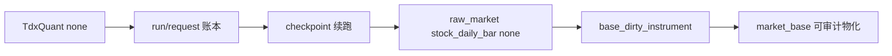

# data 模块 TdxQuant 日更原始事实接入 raw/base 账本规格

日期：`2026-04-10`
状态：`生效中`

## 适用范围

本规格冻结卡 `19` 的最小正式实现范围，覆盖：

1. `TdxQuant` 日更原始事实到 `raw_market` 的正式桥接
2. TQ 路线的 run/request/checkpoint 审计语义
3. 与现有 `base_dirty_instrument` 和 `run_market_base_build(...)` 的联动
4. 与现有 `txt -> raw_market -> market_base` 正式入口的并存边界

## 不可变前提

1. 当前唯一已生效正式入口仍是卡 `17` 的 `txt -> raw_market -> market_base`
2. `TdxQuant(front/back)` 当前不得直接写成正式 `raw_forward / raw_backward`
3. 卡 `19` 最小目标是接官方日更原始事实，不是完成 corporate action 总账
4. `raw_market` 仍然是任何下游 `base` 物化的唯一正式上游，不允许绕层

## 正式 runner

卡 `19` 的最小正式 runner 冻结为：

1. Python API：`run_tdxquant_daily_raw_sync(...)`
2. CLI 入口：`scripts/data/run_tdxquant_daily_raw_sync.py`

该 runner 的职责只包括：

1. 读取 TQ 日更原始事实
2. 物化到正式 `raw_market`
3. 记录 raw 侧 run/request/checkpoint 审计
4. 标记 `base_dirty_instrument`

该 runner 不负责：

1. 直接写 `market_base.stock_daily_adjusted`
2. 直接写下游 `malf`
3. 直接消费 `front/back` 作为正式复权结果

## 正式输入

### 1. 连接输入

runner 至少需要：

1. `strategy_path`
2. `instrument_scope`
3. `end_trade_date`
4. `count` 或显式窗口上限

其中：

1. `strategy_path` 必须是唯一策略实例路径，而不是任意目录字符串
2. 同一路径在同一时刻只允许一个活跃 run

### 2. universe 输入

本卡最小 universe 合同冻结为以下并集：

1. `raw_market.stock_file_registry` 已存在标的
2. 明确传入的 onboarding 标的列表

当前不允许默认依赖：

1. `get_stock_list(market='0')`
2. `get_stock_list(market='1')`
3. `get_stock_list(market='2')`

### 3. 价格输入

卡 `19` 最小桥接只接受：

1. `TdxQuant(dividend_type='none')` 的日更 OHLCV

可额外记录但不直接进入正式真值面的信息：

1. `front/back` 返回结果
2. `ForwardFactor`

## 正式 raw 表族

卡 `19` 最小新增或冻结的 raw 侧表族应包括：

### 1. `raw_tdxquant_run`

记录一次 TQ 日更同步 run，至少包含：

1. `run_id`
2. `runner_name`
3. `strategy_path`
4. `scope_source`
5. `requested_end_trade_date`
6. `status`
7. `started_at_utc / finished_at_utc`

### 2. `raw_tdxquant_request`

记录一次按标的发起的官方请求，至少包含：

1. `request_nk`
2. `run_id`
3. `code`
4. `requested_dividend_type`
5. `requested_count`
6. `requested_end_time`
7. `response_trade_date_min / response_trade_date_max`
8. `response_row_count`
9. `response_digest`
10. `status`

### 3. `raw_tdxquant_instrument_checkpoint`

记录每个标的的日更续跑状态，至少包含：

1. `code`
2. `asset_type`
3. `last_success_trade_date`
4. `last_observed_trade_date`
5. `last_success_run_id`
6. `last_response_digest`
7. `updated_at_utc`

## 正式落表规则

### 1. `raw_market.stock_daily_bar`

卡 `19` 最小只允许物化：

1. `adjust_method='none'`

并要求：

1. 自然键仍按正式 `bar_nk` 累积
2. 已存在同键行时走 `inserted / reused / rematerialized` 审计
3. 只对新增日期或变更日期写入

### 2. dirty queue 联动

TQ raw 日更成功后，runner 必须：

1. 对受影响标的写入 `base_dirty_instrument`
2. dirty queue 仍以仓内 `adjust_method` 为正式语义

当前最小策略是：

1. 若只桥接 `none` 原始事实，则只允许标记最小可确认的 downstream dirty
2. 不能伪造 `forward/backward` 已完成更新

## 续跑与 replay

卡 `19` runner 至少必须支持：

1. 从 `raw_tdxquant_instrument_checkpoint.last_success_trade_date` 继续
2. 对失败标的单独补跑
3. bounded replay 到指定 `end_trade_date`

必须拒绝的行为：

1. 每日无脑全量回扫所有历史窗口
2. 用不同 `count` 长度重放同一窗口却不记录差异

## Fallback 规则

卡 `19` 的正式 fallback 合同冻结为：

1. `TdxQuant` 路线失败时，不得污染现有 `txt` 正式账本
2. 现有 `txt` 路线继续保留并可单独运行
3. 若日更 run 失败，operator 可回退到卡 `17` 的 `txt` 正式入口

## bounded 实现最低要求

卡 `19` 若要进入正式实现收口，至少需要：

1. design/spec/card/evidence/record/conclusion 全套闭环
2. `run_tdxquant_daily_raw_sync(...)` 的最小正式实现
3. 至少一轮 bounded official pilot
4. 对 `run/request/checkpoint` 三层账本的真实读数
5. 对 fallback 与 dirty queue 联动的真实证据

## 当前明确不做

1. 直接把 `TdxQuant(front/back)` 落成正式 `market_base`
2. 在本卡重做 `market_base` 复权算法
3. 在本卡解决完整 universe 治理
4. 在本卡扩展分钟线或 tick 账本

## 一句话收口

卡 `19` 的正式合同是：把 `TdxQuant(dividend_type='none')` 代表的官方日更原始事实，按 request/checkpoint 账本语义正式接进 `raw_market`，并与现有 `raw/base` 增量机制并存。

## 流程图

