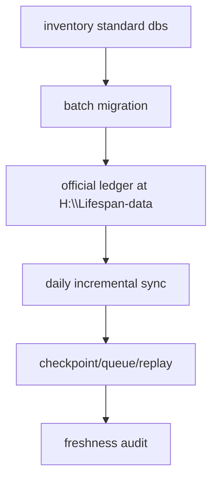

# 主线本地账本标准化规格

日期：`2026-04-13`
状态：`生效中`

## 适用范围

本规格覆盖主线正式持久化库：

1. `raw_market`
2. `market_base`
3. `malf`
4. `structure`
5. `filter`
6. `alpha`
7. `position`
8. `portfolio_plan`
9. `trade`
10. `system`

## 标准化要求

### 1. 正式库路径

1. 正式永续库落在 `H:\Lifespan-data`
2. 临时工作库、迁移缓存、pytest、smoke 落在 `H:\Lifespan-temp`
3. 报告与导出不写回正式库目录

### 2. 存量迁移

每个正式库都必须声明：

1. 现存源库位置
2. 目标标准库位置
3. 一次性批量迁移批次切分
4. 迁移完成后的对账方法

迁移批次默认至少按下列自然键之一切分：

1. `asset_type + code`
2. `asset_type + code + timeframe`
3. 模块正式 NK

### 3. 增量同步

每个正式库都必须声明：

1. 每日增量输入来源
2. checkpoint 字段
3. dirty queue 触发条件
4. replay 边界
5. 新鲜度审计字段

### 4. 断点续跑

断点续跑至少要求：

1. `last_completed_bar_dt`
2. `tail_start_bar_dt`
3. `tail_confirm_until_dt`
4. `source_fingerprint`
5. `last_run_id`

## 施工分解

### `39`

1. 输出主线正式库清单
2. 冻结标准路径与迁移批次方案
3. 补齐首轮存量迁移入口

### `40`

1. 冻结每日增量同步入口
2. 补齐 checkpoint / dirty queue / replay 契约
3. 形成新鲜度 readout

## 验收要求

1. 正式库与临时库路径边界清晰
2. 至少一条主线链路完成存量迁移演练
3. 至少一条主线链路完成增量更新与断点恢复演练

## 规格图

