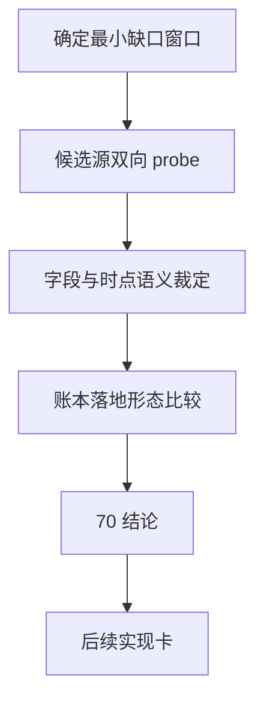

# data 模块历史 objective profile 回补源选型与治理规格

`日期：2026-04-15`
`状态：生效中`

## 适用范围

本规格冻结 `70` 的正式研究范围与最低产出，覆盖：

1. 候选历史源 `Tushare / Baostock`。
2. 现有 `TdxQuant get_stock_info(...)` 的语义边界复核。
3. objective 字段的静态/时变分层。
4. 后续正式账本实现的候选落地形态。

## 不可变前提

1. `69` 已接受，`filter` 的 objective gate 合同已经成立。
2. 当前真实官方库 objective coverage 缺口窗口是 `2010-01-04 -> 2026-04-08`。
3. 当前真实官方 raw DB 尚无 `raw_tdxquant_instrument_profile`。
4. 在 `70` 结论生效前，不允许把任一第三方源直接写成正式历史真值。

## 必答问题

### 1. 历史时点真值

必须明确回答：

1. 候选源是否支持按日期、公告日、生效日或交易日回看状态。
2. 候选源返回的是事件，还是当日状态快照。
3. 候选源是否能稳定覆盖最小缺口窗口。

### 2. 字段映射

必须至少回答下列字段的来源与语义：

1. `market_type`
2. `security_type`
3. `list_status / list_date / delist_date`
4. `suspension_status`
5. `risk_warning_status`
6. `delisting_arrangement`

### 3. 账本落地

必须明确回答：

1. 正式实体锚点是什么。
2. 业务自然键是什么。
3. 批量建仓怎样做。
4. 增量更新怎样做。
5. checkpoint / replay 怎样续跑。
6. 审计账本落在哪里。

## 正式比较标准

候选源必须至少按以下标准并列评估：

1. `历史真值能力`
2. `字段覆盖`
3. `A 股 universe 覆盖`
4. `2010 起窗口回补能力`
5. `权限 / 许可证 / 接入稳定性`
6. `账本化适配度`
7. `续跑与审计适配度`
8. `长期维护成本`

## 正式输出要求

`70` 若要收口，至少要输出：

1. 一份 design 级源选型裁决。
2. 一份 spec 级字段与账本映射表。
3. `Tushare` bounded probe 证据。
4. `Baostock` bounded probe 证据。
5. 对 `TdxQuant get_stock_info(...)` 历史语义的书面裁定。
6. 下一张正式实现卡的边界建议。

## 当前明确不做

1. 不写正式 backfill runner。
2. 不回写生产库。
3. 不把 `filter` 直接改成第三方接口在线依赖。
4. 不把“当前状态快照”伪装成“历史时点真值”。

## 一句话收口

`70` 的正式产出必须是“可执行的选型裁决”，而不是“把外部接口试通了”的临时笔记。

## 流程图

