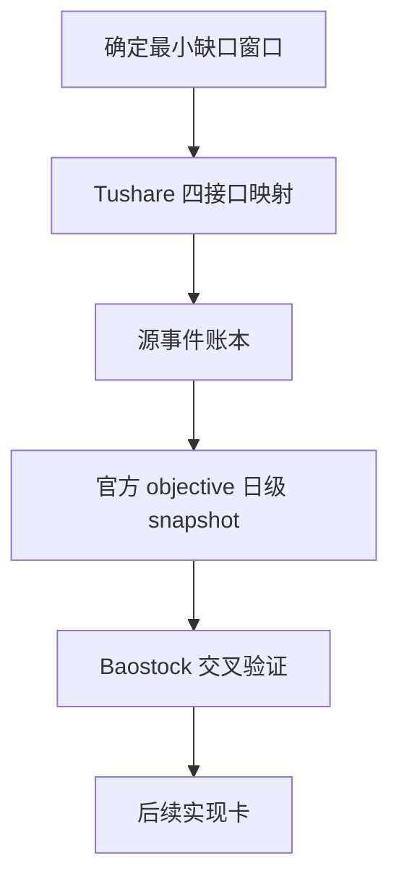

# data 模块历史 objective profile 回补源选型与治理规格
`日期：2026-04-15`
`状态：生效中`

## 适用范围

本规格冻结 `70` 的正式研究范围与最小产出，覆盖：

1. 候选历史源 `Tushare / Baostock`
2. 现有 `TdxQuant get_stock_info(...)` 的语义边界复核
3. objective 字段的静态 / 时变分层
4. `Tushare` 主源字段映射与账本化形态

## 不可变前提

1. `69` 已接受，`filter` 的 objective gate 合同已经成立。
2. 当前真实官方库 objective coverage 缺口窗口是 `2010-01-04 -> 2026-04-08`。
3. 当前真实官方 raw DB 尚无 `raw_tdxquant_instrument_profile`。
4. 在 `70` 结论生效前，不允许把任一第三方源直接写成正式历史真值。

## 必答问题

### 1. 历史时点真值

必须明确回答：

1. 候选源是否支持按日期、公告日、生效日或交易日回看状态。
2. 候选源返回的是事件，还是当日状态快照。
3. 候选源是否能稳定覆盖最小缺口窗口。

### 2. 字段映射

必须至少回答下列字段的来源与语义：

1. `instrument_name`
2. `market_type`
3. `security_type`
4. `list_status / list_date / delist_date`
5. `suspension_status`
6. `risk_warning_status`
7. `delisting_arrangement`

### 3. 账本落地

必须明确回答：

1. 正式实体锚点是什么。
2. 业务自然键是什么。
3. 批量建仓怎样做。
4. 增量更新怎样做。
5. checkpoint / replay 怎样续跑。
6. 审计账本落在哪里。

## 正式比较标准

候选源必须至少按以下标准并列评估：

1. `历史真值能力`
2. `字段覆盖`
3. `A 股 universe 覆盖`
4. `2010 起窗口回补能力`
5. `权限 / 许可 / 接入稳定性`
6. `账本化适配度`
7. `续跑与审计适配度`
8. `长期维护成本`

## 主源字段映射

| 目标字段 | 主源接口 | 粒度 | 归一化维度 | 说明 |
| --- | --- | --- | --- | --- |
| `instrument_name` | `stock_basic` | 低频属性 | `instrument_name` | 作为辅助属性和审计字段，不替代稳定主键 |
| `market_type` | `stock_basic` | 低频属性 | `market_type` | 由 `exchange / market` 归一化到正式市场类型 |
| `security_type` | `stock_basic` | 低频属性 | `security_type` | 由 `market / 类型映射表` 归一化到正式证券类型 |
| `list_status` | `stock_basic` | 区间属性 | `list_status` | 使用 `L / D / P` 等状态与 `list_date / delist_date` 生成开区间或闭区间事实 |
| `list_date` | `stock_basic` | 属性 | `list_status` | 作为上市区间起点 |
| `delist_date` | `stock_basic` | 属性 | `list_status` | 作为退市终点或退市事实补充 |
| `suspension_status` | `suspend_d` | 交易日事件 | `suspension_status` | 以 `trade_date` 为观察日，区分停牌 / 复牌或可交易状态 |
| `risk_warning_status` | `stock_st` | 交易日事件 | `risk_warning_status` | 仅覆盖 `2016-01-01` 之后的日级 ST 事实 |
| `risk_warning_status` | `namechange` | 区间补充 | `risk_warning_status` | 用于补齐 `2010-2015` 的 `ST/*ST/SST/撤销ST` 区间 |
| `delisting_arrangement` | `namechange` | 区间补充 | `delisting_arrangement` | 先作为候选来源冻结，后续实现卡需定义模式识别与最低合同 |

补充规则：

1. `stock_st` 与 `namechange` 同时覆盖时，优先使用 `stock_st` 作为日级事实，`namechange` 只作补齐与对账。
2. `namechange` 产生的状态区间必须先经过规则归一化与去重，不能原样直写正式快照。
3. `Baostock` 不进入主源映射表，只作为旁路验证源。

## 正式表族

后续正式实现卡最小表族冻结为：

1. `raw_market.tushare_objective_run`
   - 审计一轮 bounded 拉取或回补运行。
2. `raw_market.tushare_objective_request`
   - 审计单次接口请求、窗口、返回统计与失败信息。
3. `raw_market.tushare_objective_checkpoint`
   - 维护 `source_api + cursor_type + cursor_value` 级续跑状态。
4. `raw_market.tushare_objective_event`
   - 沉淀归一化后的 objective 事件或属性区间。
5. `raw_market.raw_tdxquant_instrument_profile`
   - 继续作为 `filter` 当前只读消费的官方 objective 日级 snapshot。

说明：

1. `raw_tdxquant_instrument_profile` 在后续实现卡落地前仍沿用现名，不在 `70` 内改名。
2. 后续如需改为 source-neutral 命名，必须单开合同升级卡，不能顺手在 `70` 内漂移下游契约。

## 业务自然键

1. `tushare_objective_run`
   - `run_id`
2. `tushare_objective_request`
   - `run_id + source_api + cursor_type + cursor_value + request_sequence`
3. `tushare_objective_checkpoint`
   - `source_api + cursor_type + cursor_value`
4. `tushare_objective_event`
   - `asset_type + code + source_api + objective_dimension + effective_start_date + source_record_hash`
5. `raw_tdxquant_instrument_profile`
   - `asset_type + code + observed_trade_date`

## 源事件账本字段

`tushare_objective_event` 至少应包含：

1. `asset_type`
2. `code`
3. `source_api`
4. `objective_dimension`
5. `effective_start_date`
6. `effective_end_date`
7. `status_value_code`
8. `status_value_text`
9. `source_record_hash`
10. `source_trade_date`
11. `source_ann_date`
12. `payload_json`
13. `first_seen_run_id`
14. `last_seen_run_id`

补充规则：

1. `trade_date` 型接口允许 `effective_start_date = effective_end_date = source_trade_date`。
2. `stock_basic` 型低频属性允许以开区间形式记账。
3. `namechange` 型记录必须保留原始 `change_reason` 与原名 / 新名辅助字段在 `payload_json` 中。

## 官方消费快照字段

后续物化到 `raw_tdxquant_instrument_profile` 时，最低应产出：

1. `asset_type`
2. `code`
3. `observed_trade_date`
4. `instrument_name`
5. `market_type`
6. `security_type`
7. `list_status`
8. `list_date`
9. `delist_date`
10. `is_suspended`
11. `is_risk_warning`
12. `is_delisting_arrangement`
13. `source_owner`
14. `source_detail_json`
15. `first_seen_run_id`
16. `last_materialized_run_id`

## 批量建仓规则

1. `stock_basic`
   - 按 `exchange + list_status` 分批拉取，至少覆盖 `SSE / SZSE / BSE` 与活跃 / 退市状态。
2. `suspend_d`
   - 按交易日窗口自 `2010-01-04` 顺推拉取。
3. `stock_st`
   - 按交易日窗口自 `2016-01-01` 顺推拉取。
4. `namechange`
   - 对 bootstrap universe 做按标的批量拉取。
5. 日级 snapshot 物化
   - 以交易日和标的为边界，将事件账本归并到 `observed_trade_date` 粒度。

## 增量更新规则

1. `suspend_d / stock_st`
   - 按每日交易日增量执行。
2. `stock_basic`
   - 低频定时刷新，或在 universe 审计发现变化时触发。
3. `namechange`
   - 仅对新增标的、状态变化标的或审计异常标的执行定向刷新。
4. snapshot 物化
   - 只重算受影响 `asset_type + code + observed_trade_date` 窗口，不允许每日全量回算全部历史。

## Checkpoint / Replay 规则

checkpoint 至少区分三类游标：

1. `cursor_type='trade_date'`
   - 用于 `suspend_d / stock_st`
2. `cursor_type='instrument'`
   - 用于 `namechange`
3. `cursor_type='exchange_status'`
   - 用于 `stock_basic`

replay 规则：

1. 允许按单接口重放。
2. 允许按局部日期窗口重放。
3. 允许按单标的重放 `namechange`。
4. 不允许把所有接口混成一条无边界的全量重跑命令。

## Baostock 侧证规则

`Baostock` 在后续实现卡内只允许承担：

1. `tradestatus` 交叉验证
2. `isST` 交叉验证
3. 样本日质量审计

不允许承担：

1. 全 universe 主数据来源
2. 北交所历史主源
3. 正式 objective snapshot 的唯一真值来源

## 正式输出要求

`70` 若要收口，至少要输出：

1. 一份 design 级源选型与账本形态裁决。
2. 一份 spec 级字段映射与表族定义。
3. `Tushare` bounded probe 证据。
4. `Baostock` bounded probe 证据。
5. 对 `TdxQuant get_stock_info(...)` 历史语义的书面裁定。
6. 下一张正式实现卡的边界建议。

## 当前明确不做

1. 不写正式 backfill runner。
2. 不回写生产库。
3. 不把 `filter` 直接改成第三方接口在线依赖。
4. 不把“当前状态快照”伪装成“历史时点真值”。

## 一句话收口

`70` 的正式产出必须是“可执行的主源字段映射与账本化合同”，而不是“把外部接口试通了”的临时笔记。

## 流程图

