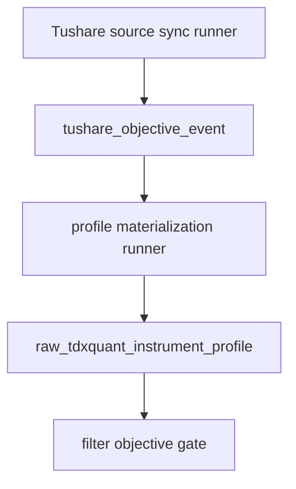

# data 模块 Tushare objective source ledger 与 profile materialization 规格
`日期：2026-04-15`
`状态：生效中`

## 适用范围

本规格冻结 `71` 的最小正式实现范围，覆盖：

1. `Tushare objective source` schema / bootstrap
2. `run_tushare_objective_source_sync(...)`
3. `objective profile materialization` schema / bootstrap
4. `run_tushare_objective_profile_materialization(...)`
5. `raw_tdxquant_instrument_profile` 的 bounded 历史回补与未来增量沉淀

## 不可变前提

1. `70` 已冻结主源字段映射与两层账本形态。
2. `filter` 当前继续只读消费 `raw_market.raw_tdxquant_instrument_profile`。
3. `Baostock` 不进入本卡正式写库路径。
4. `TdxQuant get_stock_info(...)` 不在本卡承担历史回补真值。

## 正式入口

### 1. Source Sync Runner

Python API：
`run_tushare_objective_source_sync(...)`

CLI：
`scripts/data/run_tushare_objective_source_sync.py`

### 2. Profile Materialization Runner

Python API：
`run_tushare_objective_profile_materialization(...)`

CLI：
`scripts/data/run_tushare_objective_profile_materialization.py`

## 正式表族

### 1. Source Ledger

1. `raw_market.tushare_objective_run`
2. `raw_market.tushare_objective_request`
3. `raw_market.tushare_objective_checkpoint`
4. `raw_market.tushare_objective_event`

### 2. Materialization Ledger

1. `raw_market.objective_profile_materialization_run`
2. `raw_market.objective_profile_materialization_checkpoint`
3. `raw_market.objective_profile_materialization_run_profile`
4. `raw_market.raw_tdxquant_instrument_profile`

## 业务自然键

1. `tushare_objective_run`
   - `run_id`
2. `tushare_objective_request`
   - `run_id + source_api + cursor_type + cursor_value + request_sequence`
3. `tushare_objective_checkpoint`
   - `source_api + cursor_type + cursor_value`
4. `tushare_objective_event`
   - `asset_type + code + source_api + objective_dimension + effective_start_date + source_record_hash`
5. `objective_profile_materialization_run`
   - `run_id`
6. `objective_profile_materialization_checkpoint`
   - `asset_type + code + observed_trade_date`
7. `objective_profile_materialization_run_profile`
   - `run_id + asset_type + code + observed_trade_date`
8. `raw_tdxquant_instrument_profile`
   - `asset_type + code + observed_trade_date`

## 最低字段合同

### `tushare_objective_event`

1. `asset_type`
2. `code`
3. `source_api`
4. `objective_dimension`
5. `effective_start_date`
6. `effective_end_date`
7. `status_value_code`
8. `status_value_text`
9. `source_record_hash`
10. `source_trade_date`
11. `source_ann_date`
12. `payload_json`
13. `first_seen_run_id`
14. `last_seen_run_id`

### `raw_tdxquant_instrument_profile`

1. `asset_type`
2. `code`
3. `observed_trade_date`
4. `instrument_name`
5. `market_type`
6. `security_type`
7. `list_status`
8. `list_date`
9. `delist_date`
10. `is_suspended`
11. `is_risk_warning`
12. `is_delisting_arrangement`
13. `source_owner`
14. `source_detail_json`
15. `first_seen_run_id`
16. `last_materialized_run_id`

## Bootstrap 规则

1. `stock_basic` 按 `exchange + list_status` 批量抓取
2. `suspend_d` 自 `2010-01-04` 按交易日顺推
3. `stock_st` 自 `2016-01-01` 按交易日顺推
4. `namechange` 对 bootstrap universe 按标的批量抓取
5. materialization 以 `asset_type + code + observed_trade_date` 为最小物化粒度

## 增量更新规则

1. `suspend_d / stock_st` 每日交易日增量
2. `stock_basic` 低频刷新
3. `namechange` 定向刷新
4. `raw_tdxquant_instrument_profile` 只重算受影响窗口

## Checkpoint / Replay 规则

### Source Sync

1. `cursor_type='exchange_status'` 用于 `stock_basic`
2. `cursor_type='trade_date'` 用于 `suspend_d / stock_st`
3. `cursor_type='instrument'` 用于 `namechange`

### Materialization

1. `asset_type + code + observed_trade_date`
2. 支持按单标的、单日期窗口、单 run 局部 replay

## Runner 参数最小集

### `run_tushare_objective_source_sync(...)`

1. `raw_db_path`
2. `source_apis`
3. `signal_start_date`
4. `signal_end_date`
5. `instrument_limit` 或 `instrument_list`
6. `use_checkpoint_queue`
7. `summary_path`

### `run_tushare_objective_profile_materialization(...)`

1. `raw_db_path`
2. `signal_start_date`
3. `signal_end_date`
4. `instrument_limit` 或 `instrument_list`
5. `use_checkpoint_queue`
6. `summary_path`

规则：

1. 两个 CLI 都必须显式二选一：bounded window 或 `--use-checkpoint-queue`
2. 不允许无边界全量重算全部历史

## bounded 验证最低要求

1. `tests/unit/data` 单测覆盖 source event 归一化、namechange 去重、materialization 决策
2. bounded smoke 覆盖至少一个 `stock_basic`、一个 `suspend_d`、一个 `stock_st`、一个 `namechange` 路径
3. 真实库 readout 能证明 `tushare_objective_event` 与 `raw_tdxquant_instrument_profile` 已写入
4. coverage audit 能显示 `69` 的 `100% missing` 至少开始下降

## 一句话收口

`71` 的最小正式实现目标，是把 `Tushare` 历史 objective 事实沉淀成可续跑的 source ledger，再把这些事实有边界地物化进 `raw_tdxquant_instrument_profile`。

## 流程图

