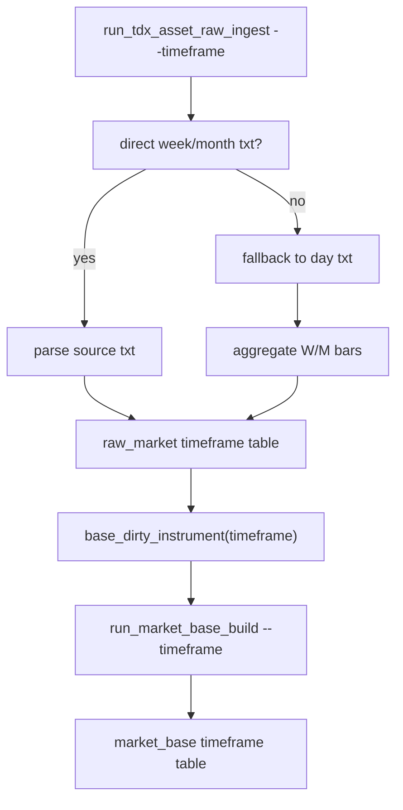

# data 模块 raw/base 周月线正式账本扩展规格
`日期：2026-04-16`
`状态：生效中`

## 适用范围

本规格覆盖 `75` 的最小正式实现：

1. `raw_market` 周/月表族
2. `market_base` 周/月表族
3. `raw/base` 共享 run / scope / dirty audit 的 `timeframe` 扩展
4. `run_tdx_asset_raw_ingest(...)`
5. `run_asset_market_base_build(...)`
6. 两个 CLI 的 `--timeframe` 与 `--batch-size`

## 不可变前提

1. 现有日线正式表族和日线消费路径不得破坏。
2. `73` 冻结的全历史 full 删除权限规则继续有效。
3. `74` 冻结的批次建仓治理继续有效。
4. 个人 PC 正式建仓仍默认串行 child run，不引入并发 writer。

## 正式维度

### 1. Timeframe 枚举

`timeframe in {'day', 'week', 'month'}`

### 2. 共享维度

`asset_type + timeframe + adjust_method`

## 正式表族

### 1. raw_market

#### 文件注册表

1. `stock_file_registry`
2. `index_file_registry`
3. `block_file_registry`

新增最小字段：

1. `timeframe`

#### 行情表

1. `stock_daily_bar`
2. `stock_weekly_bar`
3. `stock_monthly_bar`
4. `index_daily_bar`
5. `index_weekly_bar`
6. `index_monthly_bar`
7. `block_daily_bar`
8. `block_weekly_bar`
9. `block_monthly_bar`

最小字段：

1. `bar_nk`
2. `source_file_nk`
3. `asset_type`
4. `timeframe`
5. `code`
6. `name`
7. `trade_date`
8. `adjust_method`
9. `open / high / low / close / volume / amount`
10. `source_path`
11. `source_mtime_utc`
12. `first_seen_run_id`
13. `last_ingested_run_id`

#### 审计表

1. `raw_ingest_run`
2. `raw_ingest_file`

新增最小字段：

1. `timeframe`

### 2. market_base

#### 行情表

1. `stock_daily_adjusted`
2. `stock_weekly_adjusted`
3. `stock_monthly_adjusted`
4. `index_daily_adjusted`
5. `index_weekly_adjusted`
6. `index_monthly_adjusted`
7. `block_daily_adjusted`
8. `block_weekly_adjusted`
9. `block_monthly_adjusted`

最小字段：

1. `bar_nk`
2. `code`
3. `name`
4. `timeframe`
5. `trade_date`
6. `adjust_method`
7. `open / high / low / close / volume / amount`
8. `source_bar_nk`
9. `first_seen_run_id`
10. `last_materialized_run_id`

#### 共享治理表

1. `base_dirty_instrument`
2. `base_build_run`
3. `base_build_scope`
4. `base_build_action`

新增最小字段：

1. `timeframe`

## 业务自然键

1. `raw_market.{asset}_daily_bar`
   - `code + trade_date + adjust_method`
2. `raw_market.{asset}_weekly_bar`
   - `code + trade_date + adjust_method`
3. `raw_market.{asset}_monthly_bar`
   - `code + trade_date + adjust_method`
4. `market_base.{asset}_daily_adjusted`
   - `code + trade_date + adjust_method`
5. `market_base.{asset}_weekly_adjusted`
   - `code + trade_date + adjust_method`
6. `market_base.{asset}_monthly_adjusted`
   - `code + trade_date + adjust_method`
7. `base_dirty_instrument`
   - `asset_type + timeframe + code + adjust_method`

说明：

1. 现有 daily 表的唯一键不改。
2. 周/月使用独立表，因此业务自然键仍不需要再额外叠加 `timeframe` 字段。
3. 共享审计/dirty 表必须显式携带 `timeframe`，避免跨周期误消费。

## raw ingest 规格

### Python API

`run_tdx_asset_raw_ingest(..., asset_type, timeframe='day', adjust_method, run_mode, ...)`

`run_tdx_asset_raw_ingest_batched(..., asset_type, timeframe='day', adjust_method, batch_size, ...)`

### CLI

`python scripts/data/run_tdx_asset_raw_ingest.py --asset-type <type> --timeframe <day|week|month> --adjust-method <method> ...`

### 文件发现规则

1. `day`
   - 优先 `{asset_type}/AdjustedFolder`
   - 回退 `{asset_type}-day/AdjustedFolder`
2. `week`
   - 优先 `{asset_type}-week/AdjustedFolder`
   - 若目录缺失或无 txt，则回退 `day` 目录并做 deterministic aggregation
3. `month`
   - 优先 `{asset_type}-month/AdjustedFolder`
   - 若目录缺失或无 txt，则回退 `day` 目录并做 deterministic aggregation

### 周/月聚合规则

对同一 `code` 的日线序列按交易日期升序聚合：

1. `week`: `to_period('W-FRI')`
2. `month`: `to_period('M')`
3. `trade_date = 组内最后一个真实交易日`
4. `open = 首日 open`
5. `high = max(high)`
6. `low = min(low)`
7. `close = 末日 close`
8. `volume = sum(volume)`
9. `amount = sum(amount)`

### raw audit 规则

1. `raw_ingest_run` 必须写入 `timeframe`
2. `raw_ingest_file` 必须写入 `timeframe`
3. `file_registry` 必须写入 `timeframe`
4. `base_dirty_instrument` 挂账必须写入 `timeframe`

## market_base build 规格

### Python API

`run_asset_market_base_build(..., asset_type, timeframe='day', adjust_method, ...)`

`run_asset_market_base_build_batched(..., asset_type, timeframe='day', adjust_method, batch_size, ...)`

### CLI

`python scripts/data/run_market_base_build.py --asset-type <type> --timeframe <day|week|month> --adjust-method <method> ...`

### 物化规则

1. `source_table` 按 `asset_type + timeframe` 选择对应 raw 表
2. `target_table` 按 `asset_type + timeframe` 选择对应 base 表
3. scoped full 删除权限继续只限当前 `timeframe` 作用域内
4. `base_build_run / scope / action` 必须写入 `timeframe`
5. `base_dirty_instrument` 的消费必须同时匹配 `asset_type + timeframe + adjust_method`

## 批量建仓规则

1. raw batch
   - `--batch-size N --run-mode full --timeframe <tf>`
2. base batch
   - `--batch-size N --build-mode full --limit 0 --timeframe <tf>`
3. parent summary 必须显式返回 `timeframe`
4. child run 必须按 `asset_type + timeframe + code batch` 落审计

## 增量更新与续跑规则

1. 日线、周线、月线各自独立挂脏、独立消费
2. `incremental + dirty_queue` 不允许跨 `timeframe` 混用
3. 周/月 direct source 缺失时，仍以日线 txt 为唯一重放输入，因此 replay 不需要额外在线源

## 向后兼容规则

1. 现有无 `timeframe` 的 daily 历史 run/dirty 行必须继续可读
2. 新代码对 daily 历史审计读取一律按 `COALESCE(timeframe, 'day')`
3. `run_tdx_stock_raw_ingest(...)` 与既有日线脚本默认行为保持 `timeframe='day'`

## bounded 验证最低要求

1. 单测覆盖 `week/month` 从 `day` txt fallback 聚合
2. 单测覆盖 `week/month` market_base 落入对应新表
3. 单测覆盖 dirty queue 以 `timeframe` 隔离
4. 真实库至少完成一轮 `stock backward week/month` 的 raw + base 落表

## 一句话收口

`75` 的正式规格是：在保留既有日线合同的前提下，把 `raw/base` runner 和账本表族升级为可审计的 `day/week/month` 通用多周期入口。

## 流程图

