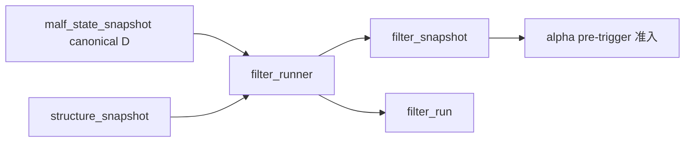

# filter 正式 snapshot 规格

日期：`2026-04-09`
状态：`生效中`

> 角色声明：本文是 `filter` 当前最小正式准入合同，不改写 `malf core` 的纯语义边界。
> 当前 runner 默认读取 `structure_snapshot + canonical malf_state_snapshot(timeframe='D')`；bridge v1 兼容上下文只允许在 canonical 表缺失时作为过渡输入解释。
> 若 `filter` 需要读取 `same_timeframe_stats_snapshot`，必须按 `docs/02-spec/modules/malf/04-malf-mechanism-layer-break-confirmation-and-same-timeframe-stats-sidecar-spec-20260411.md` 作为只读 sidecar 解释，不得反向把它写成 `malf core`。

## 适用范围

本规格冻结新仓 `filter` 模块的最小正式准入输出合同。当前只覆盖：

1. `filter_run`
2. `filter_snapshot`
3. `filter_run_snapshot`
4. `run_filter_snapshot_build(...)`
5. `scripts/filter/run_filter_snapshot_build.py`

本规格不代表全部 filter 规则已经完成，也不代表 `alpha` 已经在本卡内改完全部消费实现。

## 正式输入

`filter` 当前正式输入固定为：

1. 官方 `structure_snapshot`
2. canonical `malf_state_snapshot(timeframe='D')`
   - 当前只用于上下文存在性审计与只读提示，不参与 `malf core` 回写
   - bridge v1 `pas_context_snapshot` 只允许在 canonical 表缺失时兼容回退

至少保证以下字段可读：

1. `structure_snapshot_nk`
2. `instrument`
3. `signal_date`
4. `asof_date`
5. `structure_progress_state`
6. `is_failed_extreme`
7. `failure_type`

若需要下游兼容审计字段，可额外读取：

1. `malf_context_4`
2. `lifecycle_rank_high`
3. `lifecycle_rank_total`
4. `source_context_nk`

硬约束：

1. `filter` 不负责 trigger detection。
2. `filter` 不负责 formal signal 物化。
3. `filter` 不负责 `position / trade` 风险门。
4. 不允许把 bridge v1 上下文字段反向宣称为 `malf core` 的正式输入要求。

## 正式输出

### 1. `filter_run`

用途：

1. 记录一次 bounded filter 物化运行
2. 固定输入来源、窗口、版本与摘要

最小字段：

1. `run_id`
2. `runner_name`
3. `runner_version`
4. `run_status`
5. `signal_start_date`
6. `signal_end_date`
7. `bounded_instrument_count`
8. `source_structure_table`
9. `source_context_table`
10. `filter_contract_version`
11. `started_at`
12. `completed_at`
13. `summary_json`

补充说明：

1. `source_context_table` 当前默认表示 canonical `malf_state_snapshot`；只有在 canonical 缺表时才允许记录成 bridge v1 兼容上下文表。
2. 该字段用于审计 runner 输入来源，不得被解释成 `malf core` 的一部分。

### 2. `filter_snapshot`

用途：

1. 作为 `alpha` 的官方 pre-trigger 准入层
2. 回答在当前结构与上下文下，是否允许进入 trigger 检测

最小字段：

1. `filter_snapshot_nk`
2. `structure_snapshot_nk`
3. `instrument`
4. `signal_date`
5. `asof_date`
6. `trigger_admissible`
7. `primary_blocking_condition`
8. `blocking_conditions_json`
9. `admission_notes`
10. `source_context_nk`
11. `filter_contract_version`
12. `first_seen_run_id`
13. `last_materialized_run_id`

补充说明：

1. `source_context_nk` 当前是上下文来源审计指针。
2. 若输入来自 canonical，则它指向 canonical state snapshot 的审计指针；若输入来自兼容回退，则它指向 bridge v1 兼容上下文自然键。

自然键规则：

`filter_snapshot_nk` 当前最小固定由下列字段拼出：

1. `structure_snapshot_nk`
2. `source_context_nk`
3. `filter_contract_version`

说明：

1. 当前自然键仍保留 `source_context_nk`，是为了兼容现有 runner 的上下文审计边界。
2. 这不代表 `filter` 长期必须依赖 `malf context`；若未来切换到新的 sidecar，应另开卡升级自然键合同。

### 3. `filter_run_snapshot`

用途：

1. 桥接一次 `run` 与本次触达的 `filter_snapshot`
2. 支持 bounded readout、resume 与审计

最小字段：

1. `run_id`
2. `filter_snapshot_nk`
3. `materialization_action`
4. `trigger_admissible`
5. `primary_blocking_condition`
6. `recorded_at`

`materialization_action` 枚举：

1. `inserted`
2. `reused`
3. `rematerialized`

## 下游对齐规则

`alpha` 后续正式消费必须优先读取：

1. `filter_snapshot.trigger_admissible`
2. `filter_snapshot.primary_blocking_condition`
3. `filter_snapshot.blocking_conditions_json`

不再默认回读旧 `scene / phenomenon / pas_context` 兼容准入字段作为长期官方输入，也不允许把 bridge v1 兼容上下文重新宣称为 `malf core`。

## Producer Runner 合同

### Python 入口

`run_filter_snapshot_build(...)`

### 脚本入口

`scripts/filter/run_filter_snapshot_build.py`

### 最小参数

1. `run_id`
2. `signal_start_date`
3. `signal_end_date`
4. `instrument` 或 bounded instrument 列表
5. `limit`
6. `batch_size`
7. `source_structure_table`
8. `source_context_table`
9. `summary_path`

补充说明：

1. `source_context_table` 当前默认指向 canonical `malf_state_snapshot`，`source_timeframe` 默认固定为 `D`。
2. bridge v1 兼容上下文表只允许在 canonical 表缺失时作为兼容回退，不再是长期默认正式输入。

## Bounded Evidence 要求

本卡后续正式实现至少要留下：

1. 单元测试
2. bounded smoke
3. `filter_run / filter_snapshot / filter_run_snapshot` readout
4. `alpha` 可消费的字段对接证据

## 当前明确不做

1. 全量 filter rule backfill
2. `alpha` detector 私有 skip reason 全量外提
3. `position / trade` 风险门合并到本层

## 一句话收口

`filter` 当前最小正式目标不是更复杂的规则树，而是一个可被 `alpha` 优先消费的独立 pre-trigger 准入快照层；任何上下文或统计都只能以下游 sidecar 或 bridge v1 兼容输入身份存在。`

## 流程图

## `62` 补充规格

1. `filter_snapshot.trigger_admissible` 只表达 pre-trigger gate 是否放行。
2. `structure_progress_failed / reversal_stage_pending` 当前必须降级为 `admission_notes` 或既有 risk sidecar，不得再在 `filter` 层形成结构性 hard block。
3. 下游 `alpha` 当前继续读取 `trigger_admissible / primary_blocking_condition / blocking_conditions_json / admission_notes`，但这不代表 `filter` 已取得最终 formal signal authority。

