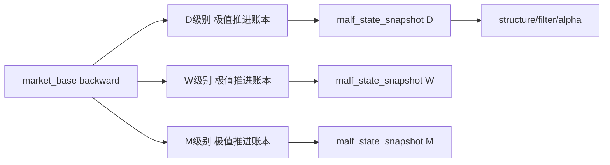

# malf 多级别极值推进账本正式规格

日期：`2026-04-11`
状态：`已被 03 收缩替代`

> 本规格保留为 `2026-04-11` 首轮扩展版历史记录。
> 当前 `malf` 正式核心请改读 `03-malf-pure-semantic-structure-ledger-spec-20260411.md`。

## 1. 适用范围

本规格冻结 `malf` 的核心定义。它回答的不是“市场看起来像什么”，而是：

1. 当前级别的结构事实是什么
2. 当前波段已经推进到哪里
3. 当前结构在同级别历史分布里站在哪个位置
4. 下游模块在此结构下允许做什么动作

本规格覆盖：

1. 月线 `M`
2. 周线 `W`
3. 日线 `D`

本规格不覆盖：

1. 分钟级别
2. 资金管理
3. 执行定价
4. 订单回报

## 2. 正式定义

`malf = 多级别极值推进账本 + 执行账本接口`

其正式分层如下：

1. `structure ledger`
2. `same_level_stats ledger`
3. `execution interface`

其中：

1. `structure ledger` 记录结构真相
2. `same_level_stats ledger` 记录同级别统计分布
3. `execution interface` 为 `structure / filter / alpha` 提供可消费的动作边界

## 3. 世界观与约束

### 3.1 价格原语

`malf` 的原语仅限：

1. `HH`
2. `HL`
3. `LL`
4. `LH`
5. `break`
6. `count`

`malf` 不以均线、收益率、波动率作为主语义原语。

### 3.2 同级别统计约束

月、周、日是三套独立生命周期。

所有分布、分位、经验概率必须在同级别内部计算。

禁止：

1. 用日线样本定义周线波段统计
2. 用周线样本定义月线反转阈值
3. 将不同生命周期混成一个统一分布

### 3.3 硬规则与软规则

硬规则只来自结构：

1. `HH / HL / LL / LH` 的排列
2. `last_valid_HL` 是否被击破
3. `last_valid_LH` 是否被上破
4. 当前波是否继续创出新极值

软规则只来自统计：

1. `push_count / pullback_count` 经验分布
2. 波段幅度分位
3. 波段持续期分位
4. 反转概率 bucket

`三顺二逆` 属于软规则，不属于硬转移条件。

## 4. 时间结构

### 4.1 级别定义

1. `M`
   - 主要回答长期背景
2. `W`
   - 主要回答中程主波段
3. `D`
   - 主要回答执行节奏

### 4.2 级别联动

级别之间仅允许“约束”，不允许“替代”。

规则如下：

1. 月线为周线提供背景约束
2. 周线为日线提供背景约束
3. 低级别逆高级别时，必须单独记账
4. 低级别反转不得自动等价为高级别反转

## 5. 状态机

### 5.1 主状态枚举

`major_state` 固定为四态：

1. `BULL_WITH_TREND`
2. `BULL_COUNTER_TREND`
3. `BEAR_WITH_TREND`
4. `BEAR_COUNTER_TREND`

中文解释：

1. `BULL_WITH_TREND`
   - 牛顺
2. `BULL_COUNTER_TREND`
   - 牛逆
3. `BEAR_WITH_TREND`
   - 熊顺
4. `BEAR_COUNTER_TREND`
   - 熊逆

### 5.2 状态定义

`BULL_WITH_TREND`

1. 当前级别由一组持续抬高的高点与低点构成
2. 新涨段持续上破前高
3. 回段不跌破最后一个有效 `HL`

`BULL_COUNTER_TREND`

1. 更高层仍处牛背景
2. 当前级别已发生逆势回摆
3. 当前级别内部开始按 `LL + LH` 跟踪

`BEAR_WITH_TREND`

1. 当前级别由一组持续下移的低点与高点构成
2. 新跌段持续下破前低
3. 反弹不突破最后一个有效 `LH`

`BEAR_COUNTER_TREND`

1. 更高层仍处熊背景
2. 当前级别已发生逆势反弹
3. 当前级别内部开始按 `HH + HL` 跟踪

### 5.3 状态转移

`BULL_WITH_TREND -> BULL_COUNTER_TREND`

触发条件：

1. `break_last_valid_HL = true`

`BULL_COUNTER_TREND -> BULL_WITH_TREND`

触发条件：

1. `break_last_valid_LH = true`

`BEAR_WITH_TREND -> BEAR_COUNTER_TREND`

触发条件：

1. `break_last_valid_LH = true`

`BEAR_COUNTER_TREND -> BEAR_WITH_TREND`

触发条件：

1. `break_last_valid_HL = true`

说明：

1. `push_count`
2. `pullback_count`
3. 分位区间

都不能替代上述硬转移。

## 6. canonical ledger 家族

`malf` 的正式 canonical 家族固定为六类。

### 6.1 `malf_bar_ledger`

用途：

1. 作为 `malf` 全部结构推导的原始 bar 输入

自然键：

`instrument + timeframe + bar_end_dt`

最小字段：

1. `instrument`
2. `instrument_name`
3. `timeframe`
4. `bar_end_dt`
5. `open`
6. `high`
7. `low`
8. `close`
9. `volume`
10. `adjust_method`
11. `source_table`

### 6.2 `pivot_ledger`

用途：

1. 记录同级别确认后的关键高点与低点

自然键：

`instrument + timeframe + pivot_id`

最小字段：

1. `pivot_id`
2. `instrument`
3. `timeframe`
4. `pivot_type`
5. `pivot_bar_dt`
6. `pivot_price`
7. `confirmed_at`
8. `prior_pivot_id`
9. `pivot_role`

枚举：

1. `pivot_type = H | L`
2. `pivot_role = HH | HL | LH | LL | UNCLASSIFIED`

### 6.3 `wave_ledger`

用途：

1. 记录当前级别的独立波段

自然键：

`instrument + timeframe + wave_id`

最小字段：

1. `wave_id`
2. `instrument`
3. `timeframe`
4. `wave_direction`
5. `major_state`
6. `start_bar_dt`
7. `end_bar_dt`
8. `anchor_pivot_id`
9. `active_flag`
10. `opened_by_event`
11. `closed_by_event`

枚举：

1. `wave_direction = UP | DOWN`

### 6.4 `extreme_progress_ledger`

用途：

1. 记录当前波内部的纪录推进

自然键：

`instrument + timeframe + wave_id + progress_seq`

最小字段：

1. `instrument`
2. `timeframe`
3. `wave_id`
4. `progress_seq`
5. `progress_type`
6. `record_bar_dt`
7. `record_price`
8. `break_base_pivot_id`
9. `cumulative_count`

枚举：

1. `progress_type = HH | LL`

正式口径：

1. 旧纪录被突破的那根 bar 开始建立新的 `progress_seq`
2. 之后每再创一次同方向新极值，`cumulative_count += 1`
3. 这就是 `HH(n+m)` 或 `LL(n+m)` 的正式表达

### 6.5 `state_snapshot`

用途：

1. 在任一 `asof_bar_dt` 固化当前结构状态

自然键：

`instrument + timeframe + asof_bar_dt`

最小字段：

1. `instrument`
2. `timeframe`
3. `asof_bar_dt`
4. `major_state`
5. `trend_direction`
6. `wave_id`
7. `last_confirmed_H`
8. `last_confirmed_L`
9. `last_valid_HL`
10. `last_valid_LH`
11. `current_hh_count`
12. `current_ll_count`
13. `push_count`
14. `pullback_count`
15. `break_trigger`
16. `higher_timeframe_state_ref`

### 6.6 `same_level_stats_ledger`

用途：

1. 记录某一级别自己的历史分布

自然键：

`universe + timeframe + regime_family + metric_name + sample_version`

最小字段：

1. `universe`
2. `timeframe`
3. `regime_family`
4. `metric_name`
5. `sample_version`
6. `sample_size`
7. `p10`
8. `p25`
9. `p50`
10. `p75`
11. `p90`
12. `mean`
13. `std`
14. `bucket_definition_json`
15. `reversal_probability_json`

## 7. 事件定义

`malf` 正式事件家族固定如下。

1. `BREAK_PREV_HIGH`
2. `BREAK_PREV_LOW`
3. `BREAK_LAST_VALID_HL`
4. `BREAK_LAST_VALID_LH`
5. `NEW_RECORD_HIGH_IN_WAVE`
6. `NEW_RECORD_LOW_IN_WAVE`
7. `CONFIRMED_PULLBACK_LOW`
8. `CONFIRMED_BOUNCE_HIGH`
9. `WAVE_RESET`
10. `STATE_TRANSITION`

语义：

`BREAK_LAST_VALID_HL`

1. 最后一个有效 `HL` 被当前价格击穿
2. 它是 `牛顺 -> 牛逆` 或 `熊逆 -> 熊顺` 的硬条件之一

`BREAK_LAST_VALID_LH`

1. 最后一个有效 `LH` 被当前价格上破
2. 它是 `熊顺 -> 熊逆` 或 `牛逆 -> 牛顺` 的硬条件之一

`NEW_RECORD_HIGH_IN_WAVE`

1. 当前上升波内部再次创出同方向新纪录
2. `current_hh_count += 1`

`NEW_RECORD_LOW_IN_WAVE`

1. 当前下降波内部再次创出同方向新纪录
2. `current_ll_count += 1`

## 8. 推进与回摆计数

### 8.1 `push_count`

用途：

1. 统计当前主状态下已经完成的顺势推进段数

规则：

1. 在 `BULL_WITH_TREND` 中，每确认一段有效 `HH` 推进，`push_count += 1`
2. 在 `BEAR_WITH_TREND` 中，每确认一段有效 `LL` 推进，`push_count += 1`

### 8.2 `pullback_count`

用途：

1. 统计当前主状态下已经完成的逆势回摆段数

规则：

1. 在 `BULL_WITH_TREND` 背景里，以有效 `LL + LH` 回摆段计数
2. 在 `BEAR_WITH_TREND` 背景里，以有效 `HH + HL` 反弹段计数

### 8.3 约束

1. `push_count / pullback_count` 只属于统计层
2. 它们不能直接触发状态翻转
3. 它们只能映射到同级别分布与经验概率 bucket

## 9. 同级别统计层

### 9.1 统计最小样本单位

最小样本单位固定为：

`wave`

而不是：

1. 单根 bar
2. 跨级别混合区间

### 9.2 正式统计指标

同级别最少应统计：

1. `hh_count_distribution`
2. `ll_count_distribution`
3. `push_count_distribution`
4. `pullback_count_distribution`
5. `wave_duration_distribution`
6. `wave_amplitude_distribution`
7. `pullback_ratio_distribution`
8. `reversal_probability_by_quartile`

### 9.3 正式输出

统计层正式输出：

1. `quartile_bucket`
2. `percentile_rank`
3. `reversal_probability_bucket`
4. `exhaustion_risk_bucket`

语义要求：

1. 它们必须在同一 `timeframe` 内计算
2. 它们必须附带 `sample_version`
3. 它们不得脱离结构事实单独存在

## 10. 执行账本接口

`malf` 本身不直接下单，但必须对执行层提供正式接口。

### 10.1 `execution_context_interface`

自然键：

`instrument + timeframe + asof_bar_dt + plan_id`

最小字段：

1. `instrument`
2. `timeframe`
3. `asof_bar_dt`
4. `major_state`
5. `wave_id`
6. `quartile_bucket`
7. `percentile_rank`
8. `reversal_probability_bucket`
9. `allowed_actions`
10. `preferred_action_family`
11. `invalidation_price`
12. `comments`

### 10.2 动作枚举

`allowed_actions` 枚举冻结为：

1. `TEST_ORDER`
2. `MOTHER_ORDER`
3. `ADD_ON`
4. `REDUCE`
5. `LOCK`
6. `EXIT`
7. `FULL_REST`

说明：

1. 这些动作是接口语义，不是交易执行实现
2. 仓位大小与定价由 `position / trade` 负责

## 11. 对下游模块的消费合同

### 11.1 `structure`

`structure` 必须优先消费：

1. `pivot_ledger`
2. `wave_ledger`
3. `state_snapshot`

`structure` 不得再把 `ma20 / ma60 / ret20` 作为 `malf` 的主输入语义。

### 11.2 `filter`

`filter` 必须消费：

1. `state_snapshot`
2. `same_level_stats_ledger`
3. `higher_timeframe_state_ref`

`filter` 负责回答：

1. 当前结构是否位于可做区
2. 当前推进是否接近高分位耗尽区
3. 当前回摆是否仍属同级别正常修正

### 11.3 `alpha`

`alpha` 必须消费：

1. `state_snapshot`
2. `same_level_stats_ledger`
3. `execution_context_interface`

`alpha` 负责回答：

1. 做不做
2. 做哪一种动作
3. 失效价位在哪里

## 12. 与 bridge v1 的兼容关系

当前仓内已存在：

1. `pas_context_snapshot`
2. `structure_candidate_snapshot`

它们在本规格下重新定义为：

1. `pas_context_snapshot`
   - `state_snapshot` 的低维兼容视图
2. `structure_candidate_snapshot`
   - `pivot / wave / progress` 的低维兼容候选视图

兼容层要求：

1. bridge v1 在迁移完成前继续保留
2. 新字段与新 runner 必须从 canonical ledger 派生
3. 不得再把 bridge v1 当作 `malf` 的终局定义

## 13. 当前明确不做

1. 不在本规格内冻结分钟级别
2. 不在本规格内冻结仓位 sizing
3. 不在本规格内冻结订单执行定价
4. 不在本规格内用跨级别统计替代同级别分布
5. 不在本规格内把 `三顺二逆` 提升为硬规则

## 14. 一句话收口

`malf` 的正式核心是：对月、周、日各自的生命过程分别记账，用 HH/HL/LL/LH 与 break 定义结构，用 HH(n+m)/LL(n+m) 定义推进，用同级别历史分布定义所处位置，再向 structure/filter/alpha 输出可执行的动作接口。`

## 流程图

