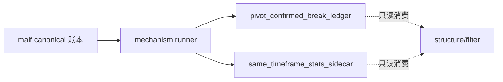

# malf 机制层 break 确认与同级别统计 sidecar 正式规格

日期：`2026-04-11`
状态：`生效中`

> 角色声明：本文冻结 `malf` 机制层的正式合同，不改写 `03-malf-pure-semantic-structure-ledger-spec-20260411.md` 已冻结的 pure semantic core。
> 本文只定义两个只读派生能力：
> 1. `pivot-confirmed break`
> 2. `same-timeframe stats sidecar`

## 1. 适用范围

本规格覆盖：

1. `break trigger -> pivot-confirmed break -> new progression confirmation` 的正式关系
2. `pivot_confirmed_break_ledger` 的自然键与最小字段
3. `same_timeframe_stats_profile / same_timeframe_stats_snapshot` 的自然键与最小字段
4. `structure / filter` 的正式消费顺序

本规格不覆盖：

1. 新 canonical runner 的代码实现
2. 多级别背景传播
3. 动作接口
4. 收益、胜率或回测统计

## 2. 与 `malf core` 的关系

`malf core` 继续只冻结：

1. `HH`
2. `HL`
3. `LL`
4. `LH`
5. `break`
6. `count`

机制层硬规则：

1. `pivot-confirmed break` 不是新的 core 原语。
2. `pivot-confirmed break` 不单独触发四态切换。
3. `same-timeframe stats sidecar` 不反向参与 `state / wave / break / count` 计算。
4. `new HH / LL` 仍是新顺状态成立的唯一确认条件。

## 3. break 三段式正式关系

### 3.1 `break_trigger`

用途：

1. 标记最后有效守护点被破坏

正式语义：

1. `break_last_valid_HL`
   - 上行顺结构的最后有效 `HL` 被破坏
2. `break_last_valid_LH`
   - 下行顺结构的最后有效 `LH` 被上破

职责：

1. 只宣布旧结构失效
2. 不宣布新顺趋势成立

### 3.2 `pivot_confirmed_break`

用途：

1. 把 break 从 bar 级触发提升到同级别 pivot 级确认

正式语义：

1. 对下破 `HL` 的场景：
   - `break_trigger` 发生后，后续修复高点被确认为同级别 `LH`
   - 说明 break 已经走到可被 pivot 级别确认的阶段
2. 对上破 `LH` 的场景：
   - `break_trigger` 发生后，后续回踩低点被确认为同级别 `HL`
   - 说明 break 已经走到可被 pivot 级别确认的阶段

职责：

1. 只提高 break 的结构可信度
2. 不单独宣告新顺状态成立

### 3.3 `new_progression_confirmation`

用途：

1. 确认 break 之后新的顺势推进已经形成

正式语义：

1. break 下行后，新的 `LL` 推进出现
2. break 上行后，新的 `HH` 推进出现

职责：

1. 负责把逆状态确认成新的顺状态
2. 继续作为唯一状态确认条件

### 3.4 顺序约束

正式顺序固定为：

1. `break_trigger` 必须早于或等于 `pivot_confirmed_break`
2. `pivot_confirmed_break` 若存在，只能晚于对应 `break_trigger`
3. `new_progression_confirmation` 可以晚于 `pivot_confirmed_break`
4. 快行情下若直接出现新的 `HH / LL`，允许 `pivot_confirmed_break` 缺席

补充约束：

1. 不允许因为 `pivot_confirmed_break` 缺席而延迟 core 的状态确认
2. 不允许反过来用 `pivot_confirmed_break` 覆盖 `new_progression_confirmation`

## 4. `pivot_confirmed_break_ledger`

### 4.1 用途

1. 记录 break 事件是否已经获得 pivot 级确认
2. 为 `structure` 提供只读 break 确认读数

### 4.2 自然键

`instrument + timeframe + guard_pivot_id + trigger_bar_dt`

说明：

1. `guard_pivot_id`
   - 指被 break 破坏的最后有效守护 pivot
2. `trigger_bar_dt`
   - 指首次触发 break 的 bar 时间

### 4.3 最小字段

1. `instrument`
2. `timeframe`
3. `guard_pivot_id`
4. `guard_pivot_role`
5. `origin_wave_id`
6. `trigger_bar_dt`
7. `trigger_price`
8. `break_direction`
9. `confirmation_status`
10. `confirmation_pivot_id`
11. `confirmation_pivot_role`
12. `confirmed_at`
13. `superseded_by_progress_bar_dt`
14. `invalidated_at`

枚举：

1. `guard_pivot_role = HL | LH`
2. `break_direction = DOWN | UP`
3. `confirmation_status = pending | pivot_confirmed | superseded_by_new_progression | invalidated`
4. `confirmation_pivot_role = LH | HL | NONE`

### 4.4 正式约束

1. 每个 break 事件只允许一条 `pivot_confirmed_break_ledger` 记录。
2. `confirmation_pivot_role` 必须与 `break_direction` 一致：
   - `DOWN -> LH`
   - `UP -> HL`
3. `pivot_confirmed_break` 只对同一个 `instrument + timeframe` 生效。
4. 不允许跨 `timeframe` 回填确认 pivot。

## 5. `same_timeframe_stats_profile`

### 5.1 用途

1. 记录同级别样本分布本身

### 5.2 自然键

`universe + timeframe + regime_family + metric_name + sample_version`

### 5.3 最小字段

1. `universe`
2. `timeframe`
3. `regime_family`
4. `metric_name`
5. `sample_version`
6. `sample_size`
7. `p10`
8. `p25`
9. `p50`
10. `p75`
11. `p90`
12. `mean`
13. `std`
14. `bucket_definition_json`

### 5.4 正式约束

1. 样本只能来自同一 `timeframe`。
2. 样本最小单位必须来自同级别 `wave / state / progress`。
3. 不允许混入其他 `timeframe` 的样本。

## 6. `same_timeframe_stats_snapshot`

### 6.1 用途

1. 记录某个 `instrument + timeframe + asof_bar_dt` 当前落在同级别分布中的位置

### 6.2 自然键

`instrument + timeframe + asof_bar_dt + sample_version + stats_contract_version`

### 6.3 最小字段

1. `instrument`
2. `timeframe`
3. `asof_bar_dt`
4. `source_state_snapshot_nk`
5. `source_wave_id`
6. `sample_version`
7. `stats_contract_version`
8. `regime_family`
9. `current_hh_count_percentile`
10. `current_ll_count_percentile`
11. `wave_duration_percentile`
12. `wave_amplitude_percentile`
13. `pullback_depth_percentile`
14. `exhaustion_risk_bucket`
15. `reversal_probability_bucket`
16. `source_profile_refs_json`

### 6.4 正式约束

1. `source_state_snapshot_nk` 只能指向同级别 `state_snapshot`。
2. 百分位与 bucket 只读输出，不得回写 `state_snapshot`。
3. 若当前级别没有足够样本，允许字段留空，但不得改用跨级别样本填补。

## 7. 下游消费合同

### 7.1 `structure`

`structure` 的正式消费顺序：

1. 先读 `malf core` 或 bridge v1 兼容视图
2. 可附加只读读取 `pivot_confirmed_break_ledger`
3. 可附加只读读取 `same_timeframe_stats_snapshot`

硬约束：

1. `structure` 不得把 `pivot_confirmed_break` 重新定义成 `malf core` 必备原语。
2. `structure` 不得把统计 bucket 写回 `malf state`。

### 7.2 `filter`

`filter` 的正式消费顺序：

1. 优先读 `structure_snapshot`
2. 再读 `same_timeframe_stats_snapshot`

硬约束：

1. `filter` 不得把 `pivot_confirmed_break_ledger` 当成绕过 `structure` 的长期正式主入口。
2. `filter` 不得用统计 bucket 覆盖 `trigger_admissible` 的结构硬条件。

## 8. 批量建仓、增量更新、续跑与审计

### 8.1 批量建仓

1. 先从官方 `market_base(backward)` 构造同级别 `malf core`
2. 再按 `instrument + timeframe` 派生 `pivot_confirmed_break_ledger`
3. 最后按同级别样本物化 `same_timeframe_stats_profile / snapshot`

### 8.2 增量更新

1. 只对上游 `state_snapshot / wave_ledger / extreme_progress_ledger` 发生变化的 `instrument + timeframe` 续算
2. 同一时间级别以最新触达 `bar` 作为增量边界

### 8.3 断点续跑

1. checkpoint 必须至少记到 `instrument + timeframe + asof_bar_dt`
2. break 确认续跑必须能按 `guard_pivot_id + trigger_bar_dt` 重放
3. stats 续跑必须能按 `sample_version` 与 `source_state_snapshot_nk` 重放

### 8.4 审计账本

本卡当前只冻结正式合同，不宣称代码 runner 已落地。

未来若实现正式机制层 runner，至少应沉淀：

1. `malf_mechanism_run`
2. `malf_mechanism_run_output`
3. `pivot_confirmed_break_ledger`
4. `same_timeframe_stats_profile`
5. `same_timeframe_stats_snapshot`

## 9. 当前明确不做

1. 不把 `pivot-confirmed break` 升格为状态机硬前提
2. 不把 `same-timeframe stats sidecar` 写回 `major_state`
3. 不做跨级别统计混样本
4. 不恢复动作接口

## 10. 一句话收口

`pivot-confirmed break` 是对 `break` 的机制层确认，不是新趋势确认；`same-timeframe stats sidecar` 是同级别位置读数，不是结构真相。两者都只能只读派生、只读消费。`

## 流程图

