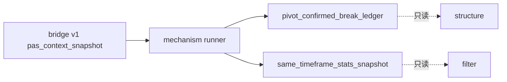

# malf 机制层 sidecar 账本 bootstrap 正式规格

日期：`2026-04-11`
状态：`生效中`

> 角色声明：本文冻结 `25` 号实现卡的正式实现合同。
> 它在 `04` 号机制层边界之下，定义 bridge-era 机制层 sidecar 的正式表族、runner、checkpoint 与下游最小接入方式。

## 1. 适用范围

本规格覆盖：

1. `malf_mechanism_run`
2. `malf_mechanism_checkpoint`
3. `pivot_confirmed_break_ledger`
4. `same_timeframe_stats_profile`
5. `same_timeframe_stats_snapshot`
6. `run_malf_mechanism_build(...)`
7. `scripts/malf/run_malf_mechanism_build.py`
8. `structure / filter` 的最小只读 sidecar 接入

本规格不覆盖：

1. pure semantic canonical runner
2. `alpha / position / trade` 的 sidecar 消费改造
3. 多级别背景系统

## 2. 正式输入

本轮机制层 runner 的正式输入固定为：

1. `pas_context_snapshot`
2. `structure_candidate_snapshot`

硬约束：

1. 它们只代表 bridge v1 时代的正式过渡输入。
2. 不得因此重新宣称 `malf_context_4 / lifecycle_rank_*` 属于 `malf core`。
3. 未来若切到 pure semantic canonical core，必须另开卡升级输入合同。

## 3. 正式表族

### 3.1 `malf_mechanism_run`

用途：

1. 记录一次机制层 bounded 物化运行

最小字段：

1. `run_id`
2. `runner_name`
3. `runner_version`
4. `run_status`
5. `signal_start_date`
6. `signal_end_date`
7. `bounded_instrument_count`
8. `source_context_table`
9. `source_structure_input_table`
10. `timeframe`
11. `stats_sample_version`
12. `mechanism_contract_version`
13. `started_at`
14. `completed_at`
15. `summary_json`

### 3.2 `malf_mechanism_checkpoint`

用途：

1. 记录某个 `instrument + timeframe` 已处理到的最近时点

自然键：

`instrument + timeframe`

最小字段：

1. `instrument`
2. `timeframe`
3. `last_signal_date`
4. `last_asof_date`
5. `last_run_id`
6. `source_context_nk`
7. `updated_at`

### 3.3 `pivot_confirmed_break_ledger`

用途：

1. 记录 break 机制层确认事实

自然键：

`instrument + timeframe + guard_pivot_id + trigger_bar_dt`

最小字段：

1. `break_event_nk`
2. `instrument`
3. `timeframe`
4. `guard_pivot_id`
5. `guard_pivot_role`
6. `origin_context`
7. `trigger_bar_dt`
8. `trigger_price_proxy`
9. `break_direction`
10. `confirmation_status`
11. `confirmation_bar_dt`
12. `confirmation_pivot_id`
13. `confirmation_pivot_role`
14. `source_context_nk`
15. `source_candidate_nk`
16. `first_seen_run_id`
17. `last_materialized_run_id`

说明：

1. `guard_pivot_id / confirmation_pivot_id` 在 bridge-era 实现中允许使用稳定的 synthetic key。
2. `trigger_price_proxy` 在当前 bridge-era 实现中允许用当前 bar 的 `close/open` 派生代理值表达。

### 3.4 `same_timeframe_stats_profile`

用途：

1. 记录同级别分布样本池

自然键：

`universe + timeframe + regime_family + metric_name + sample_version`

最小字段：

1. `stats_profile_nk`
2. `universe`
3. `timeframe`
4. `regime_family`
5. `metric_name`
6. `sample_version`
7. `sample_size`
8. `p10`
9. `p25`
10. `p50`
11. `p75`
12. `p90`
13. `mean`
14. `std`
15. `bucket_definition_json`
16. `first_seen_run_id`
17. `last_materialized_run_id`

`metric_name` 本轮固定为：

1. `new_high_count`
2. `new_low_count`
3. `refresh_density`
4. `advancement_density`

### 3.5 `same_timeframe_stats_snapshot`

用途：

1. 记录当前时点在同级别分布中的位置

自然键：

`instrument + timeframe + asof_bar_dt + sample_version + stats_contract_version`

最小字段：

1. `stats_snapshot_nk`
2. `instrument`
3. `timeframe`
4. `signal_date`
5. `asof_bar_dt`
6. `regime_family`
7. `sample_version`
8. `stats_contract_version`
9. `source_context_nk`
10. `source_candidate_nk`
11. `new_high_count_percentile`
12. `new_low_count_percentile`
13. `refresh_density_percentile`
14. `advancement_density_percentile`
15. `exhaustion_risk_bucket`
16. `reversal_probability_bucket`
17. `source_profile_refs_json`
18. `first_seen_run_id`
19. `last_materialized_run_id`

## 4. runner 合同

### Python 入口

`run_malf_mechanism_build(...)`

### 脚本入口

`scripts/malf/run_malf_mechanism_build.py`

### 最小参数

1. `run_id`
2. `signal_start_date`
3. `signal_end_date`
4. `instrument` 或 bounded instrument 列表
5. `limit`
6. `batch_size`
7. `timeframe`
8. `source_context_table`
9. `source_structure_input_table`
10. `stats_sample_version`
11. `summary_path`

### 输出摘要最小字段

1. `break_event_count`
2. `break_inserted_count`
3. `break_reused_count`
4. `break_rematerialized_count`
5. `stats_profile_count`
6. `stats_snapshot_count`
7. `checkpoint_upserted_count`

## 5. 计算规则

### 5.1 bridge-era break 触发

本轮 break 触发最小判断：

1. `structure_candidate_snapshot.is_failed_extreme = true`
2. 或 `failure_type IS NOT NULL`

方向映射：

1. `malf_context_4` 属于 `BULL_*` 时，`break_direction = DOWN`
2. `malf_context_4` 属于 `BEAR_*` 时，`break_direction = UP`

### 5.2 bridge-era break 确认

本轮 `pivot_confirmed_break` 最小确认规则：

1. 对同一 `instrument + timeframe` 的 break 触发窗口
2. 若后续一个或多个相邻时点仍保持 break 后方向上的候选延续，则记为 `pivot_confirmed`
3. 若直接被新的主流推进覆盖，则记为 `superseded_by_new_progression`
4. 若没有后续足够信息，则记为 `pending`

### 5.3 stats profile 计算

1. 以 `regime_family = malf_context_4` 分组
2. 对四个固定指标计算分布
3. 百分位使用组内经验分布

### 5.4 stats snapshot 计算

1. 当前值相对所属 `regime_family + metric_name + sample_version` 的 profile 计算百分位
2. `exhaustion_risk_bucket` 本轮最小枚举：
   - `low`
   - `medium`
   - `high`
3. `reversal_probability_bucket` 本轮最小枚举：
   - `low`
   - `medium`
   - `high`

## 6. checkpoint / replay

1. 每次 runner 成功处理某个 `instrument + timeframe` 的最新时点后，必须 upsert 对应 checkpoint。
2. replay 时允许按：
   - `instrument`
   - `signal_start_date / signal_end_date`
   - `run_id`
   重新物化
3. checkpoint 只决定“从哪继续”，不决定业务自然键。

## 7. 下游最小接入

### 7.1 `structure`

本轮最小接入要求：

1. 允许从 `malf` 机制层表读取：
   - `pivot_confirmed_break_ledger`
   - `same_timeframe_stats_snapshot`
2. 在 `structure_snapshot` 中落最小只读审计字段：
   - `break_confirmation_status`
   - `break_confirmation_ref`
   - `stats_snapshot_nk`
   - `exhaustion_risk_bucket`
3. 不得用这些字段覆盖 `structure_progress_state` 现有硬逻辑

### 7.2 `filter`

本轮最小接入要求：

1. 允许从 `structure_snapshot` 读取上述 sidecar 读数
2. 在 `filter_snapshot` 中落最小只读辅助字段：
   - `stats_snapshot_nk`
   - `exhaustion_risk_bucket`
   - `reversal_probability_bucket`
3. 不得用这些字段覆盖现有 `failed_extreme / structure_failed` 等硬阻断逻辑

## 8. bounded evidence 要求

本卡正式收口至少要留下：

1. `malf` 机制层 bootstrap / runner 单测
2. `structure / filter` sidecar 接入单测
3. 运行证据与 summary
4. 治理检查

## 9. 当前明确不做

1. 不把 bridge-era break 确认宣称为终局 pure semantic pivot 确认
2. 不做多级别背景传播
3. 不把 sidecar bucket 提升为硬状态机
4. 不改 `alpha / position / trade`

## 10. 一句话收口

`25` 号卡的正式实现口径是：先基于 bridge v1 把机制层 sidecar 落成正式历史账本，并用最小只读字段把它们接入 `structure / filter`，同时保留未来切 pure semantic canonical runner 的升级空间。`

## 流程图

