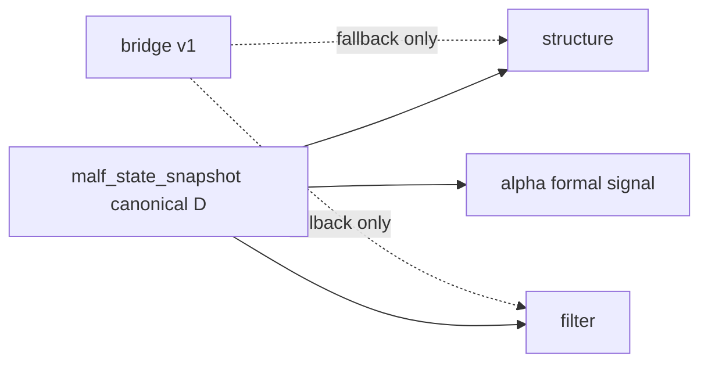

# structure filter alpha rebind to canonical malf 规格

日期：`2026-04-11`
状态：`已裁决`

本规格适用于 `31-structure-filter-alpha-rebind-to-canonical-malf-card-20260411.md` 及其后续 evidence / record / conclusion。

## 目标

让 `structure / filter / alpha` 正式切换到 canonical malf 上游。

## 默认上游合同

1. `structure`
   - `source_context_table = malf_state_snapshot`
   - `source_structure_input_table = malf_state_snapshot`
   - `source_timeframe = D`
   - bridge v1 `pas_context_snapshot / structure_candidate_snapshot` 只允许在 canonical 表缺失时作为兼容回退
2. `filter`
   - `source_structure_table = structure_snapshot`
   - `source_context_table = malf_state_snapshot`
   - `source_timeframe = D`
   - bridge v1 `pas_context_snapshot` 只允许在 canonical 表缺失时作为兼容回退
3. `alpha formal signal`
   - 默认只从 `alpha_trigger_event + filter_snapshot + structure_snapshot` 读取正式上下文
   - `fallback_context_table` 默认关闭，不再默认指向 `pas_context_snapshot`

## 范围

1. `structure`
2. `filter`
3. `alpha`
4. `PAS` 相关内部能力

## 验收

1. 下游 design/spec/card 不再把 bridge-v1 近似输出当作 canonical 上游。
2. `structure / filter / alpha` 的正式输入边界完成重写。
3. 新增单测证明：在只有 canonical `malf_state_snapshot`、没有 bridge-v1 表的前提下，`structure -> filter -> alpha` 默认主线仍可跑通。
4. 为 `32` 的 truthfulness revalidation 提供正式前提。

## 流程图

