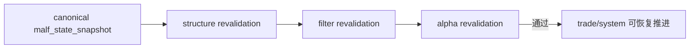

# downstream truthfulness revalidation after malf canonicalization 规格

日期：`2026-04-11`
状态：`待执行`

本规格适用于 `32-downstream-truthfulness-revalidation-after-malf-canonicalization-card-20260411.md` 及其后续 evidence / record / conclusion。

## 目标

在 canonical malf 之后，重新确认 `structure / filter / alpha` 主线 truthfulness，并用真实数据做最小复核。

## 最小证据

1. bounded revalidation 命令
2. 关键账本摘要
3. 对 canonical malf 是否已成为正式上游的结论裁决

## 流程图

