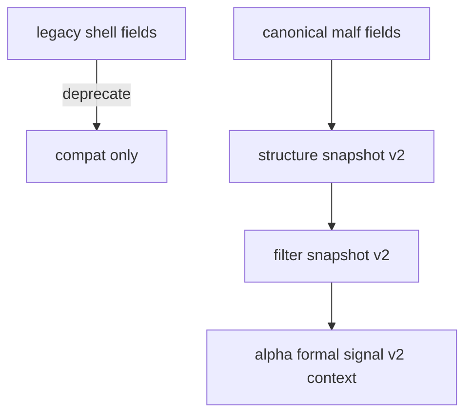

# malf downstream canonical contract purge 规格

日期：`2026-04-11`
状态：`待执行`

本规格适用于 `33-malf-downstream-canonical-contract-purge-card-20260411.md` 及其后续 evidence / record / conclusion。

## 目标

把 `structure / filter / alpha` 的正式合同从 bridge-era 字段壳切换到 canonical `malf` 字段族。

## 最小合同范围

1. `structure` 至少正式读入：
   - `major_state`
   - `trend_direction`
   - `reversal_stage`
   - `wave_id`
   - `current_hh_count`
   - `current_ll_count`
2. `filter` 至少正式读入：
   - `structure` 的 canonical 结构字段
   - canonical `malf` 的 `break/stats` sidecar 引用或透传字段
3. `alpha` 至少正式透传：
   - `major_state`
   - `reversal_stage`
   - `wave_id`
   - `current_hh_count/current_ll_count`

## 合同切换图

## 最小证据

1. `structure / filter / alpha` 不再把 `malf_context_4 / new_high_count / lifecycle_rank_*` 作为正式主输入。
2. 新增或更新单元测试，验证 canonical 字段贯穿 `structure -> filter -> alpha`。
3. `conclusion` 明确旧字段壳的正式地位已降级为兼容桥。
