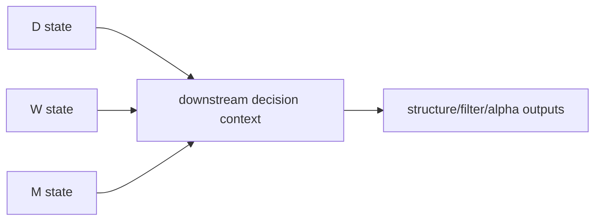

# malf multi-timeframe downstream consumption 规格

日期：`2026-04-11`
状态：`待执行`

本规格适用于 `34-malf-multi-timeframe-downstream-consumption-card-20260411.md`。

## 目标

把 canonical `malf` 的 `W/M` 读数正式接入下游消费合同，同时保持只读边界。

## 最小合同

1. `structure` 或 `filter` 至少新增：
   - `daily_major_state`
   - `weekly_major_state`
   - `monthly_major_state`
   - `weekly_reversal_stage`
   - `monthly_reversal_stage`
   - 对应 `source_context_nk`
2. `alpha` 至少能只读透传周/月 canonical 上下文。
3. 不允许因为 `weekly/monthly` 读数改变 `daily` 的 `malf core` 计算结果。

## 多级别消费图

## 最小证据

1. 单元测试证明 `D/W/M` 读数可以同时进入下游正式合同。
2. 单元测试证明高周期读数不反向改变 `D` 级别结构真值。
3. `conclusion` 明确周/月 context 只是只读消费层。
