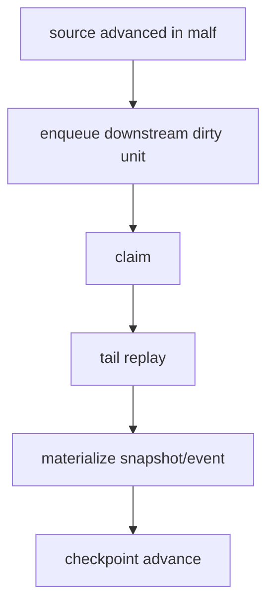

# downstream data-grade checkpoint alignment after malf 规格

日期：`2026-04-11`
状态：`待执行`

本规格适用于 `35-downstream-data-grade-checkpoint-alignment-after-malf-card-20260411.md`。

## 目标

让 `structure / filter / alpha` 正式具备 `work_queue + checkpoint + replay`，并与 canonical `malf` 边界对齐。

## 最小表族

每个模块至少应具备：

1. `*_run`
2. `*_work_queue`
3. `*_checkpoint`
4. 正式 snapshot/event 表

## 续跑图

## 最小证据

1. `structure / filter / alpha` 的 queue/checkpoint 表正式落地。
2. 有单元测试或可复现命令证明 replay/resume 生效。
3. `conclusion` 明确下游默认增量口径已不再依赖全窗口重跑。
