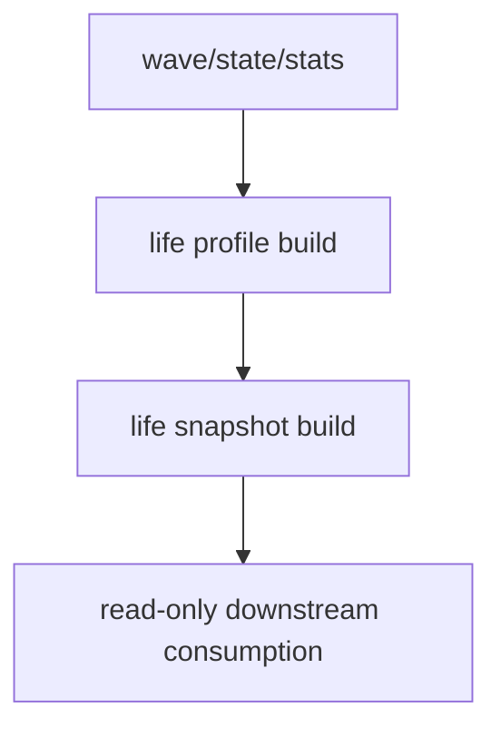

# malf wave life probability sidecar 规格

日期：`2026-04-11`
状态：`待执行`

本规格适用于 `36-malf-wave-life-probability-sidecar-bootstrap-card-20260411.md`。

## 目标

为 canonical `malf` 增补正式寿命概率 sidecar。

## 最小表族

1. `malf_wave_life_run`
2. `malf_wave_life_work_queue`
3. `malf_wave_life_checkpoint`
4. `malf_wave_life_snapshot`
5. `malf_wave_life_profile`

## 最小字段

1. `wave_life_percentile`
2. `remaining_life_bars_p50`
3. `remaining_life_bars_p75`
4. `termination_risk_bucket`
5. `sample_size`
6. `sample_version`

## 处理图

## 最小证据

1. 寿命快照与寿命 profile 可以 batch + increment + resume 正式运行。
2. 单元测试或可复现命令证明活跃 wave 与已完成 wave 分别建模。
3. `conclusion` 明确其是 sidecar，不是 `malf core`。
