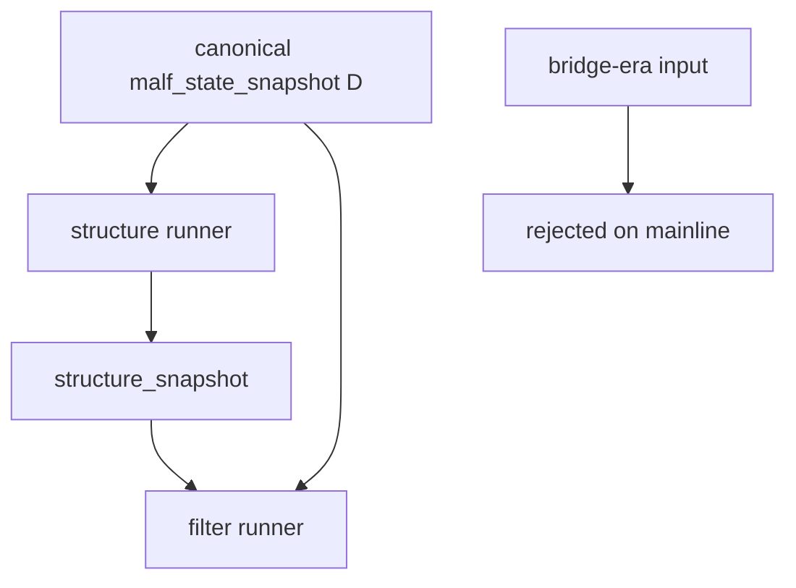

# structure filter 主线旧版 malf 语义清理规格

日期：`2026-04-13`
状态：`生效中`

> 本规格冻结 `38` 之后 `structure / filter` 的正式主线契约。目标不是再做一次“默认改绑”，而是把旧版 malf 语义从主线实现层彻底退出。

## 适用范围

本规格覆盖：

1. `src/mlq/structure/*`
2. `src/mlq/filter/*`
3. `scripts/structure/run_structure_snapshot_build.py`
4. `scripts/filter/run_filter_snapshot_build.py`
5. `tests/unit/structure/*`
6. `tests/unit/filter/*`
7. 与主线真值复核直接相关的 `tests/unit/system/*`

本规格不覆盖：

1. `scripts/malf/run_malf_snapshot_build.py` 的 bridge v1 兼容输出
2. `scripts/malf/run_malf_mechanism_build.py` 的 sidecar 账本
3. `alpha` 五触发扩编本身

## 正式输入契约

### `structure`

正式输入固定为：

1. `malf_state_snapshot`
2. `timeframe='D'`
3. `asset_type='stock'`

只读可选 sidecar：

1. `pivot_confirmed_break_ledger`
2. `same_timeframe_stats_snapshot`

禁止事项：

1. 不再接受 `pas_context_snapshot`
2. 不再接受 `structure_candidate_snapshot`
3. 不再根据 bridge-era 列结构自动降级到旧 loader

### `filter`

正式输入固定为：

1. `structure_snapshot`
2. `malf_state_snapshot`
3. `timeframe='D'`

禁止事项：

1. 不再把 bridge-era `pas_context_snapshot` 视为主线 context
2. 不再通过旧字段兼容壳重建 `malf` 主语义

## 正式行为契约

### 1. 参数约束

`run_structure_snapshot_build(...)` 与 `run_filter_snapshot_build(...)` 必须满足：

1. 默认仍指向 canonical 官方表
2. 若显式传入 bridge-era 表名，runner 应直接拒绝，而不是静默兼容
3. bounded window 与 queue/replay 仍保留

### 2. 旧语义清理

以下逻辑不得继续存在于主线判断路径：

1. `_map_legacy_context_code_to_major_state`
2. `malf_context_4.startswith("BULL_"/"BEAR_")` 驱动结构判断
3. `lifecycle_rank_*` 充当 `structure / filter` 主判断输入

### 3. 测试契约

单元测试与主线复核测试必须改为：

1. 直接构造 canonical `malf_state_snapshot`
2. 只在显式兼容测试中出现 bridge-era 表
3. 不再把 bridge-era 夹具当作主线默认样本

## 历史账本约束

1. 实体锚点：`asset_type + code`
2. 业务自然键：
   - `structure_snapshot_nk`
   - `filter_snapshot_nk`
   - `asset_type + code + timeframe` checkpoint
3. 批量建仓：允许按 bounded window 重新物化 canonical 官方历史区间
4. 增量更新：默认走 `work_queue + checkpoint + tail replay`
5. 断点续跑：依赖 `source_fingerprint + last_completed_bar_dt + tail_*`
6. 审计账本：各模块 `run / run_snapshot / checkpoint / work_queue`

## 验收要求

1. `structure / filter` 主线测试不再依赖 bridge-era 表
2. 显式传入 bridge-era 表名时，runner 给出清晰错误
3. canonical `structure -> filter -> alpha` 主线 smoke 仍通过

## 规格图

