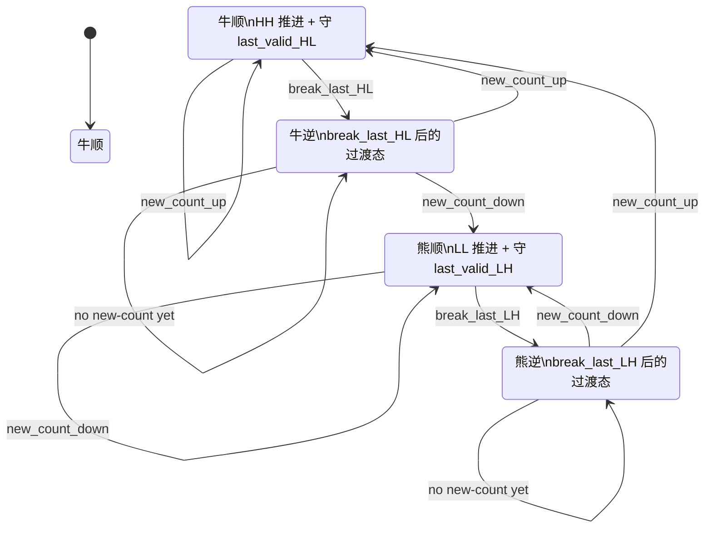
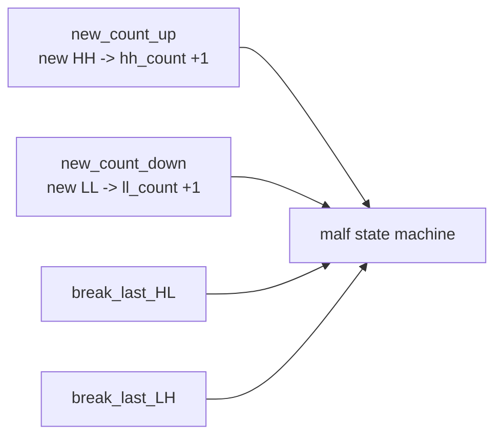
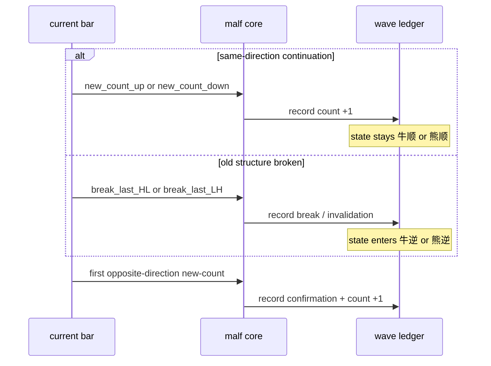

# malf 最新权威时间级别原生账本规格

适用执行卡：

- `80-malf-zero-one-wave-filter-boundary-freeze-card-20260418.md`
- `91-malf-timeframe-native-base-source-rebind-card-20260418.md`
- `92-structure-thin-projection-and-day-binding-card-20260418.md`
- `93-filter-objective-gate-and-note-sidecar-demotion-card-20260418.md`
- `94-alpha-dual-axis-decision-rebind-and-formal-cutover-card-20260418.md`
- `95-malf-alpha-official-truthfulness-and-cutover-gate-card-20260418.md`

## 1. 权威地位

本文档是当前 `malf` 的单点权威规格。

`docs/02-spec/modules/malf/01-14` 继续保留为历史切片规格；当需要回答“当前 `malf` 整体应该是什么”时，以本文档为准。

## 2. 官方数据库与 runner 入口

### 2.1 official canonical

`malf` 官方 canonical 数据库固定为：

1. `H:\Lifespan-data\malf\malf_day.duckdb`
2. `H:\Lifespan-data\malf\malf_week.duckdb`
3. `H:\Lifespan-data\malf\malf_month.duckdb`

对应正式 runner 入口固定为：

1. `scripts/malf/run_malf_canonical_build.py`
2. `scripts/malf/run_malf_snapshot_build.py`
3. `scripts/malf/run_malf_mechanism_build.py`
4. `scripts/malf/run_malf_wave_life_build.py`
5. `scripts/malf/run_malf_zero_one_wave_audit.py`

### 2.2 legacy fallback

`H:\Lifespan-data\malf\malf.duckdb` 只保留 `legacy fallback` 地位，不再是默认官方真值库。

## 3. source contract

### 3.1 canonical truth

`canonical` source contract 固定为：

1. `malf_day <- market_base_day.stock_daily_adjusted(adjust_method='backward')`
2. `malf_week <- market_base_week.stock_weekly_adjusted(adjust_method='backward')`
3. `malf_month <- market_base_month.stock_monthly_adjusted(adjust_method='backward')`

禁止事项：

1. `malf_week/month` 不允许默认从 `day` 内部重采样
2. 不允许把 `market_base_week/month` 写回 `malf_day`
3. 不允许继续把 bridge v1 当 canonical source

### 3.2 bridge v1

`run_malf_snapshot_build.py` 继续只消费：

- `market_base.stock_daily_adjusted(adjust_method='backward')`

它的职责仅限：

- `pas_context_snapshot`
- `structure_candidate_snapshot`
- `malf_run_context_snapshot`
- `malf_run_structure_snapshot`

它不得冒充 canonical truth。

## 4. canonical 表族合同

每个官方 timeframe native 库都必须承载下列 canonical 表族：

1. `malf_canonical_run`
2. `malf_canonical_work_queue`
3. `malf_canonical_checkpoint`
4. `malf_pivot_ledger`
5. `malf_wave_ledger`
6. `malf_extreme_progress_ledger`
7. `malf_state_snapshot`
8. `malf_same_level_stats`

### 4.1 单值 timeframe 约束

每个库都必须满足：

1. 允许保留 `timeframe` 列
2. 该列只能出现单一 native timeframe
3. `malf_ledger_contract(storage_mode='official_native')` 必须存在

### 4.2 历史账本语义

1. `run_id` 只做审计，不做业务主语义
2. `wave_id / pivot_nk / snapshot_nk` 继续承担 canonical 自然键语义
3. `work_queue / checkpoint` 只允许用于续跑，不允许反写结构真值

## 5. 结构语义合同

### 5.1 core primitive

`malf core` 只允许以下原语：

- `HH`
- `HL`
- `LL`
- `LH`
- `break`
- `count`

### 5.1.1 四态 + 四事件终极版

当前正式规格把 `malf` 总状态机冻结为：

1. 四态
   - `牛顺`
   - `牛逆`
   - `熊顺`
   - `熊逆`
2. 四事件
   - `new_count_up`
     - 等价于：新的有效 `HH`
     - 副作用：`hh_count += 1`
   - `new_count_down`
     - 等价于：新的有效 `LL`
     - 副作用：`ll_count += 1`
   - `break_last_HL`
     - 等价于：击穿最后有效 `HL`
   - `break_last_LH`
     - 等价于：上破最后有效 `LH`

关键冻结：

1. `count` 必须以事件方式进入状态机，而不是只作为静态字段存在。
2. `break` 必须绑定到 `last_valid_HL / last_valid_LH`，不能抽象成无锚点的“突破”。
3. `HL / LH` 是结构锚点，不是推进计数。
4. `HH / LL` 是推进确认来源，不是背景标签。

### 5.2 state contract

`major_state` 只允许：

- `牛顺`
- `牛逆`
- `熊顺`
- `熊逆`

`reversal_stage` 只允许：

- `none`
- `trigger`
- `hold`
- `expand`

### 5.2.1 四态状态机共用图

### 5.3 break / confirmation 边界

1. `break` 只表示旧结构失效，不代表新顺结构已成立
2. 新方向仍需新的 `HH` 或 `LL` 推进确认
3. `pivot_confirmed_break` 只允许作为 `malf` 之外的 readonly mechanism fact
4. 在总状态机里，真正承载确认职责的是第一笔 opposite-direction `new-count`

### 5.4 四事件语义图

### 5.5 推进 / 失效 / 确认时序图

## 6. readonly sidecar contract

### 6.1 mechanism

`run_malf_mechanism_build.py` 只允许输出：

- `pivot_confirmed_break_ledger`
- `same_timeframe_stats_profile`
- `same_timeframe_stats_snapshot`

它不得反写 canonical `state / wave / break / count`。

### 6.2 wave life

`run_malf_wave_life_build.py` 只允许只读消费：

- `malf_wave_ledger`
- `malf_state_snapshot`
- `malf_same_level_stats`

并输出：

- `malf_wave_life_run`
- `malf_wave_life_work_queue`
- `malf_wave_life_checkpoint`
- `malf_wave_life_snapshot`
- `malf_wave_life_profile`

### 6.3 zero/one audit

`run_malf_zero_one_wave_audit.py` 只允许只读消费：

- `malf_day`
- `malf_week`
- `malf_month`

并输出：

- `summary.json`
- `report.md`
- `detail.csv`

分类合同固定为：

1. `same_bar_double_switch`
2. `stale_guard_trigger`
3. `next_bar_reflip`

## 7. `0/1 wave` 治理合同

1. canonical truth 不得静默删除或篡改 `bar_count in {0,1}` 的已完成 wave
2. downstream 若需要过滤，只能通过 readonly projection / sidecar 实现
3. 任何 `canonical_materialization` 改写、`bar_count` 归属调整、stale guard 合同调整或三库重建，都必须先后各跑一版 `run_malf_zero_one_wave_audit.py`
4. audit baseline 必须至少保留：
   - 总短 wave 数
   - 三类分类计数
   - 分 timeframe 摘要
   - 代表样本

## 8. build / replay / rebuild 合同

### 8.1 full coverage

`run_malf_canonical_build.py --limit 0` 是 official full coverage build 入口。

收口要求：

1. `malf_day / week / month` 都必须完成 official full coverage
2. 每库 `checkpoint` 都必须追平官方 source 尾部
3. full coverage 证据必须给出 `scope / checkpoint / date-range / freshness` 摘要

### 8.2 incremental

增量更新固定为：

1. 每个 timeframe 独立 `work_queue`
2. 每个 timeframe 独立 `checkpoint`
3. 中断后必须围绕对应 timeframe 库独立恢复

### 8.3 rebuild

如果决定重建 `malf_day / malf_week / malf_month`：

1. 必须先保存变更前 `0/1` audit baseline
2. 再执行 rebuild
3. 再保存变更后 baseline
4. 最后才允许进入 `95` cutover truthfulness 判定

## 9. downstream contract

### 9.1 structure

`structure` 默认只读：

1. `malf_day.malf_state_snapshot`
2. `malf_week.malf_state_snapshot`
3. `malf_month.malf_state_snapshot`

它只允许形成 thin projection，不得重定义 `malf core`。

### 9.2 filter

`filter` 只允许把 `malf` 当作结构上下文；它的 hard block 只来自 objective tradability / universe gate。

### 9.3 alpha

`alpha` 持有最终决策主权，但只允许消费 canonical truth 与 readonly sidecar，不得反推 `malf` 结构定义。

## 10. 当前权威阅读顺序

