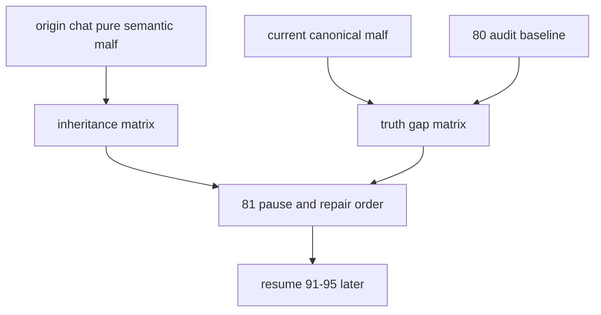

# malf 原始对话语义回溯与当前真值偏差冻结规格

适用执行卡：

- `81-malf-origin-chat-semantic-truth-gap-freeze-card-20260419.md`

## 1. 规格目的

本规格不直接改 `malf` 算法。

本规格只冻结三类正式事实：

1. 原始对话里哪一版 `malf` 语义是当前正式对齐对象
2. 当前系统 `malf` 与该语义之间的继承矩阵与偏差矩阵
3. 彻底修 `malf` 时的前置顺序与暂停边界

## 2. 原始语义锚点合同

### 2.0 分层说明

origin-chat `malf` 必须拆成两层读取：

1. 早期重型版：
   - `malf = 多级别极值推进账本 + 执行账本接口`
   - 带 `execution_interface`
   - 带 higher timeframe context 消费
   - 带较重的状态/动作接口
2. 最终纯语义版：
   - 去掉 execution interface
   - 去掉 context 对结构计算的反馈
   - 只保留 `HH / HL / LL / LH / break / count`
   - 把 `break != confirmation` 说死

### 2.1 接受为当前对齐对象

当前正式对齐对象固定为聊天里最后收敛出的“纯语义版 malf”：

1. `malf` 只读 `price bar`
2. 原语只允许 `HH / HL / LL / LH / break / count`
3. 各 timeframe 独立运行
4. `break` 只表示旧结构失效
5. 新结构必须由新的 `HH / LL` 推进确认

### 2.2 明确不再对齐的早期元素

以下聊天内容只保留为历史来路，不再作为当前 `malf` 直接目标：

1. `execution_interface`
2. `allowed_actions`
3. `confidence`
4. 直接交易动作接口
5. 把高周期 context 写入 `malf core`

### 2.3 必须保留的 origin 直觉

尽管最终不再对齐早期重型版，但以下 origin 直觉必须保留为后续 truth contract 的语义来源：

1. `LL` / `HH` 负责推进
2. `LH` / `HL` 负责最后有效结构门槛
3. 第一个被突破的有效 `LH / HL` 属于旧结构失效门槛
4. 日线 break 可能是假，周月更难假，但任何级别都必须经过确认
5. 统计对象必须是 wave，不得跨级别混样本

## 3. 继承矩阵

### 3.1 已继承

当前系统 `malf` 已正式继承：

1. timeframe native `D/W/M` 独立世界
2. `malf` 与 execution / decision 解耦
3. same-timeframe stats sidecar 只读化
4. 高周期 context 不回写 `malf core`

### 3.2 未忠实实现

当前系统 `malf` 尚未忠实实现：

1. `break != confirmation` 的正式账本分层
2. `trigger -> hold -> expand` 的正式 truth contract
3. “失效”和“新顺结构成立”之间的过渡态稳定记账
4. 最近有效结构门槛的稳定更新
5. `LL` 推进与最近 `LH` break 的关系仍未被稳定记账为统一 truth contract

## 3.3 差异回答合同

以后凡是回答“当前系统 `malf` 和聊天里的 `malf` 差异大不大”，统一按下面两层答：

1. 对早期重型版：差异大，而且是有意减法
2. 对最终纯语义版：架构差异不大，truthfulness 偏差很大

禁止只回答其中一层。

## 4. 偏差矩阵

### 4.1 架构偏差

裁决：

1. 当前架构主轴没有偏离 origin-chat 最终纯语义版
2. 不存在“需要把 execution_interface 放回 malf”这种回退方向

### 4.2 truthfulness 偏差

以下视为重大 truthfulness 偏差：

1. `0/1 wave` 系统性爆发
2. 同 bar 双切制造 `bar_count=0`
3. 次 bar 回翻制造海量 `bar_count=1`
4. stale guard 长期复用放大转折噪声

### 4.3 审计基线

`80` 的只读审计结果固定为当前偏差基线：

1. `same_bar_double_switch = 243,757`
2. `stale_guard_trigger = 14,085,407`
3. `next_bar_reflip = 2,663,005`
4. `total_short_wave_count = 16,992,169`

任何后续修订都必须围绕这组基线做前后对照。

## 5. 暂停与恢复边界

### 5.1 暂停

在 `81` 未收口前：

1. `92-95` 不再视为当前最近施工位
2. `91-95` 只保留为已经远置的 downstream cutover 卡组

### 5.2 恢复条件

只有在下列内容被正式冻结后，才允许恢复 `91-95`：

1. origin-chat 语义锚点
2. 当前 truth gap 矩阵
3. `break / invalidation / confirmation` 正式合同
4. stale guard 治理边界
5. rebuild 是否需要执行的裁决

## 6. 后续修订顺序合同

`81` 之后正式顺序固定为：

1. 冻结 origin-chat 语义与当前偏差矩阵
2. 冻结 `break / invalidation / confirmation` 合同
3. 冻结 stale guard 治理边界
4. 如有必要，执行 `malf_day / malf_week / malf_month` rebuild
5. 用 `run_malf_zero_one_wave_audit.py` 保留前后对照
6. 再恢复 `91-95`

## 7. 非目标

本规格不做：

1. 直接改 `canonical_materialization.py`
2. 直接重建三库
3. 直接推进 `92-95`
4. 把早期聊天里较重的 execution 接口重新塞回 `malf`

## 8. 规格图

