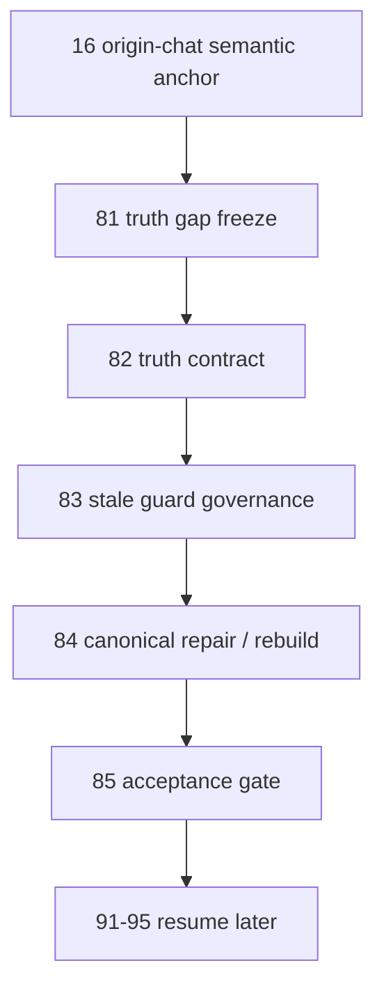
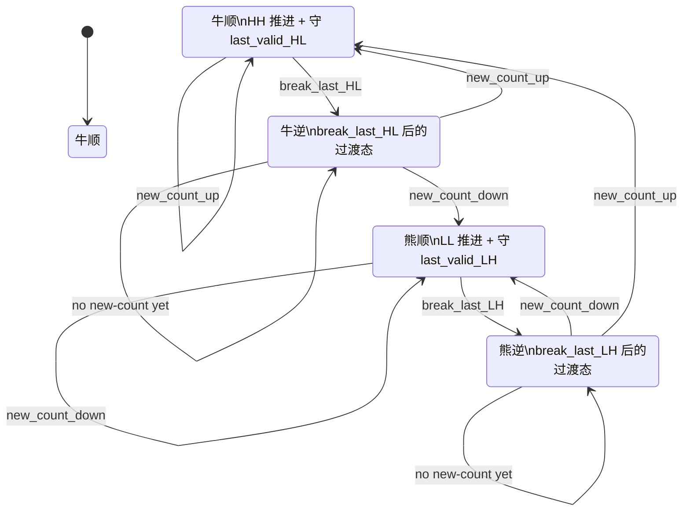
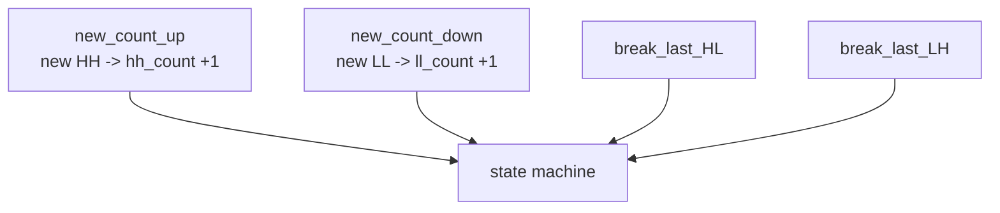
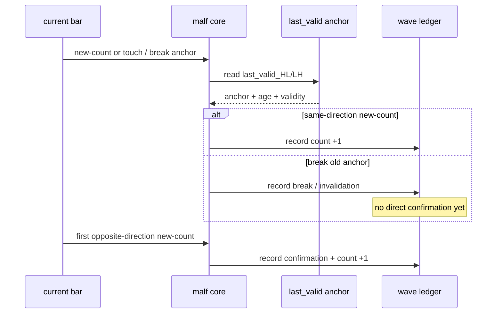

# malf truth contract、stale guard 与 rebuild 治理总规格
适用执行卡：

- `82-malf-break-invalidation-confirmation-contract-freeze-card-20260419.md`
- `83-malf-last-valid-structure-anchor-and-stale-guard-governance-card-20260419.md`
- `84-malf-canonical-materialization-repair-and-three-ledger-rebuild-card-20260419.md`
- `85-malf-post-rebuild-truthfulness-and-audit-acceptance-gate-card-20260419.md`

## 1. 规格目标

本规格把 `81` 之后的 `malf` 修订顺序冻结为四步：

1. `82`：truth contract
2. `83`：stale guard governance
3. `84`：canonical repair + rebuild
4. `85`：acceptance gate

## 2. 正式合同

### 2.1 `new-count / break / invalidation / confirmation`

1. `new-count`
   - 只表示当前方向创出新的有效 `HH / LL`，并对当前 wave 的 `hh_count / ll_count` 执行 `+1`。
   - 它是 continuation 的正式事件，而不是附属字段说明。
   - 当它发生在过渡态时，它也是新顺结构确认的正式事件载体。
2. `break`
   - 只表示对最后有效结构门槛的突破。
   - 不是新顺结构成立。
3. `invalidation`
   - 只表示旧顺结构失效已被正式记账。
   - 允许进入本级别过渡态。
4. `confirmation`
   - 只允许由新的 `HH / LL` 推进确认。
   - 不允许由单个 `break` 直接替代。
   - 在事件层，`confirmation` 必须落到“第一笔有效 `new-count`”。

### 2.2 `last_valid_HL / last_valid_LH`

1. 必须可追溯到本级别已确认的结构锚点。
2. 必须声明何时写入、何时仍有效、何时失效。
3. 必须能审计 guard 年龄与复用次数。
4. 不允许把“很久以前的锚点仍未被新结构刷新”默默当成正常状态。

### 2.3 `0/1 wave`

1. `0/1 wave` 是 canonical truthfulness 问题。
2. `same_bar_double_switch / stale_guard_trigger / next_bar_reflip` 三分类继续作为统一审计口径。
3. 后续代码改写与三库重建必须保留同口径前后对照。

## 3. 卡组输入输出

### `82` 输入输出

输入：

1. `16` origin-chat 语义回函
2. `17` 设计/规格
3. `80` 零一波段审计
4. `81` truth gap 冻结

输出：

1. `break / invalidation / confirmation` 正式合同
2. `new-count` 的 continuation / confirmation 双重职责
3. 过渡态记账边界
4. 不允许再把 `break` 当成新顺确认的裁决

### `83` 输入输出

输入：

1. `82` truth contract
2. `80` stale guard 统计基线
3. 当前 canonical `last_valid_HL / last_valid_LH` 账本行为

输出：

1. `last_valid_HL / last_valid_LH` 生命周期合同
2. stale guard 审计边界
3. guard 复用可接受/不可接受情形

### `84` 输入输出

输入：

1. `82`
2. `83`
3. 变更前 `run_malf_zero_one_wave_audit.py` 基线

输出：

1. `canonical_materialization` 正式修订
2. `malf_day / malf_week / malf_month` 必要时的重建方案与执行证据
3. 变更后同口径零一波段对照

### `85` 输入输出

输入：

1. `84` 修订结果
2. 零一波段前后对照
3. truthfulness 复核证据

输出：

1. `malf` 扳正是否通过正式裁决
2. 是否允许恢复 `91-95`
3. 若不通过，明确退回 `82-84` 的哪一层继续修

## 4. 结构图

## 4.1 终极版共用总图

这张图与 `malf/15` 共用，代表当前 `malf` 的正式最终状态机口径。

## 5. 状态机规格图

## 6. 时序规格图

## 7. 非目标

1. 不新增 `malf core` 原语
2. 不恢复 `context` 回写 `malf core`
3. 不在 `82-83` 之前提前修改 canonical 代码
4. 不在 `85` 之前恢复 `91-95`
