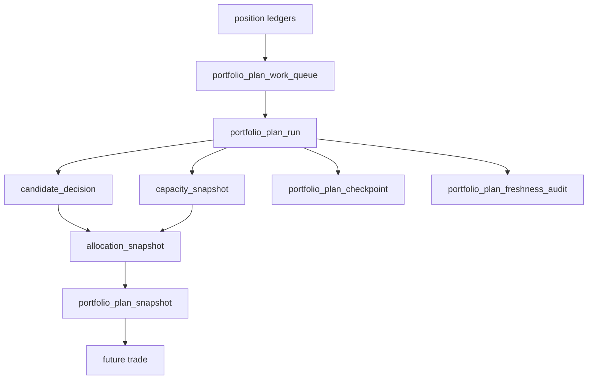

# portfolio_plan 官方账本族与容量裁决规格

日期：`2026-04-13`
状态：`生效中`

## 适用范围

本规格用于把 `portfolio_plan` 从最小桥接层升级为官方组合裁决账本层。

本规格覆盖：

1. 正式输入边界
2. 正式输出表族
3. 实体锚点与业务自然键
4. 组合裁决与容量支撑点

本规格不覆盖：

1. `trade` 成交账本
2. broker runtime
3. 多账户全量组合研究系统

## 正式输入

`portfolio_plan` 只允许消费下面这些正式输入：

1. `position_candidate_audit`
2. `position_capacity_snapshot`
3. `position_sizing_snapshot`
4. 组合配置表或组合合同参数

最小必需字段：

1. `candidate_nk`
2. `instrument`
3. `policy_id`
4. `reference_trade_date`
5. `candidate_status`
6. `position_action_decision`
7. `final_allowed_position_weight`
8. `required_reduction_weight`

## 正式输出表族

`v2` 官方表族冻结为：

1. `portfolio_plan_run`
2. `portfolio_plan_work_queue`
3. `portfolio_plan_checkpoint`
4. `portfolio_plan_candidate_decision`
5. `portfolio_plan_capacity_snapshot`
6. `portfolio_plan_allocation_snapshot`
7. `portfolio_plan_snapshot`
8. `portfolio_plan_run_snapshot`
9. `portfolio_plan_freshness_audit`

## 表职责

### 1. `portfolio_plan_candidate_decision`

职责：

1. 记录单候选在组合层的最终裁决
2. 记录 `admitted / blocked / trimmed / deferred`
3. 记录组合层 blocking / trimming 原因

自然键：

`candidate_nk + portfolio_id + reference_trade_date + plan_contract_version`

### 2. `portfolio_plan_capacity_snapshot`

职责：

1. 记录组合容量上限
2. 记录已用、剩余和当前 scope
3. 记录容量裁决依据

自然键：

`portfolio_id + capacity_scope + reference_trade_date + plan_contract_version`

### 3. `portfolio_plan_allocation_snapshot`

职责：

1. 记录最终分配权重
2. 记录裁减前后差异
3. 记录进入下游 `trade` 之前的正式组合计划

自然键：

`candidate_nk + portfolio_id + allocation_scene + reference_trade_date + plan_contract_version`

### 4. `portfolio_plan_snapshot`

职责：

1. 作为兼容读取和系统级 readout 的聚合层
2. 不再承担唯一主语义职责

### 5. `portfolio_plan_run`

职责：

1. 记录批次与审计元数据
2. 挂载 summary/freshness/readout

### 6. `portfolio_plan_work_queue`

职责：

1. 记录待处理候选或待处理日期切片
2. 支持增量与断点恢复

自然键：

`portfolio_id + candidate_nk + reference_trade_date + queue_reason`

### 7. `portfolio_plan_checkpoint`

职责：

1. 记录某个组合范围下已完成到哪一步
2. 支持 replay/resume

自然键：

`portfolio_id + checkpoint_scope`

### 8. `portfolio_plan_run_snapshot`

职责：

1. 记录本次 run 命中了哪些业务真值
2. 记录 `inserted / reused / rematerialized`

### 9. `portfolio_plan_freshness_audit`

职责：

1. 记录每个 `portfolio_id` 最近覆盖到的 `reference_trade_date`
2. 形成组合层 freshness 审计读数

## 裁决逻辑边界

允许：

1. 组合层总容量上限
2. 组内排序与裁减
3. admitted / blocked / trimmed / deferred

禁止：

1. 回答触发是否成立
2. 改写 `position` sizing 主语义
3. 直接变成 `trade` 执行计划

## 批量建仓

必须支持：

1. 按 `portfolio_id` 批量建仓
2. 按 `reference_trade_date` 窗口回放
3. 按候选切片或标的切片重放

## 增量更新

必须支持：

1. 新增 `position` 候选触发增量
2. 组合配置变更触发重物化
3. 容量约束版本变化触发 `rematerialized`

## 断点续跑

必须支持：

1. `work_queue`
2. `checkpoint`
3. selective replay
4. `run_snapshot` 审计桥接

## freshness audit

最小审计项：

1. `portfolio_id`
2. `latest_reference_trade_date`
3. `expected_reference_trade_date`
4. `freshness_status`
5. `last_run_id`

## 图示

