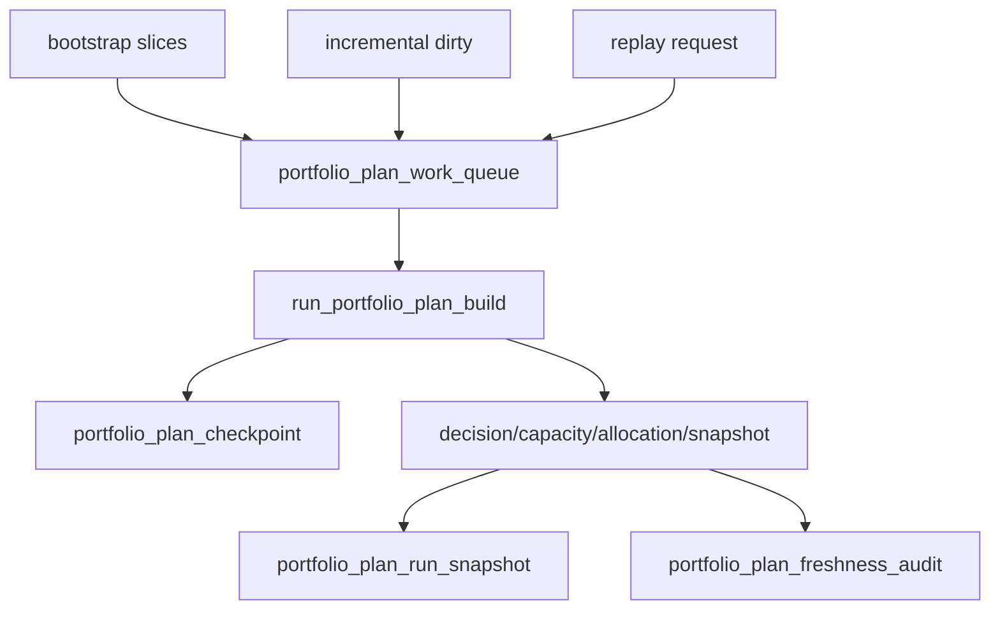

# portfolio_plan data-grade runner 与 freshness 规格

日期：`2026-04-13`
状态：`生效中`

## Runner 入口

正式 Python 入口继续固定为：

`run_portfolio_plan_build(...)`

正式脚本入口继续固定为：

`scripts/portfolio_plan/run_portfolio_plan_build.py`

## data-grade 扩展

正式 `v2` runner 必须新增支持：

1. `bootstrap_mode`
2. `incremental_mode`
3. `replay_mode`
4. `portfolio_id` 切片
5. `reference_trade_date` 窗口
6. `candidate_nk / instrument` 切片

## work_queue

最小字段：

1. `queue_nk`
2. `portfolio_id`
3. `candidate_nk`
4. `reference_trade_date`
5. `queue_reason`
6. `queued_at`
7. `queue_status`
8. `source_run_id`

## checkpoint

最小字段：

1. `checkpoint_nk`
2. `portfolio_id`
3. `checkpoint_scope`
4. `last_completed_reference_trade_date`
5. `last_completed_candidate_nk`
6. `last_run_id`
7. `updated_at`

## replay

必须支持：

1. 只重放指定 queue 范围
2. 只重放某个组合窗口
3. 只重放 rematerialized 候选

## freshness audit

最小字段：

1. `portfolio_id`
2. `audit_date`
3. `latest_reference_trade_date`
4. `expected_reference_trade_date`
5. `freshness_status`
6. `last_success_run_id`

## 审计动作

`portfolio_plan_run_snapshot.materialization_action` 继续冻结为：

1. `inserted`
2. `reused`
3. `rematerialized`

## 计算原则

1. 先只消费正式 `position` 账本
2. 先写中间正式组合账本，再给下游消费
3. 不允许为了加速而跳过中间持久化

## 图示

