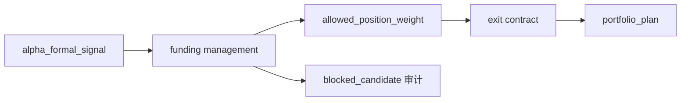

# position 资金管理与退出合同规格

日期：`2026-04-09`
状态：`生效中`

## 适用范围

本规格用于冻结新仓 `position` 模块的最小正式输入、正式输出、自然键规则、增量规则与当前激活的资金管理方法边界。

## 正式输入

`position` 当前正式输入固定为四类：

1. `alpha` 的 formal signal 账本输出
   - 至少包含：
     - 上游自然键
     - `instrument`
     - `signal_date`
     - `pattern / trigger_code`
     - `trigger_admissible`
     - 上下文字段与版本字段
2. `market_base`
   - 用于 `reference_trade_date / reference_price / share_lot_rule`
3. 上一期已冻结的当前持仓/剩余仓位快照
   - 当前允许来自正式 `trade_runtime` 或后续正式组合快照读模型
   - 只作为读入事实，不赋予 `position` 改写下游的权力
4. `position_policy_registry`
   - 已启用的资金管理方法、退出方法与版本口径

## 正式输出

`position` 的正式落点固定为模块级历史账本 `position`。

当前正式表族冻结为：

1. `position_run`
2. `position_policy_registry`
3. `position_candidate_audit`
4. `position_capacity_snapshot`
5. `position_sizing_snapshot`
6. `position_funding_fixed_notional_snapshot`
7. `position_funding_single_lot_snapshot`
8. `position_exit_plan`
9. `position_exit_leg`

预留但当前不启用的正式表位：

1. `position_funding_probe_confirm_snapshot`
2. 其他遵循 `position_funding_<family>_snapshot` 模式的方法分表

## 表合同

### 1. `position_run`

用途：

1. 记录一次正式 position 运行的批次信息
2. 关联上游输入版本、策略版本和环境元数据

规则：

1. `run_id` 只做审计，不做历史主语
2. 同一自然键对象允许在不同 `run_id` 中重复出现，但不得覆盖旧事实

### 2. `position_policy_registry`

用途：

1. 登记资金管理方法族
2. 登记退出方法族
3. 登记版本、启用状态、备注和废弃时间

最小字段：

1. `policy_id`
2. `policy_family`
3. `policy_version`
4. `entry_leg_role_default`
5. `exit_family`
6. `is_active`
7. `effective_from`
8. `effective_to`

### 3. `position_candidate_audit`

用途：

1. 保留 admitted / blocked candidate
2. 回答“这次为什么没做”

最小字段：

1. `candidate_nk`
2. 上游 `signal_nk`
3. `policy_id`
4. `reference_trade_date`
5. `candidate_status`
6. `blocked_reason_code`
7. `context_code`
8. `audit_note`

状态枚举：

1. `admitted`
2. `blocked`
3. `deferred`

### 4. `position_capacity_snapshot`

用途：

1. 显式落下上下文上限与真实容量约束
2. 为 `trim_to_context_cap` 提供真相源

最小字段：

1. `capacity_snapshot_nk`
2. `candidate_nk`
3. `current_position_weight`
4. `context_max_position_weight`
5. `remaining_single_name_capacity_weight`
6. `remaining_portfolio_capacity_weight`
7. `final_allowed_position_weight`
8. `required_reduction_weight`
9. `capacity_source_code`

规则：

1. `final_allowed_position_weight` 必须显式落列。
2. `required_reduction_weight` 允许为 `0`，但不能省略。
3. `remaining_portfolio_capacity_weight` 当前可以先消费正式组合快照读模型；缺失时必须明确写出来源状态，不允许静默回退成口头常量。

### 5. `position_sizing_snapshot`

用途：

1. 给出最终允许持仓、目标股数与动作裁决
2. 成为 `trade / system` 后续消费的最小稳定出口

最小字段：

1. `sizing_snapshot_nk`
2. `candidate_nk`
3. `policy_id`
4. `entry_leg_role`
5. `position_action_decision`
6. `target_weight`
7. `target_notional`
8. `target_shares`
9. `final_allowed_position_weight`
10. `required_reduction_weight`
11. `reference_price`
12. `reference_trade_date`

动作枚举：

1. `open_up_to_context_cap`
2. `hold_at_cap`
3. `trim_to_context_cap`
4. `reject_open`
5. `closeout_by_exit_plan`

角色枚举：

1. `base_entry`
2. `probe_entry`
3. `confirm_add`
4. `protective_trim`
5. `closeout`

当前激活角色：

1. `base_entry`
2. `protective_trim`
3. `closeout`

### 6. `position_funding_fixed_notional_snapshot`

用途：

1. 记录 `FIXED_NOTIONAL_CONTROL` 的方法内参数与计算结果

最小字段：

1. `family_snapshot_nk`
2. `candidate_nk`
3. `policy_id`
4. `target_notional_before_cap`
5. `target_shares_before_cap`
6. `cap_trim_applied`
7. `final_target_shares`

### 7. `position_funding_single_lot_snapshot`

用途：

1. 记录 `SINGLE_LOT_CONTROL` 的 floor sanity 结果

最小字段：

1. `family_snapshot_nk`
2. `candidate_nk`
3. `policy_id`
4. `min_lot_size`
5. `lot_floor_applied`
6. `final_target_shares`
7. `fallback_reason_code`

### 8. `position_exit_plan`

用途：

1. 表达一次退出计划头
2. 对齐 `trade` 未来会消费的退出身份

最小字段：

1. `exit_plan_nk`
2. `position_nk`
3. `policy_id`
4. `exit_family`
5. `exit_status`
6. `planned_leg_count`
7. `hard_close_guard_active`

规则：

1. `STOP_LOSS / FORCE_CLOSE` 继续保持 `hard full exit`。
2. partial-exit 只允许进入非紧急退出路径。

### 9. `position_exit_leg`

用途：

1. 表达退出腿明细
2. 保留 `target_qty_after / exit_leg_seq / fallback_to_full_exit` 等事实

最小字段：

1. `exit_leg_nk`
2. `exit_plan_nk`
3. `exit_leg_seq`
4. `exit_reason_code`
5. `target_qty_after`
6. `is_partial_exit`
7. `fallback_to_full_exit`

## 自然键规则

当前正式自然键规则冻结为：

1. `candidate_nk`
   - `signal_nk + policy_id + reference_trade_date`
2. `capacity_snapshot_nk`
   - `candidate_nk + capacity_snapshot_role`
3. `sizing_snapshot_nk`
   - `candidate_nk + entry_leg_role + sizing_version`
4. `family_snapshot_nk`
   - `candidate_nk + policy_family + policy_version`
5. `exit_plan_nk`
   - `position_nk + exit_family + plan_seq`
6. `exit_leg_nk`
   - `exit_plan_nk + exit_leg_seq`

规则补充：

1. `run_id` 不得单独充当任何正式表的唯一主键语义。
2. 同一自然键对象如因新版本重算而重现，必须以新版本或新 `effective_at` 追加，不得覆盖旧事实。

## 增量与断点续跑规则

1. `position_candidate_audit / position_capacity_snapshot / position_sizing_snapshot / position_exit_plan / position_exit_leg` 都按自然键追加。
2. 已有自然键命中时，只允许：
   - 写入新版本
   - 写入新的 `effective_at`
   - 写入补充审计元数据
3. 不允许为了单次 replay 方便删除整段历史。
4. blocked candidate 必须和 admitted candidate 一样进入增量账本。

## 当前激活的方法边界

`v1` 当前只正式激活：

1. `FIXED_NOTIONAL_CONTROL`
2. `SINGLE_LOT_CONTROL`
3. `FULL_EXIT_CONTROL`
4. `NAIVE_TRAIL_SCALE_OUT_50_50_CONTROL`

当前只正式预留、但不默认激活：

1. `probe_entry`
2. `confirm_add`
3. `position_funding_probe_confirm_snapshot`
4. `fixed_risk / fixed_ratio / fixed_percentage / fixed_volatility / williams_fixed_risk`

## 写权边界

### 允许

1. 写 `position` 模块历史账本
2. 读 `alpha` formal signal
3. 读 `market_base`
4. 读正式 carry / 组合快照读模型

### 禁止

1. 写 `alpha`
2. 写 `portfolio_plan`
3. 写 `trade_runtime`
4. 写 `system`
5. 绕过正式桥接直接声明实盘执行事实

## 一句话收口

`position` 的正式输出是模块级历史账本中的单标的允许仓位合同；公共账本负责共享事实，资金管理方法必须分表，blocked/trim/exit 都必须以自然键可追溯方式长期保留。`

## 流程图

