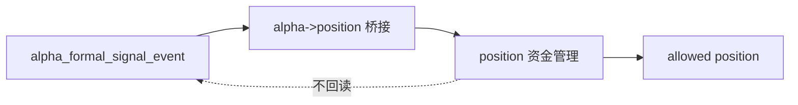

# alpha -> position 最小 formal signal 桥接合同规格

日期：`2026-04-09`
状态：`生效中`

## 目标

本页只冻结一件事：

`position` 从 `alpha` 读取正式信号时，最小必须读到哪些字段，哪些字段绝对不该从 `alpha` 内部过程里偷拿。`

这页合同不负责：

1. 定义 `alpha` 内部五表族全量结构
2. 定义 `position` 的 sizing / exit 全量字段
3. 替代 08 的表族落库卡

## 正式桥接方向

`position` 只能消费 `alpha` 已冻结的 `formal signal` 输出，不能消费：

1. trigger detector 的临时中间表
2. `alpha` 内部筛选过程的未冻结候选
3. 研究链里仅供诊断使用的 sidecar 列

桥接方向固定为：

`alpha formal signal -> position_candidate_audit / position_capacity_snapshot / position_sizing_snapshot`

## `position` 当前最小必需字段

`v1` 当前固定最小桥接字段组为：

1. `signal_nk`
   - `position` 对上游信号的正式自然键引用
2. `instrument`
   - 单标的代码
3. `signal_date`
   - 信号日期
4. `asof_date`
   - 当前正式上下文归属日期
5. `trigger_family`
   - 当前至少能区分 `PAS`
6. `trigger_type`
   - 当前至少能区分 `bof / tst / pb / cpb / bpb`
7. `pattern_code`
   - 允许与 trigger_type 同值，但必须有稳定字段位
8. `formal_signal_status`
   - 当前至少能区分 `admitted / blocked`
9. `trigger_admissible`
   - 布尔放行位
10. `malf_context_4`
    - 四格上下文
11. `lifecycle_rank_high`
    - 保守排序分子
12. `lifecycle_rank_total`
    - 保守排序分母
13. `source_trigger_event_nk`
    - 回指 trigger ledger
14. `signal_contract_version`
    - 当前桥接合同版本

## 字段职责冻结

### `alpha` 负责

1. 信号是否成立
2. 触发器类别是什么
3. 当前 formal signal 属于哪个上下文
4. 触发事实与 formal signal 的可追溯关系

### `position` 负责

1. 这次能不能做
2. 最多能做到多大
3. 当前是否需要减仓
4. 退出腿如何表达

因此下面这些字段不得从 `alpha` 直接下发为 `position` 事实：

1. `final_allowed_position_weight`
2. `required_reduction_weight`
3. `target_shares`
4. `position_action_decision`
5. `exit_plan_nk / exit_leg_nk`

## 当前最小派生规则

`position` 当前只允许基于桥接字段做下面三类最小派生：

1. 用 `formal_signal_status / trigger_admissible` 决定 `position_candidate_audit.candidate_status`
2. 用 `malf_context_4 + lifecycle_rank_high + lifecycle_rank_total` 计算上下文上限所需的保守比率
3. 用 `instrument + signal_date + signal_nk + policy_id + reference_trade_date` 生成 `position` 自身自然键

## 不允许的桥接方式

当前明确不允许：

1. `position` 直接读 `alpha` 内部 detector payload JSON 决定仓位
2. `position` 直接消费 research-only sidecar 列
3. `alpha` 预先替 `position` 计算最终仓位
4. `trade` 反写 `alpha` 是否触发

## 与 08 的关系

这页合同是 08 的前置桥接页。

08 当前可以先做：

1. `position` 最小表族落库
2. 默认 policy registry seed
3. 账本 bootstrap 与单测

08 当前不在本页内直接做：

1. `alpha` runner
2. `position` 对正式 `alpha formal signal` 的真实消费实现

## 一句话收口

`position` 当前只认 `alpha` 已冻结的 formal signal 最小字段组，不认 `alpha` 内部临时过程；上游负责“信号是否成立”，下游负责“这次能做多大”。`

## 流程图

## 2026-04-15 admission verdict 补充桥接

自 `65` 起，`position` 对 `alpha formal signal` 的正式读取还应兼容：

1. `admission_verdict_code`
2. `admission_reason_code`
3. `admission_audit_note`
4. `filter_gate_code`
5. `filter_reject_reason_code`

补充规则：

1. `candidate_status` 默认优先取 `formal_signal_status`
2. `blocked_reason_code` 默认优先取 `admission_reason_code`
3. 只有 `filter_gate_code='pre_trigger_blocked'` 时，`filter_reject_reason_code` 才能作为正式阻断原因兜底
4. `position` 不得绕过 `alpha` 自行把 `family_alignment` 或 `stage_percentile` 重新解释成 admission authority
