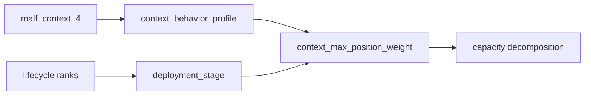
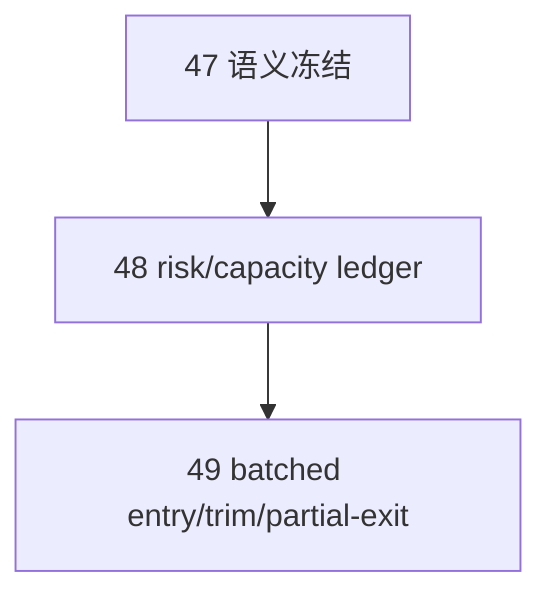

# position MALF 驱动分批仓位管理规格

`生效日期`：`2026-04-13`
`状态`：`Active`

## 1. 输入契约

`position` 正式输入分三层：

1. 必需输入
   - `alpha_formal_signal_event`
   - `market_base.stock_daily_adjusted(adjust_method='none')`
2. 必需 MALF 语义
   - `malf_context_4`
   - `lifecycle_rank_high`
   - `lifecycle_rank_total`
   - 后续可扩展 `lifecycle_rank_low / lifecycle_bucket`
3. 预留输入
   - `structure_*`
   - `filter_*`

预留输入默认只读，不作为当前卡组的硬依赖。

## 2. 正式输出分层

`position` 主线输出应从当前最小表族扩展为以下事实层：

1. `position_candidate_audit`
2. `position_risk_budget_snapshot`
3. `position_capacity_snapshot`
4. `position_sizing_snapshot`
5. `position_entry_leg_plan`
6. `position_exit_plan / position_exit_leg`

## 3. `_context_max_position_weight` 的重构原则

现有 `_context_max_position_weight` 不能再维持硬编码 if/else 的最小形式。

必须改为：

1. 先把 `malf_context_4` 映射成 `context_behavior_profile`。
2. 再把 `lifecycle` 映射成 `deployment_stage`。
3. 最后由 `context_behavior_profile + deployment_stage + policy contract` 得到 `context_max_position_weight`。

## 4. MALF 驱动的正式分档

当前主线先冻结四档：

1. `BULL_MAINSTREAM`
   - 主升浪背景，允许主仓与分批加仓。
2. `BULL_COUNTERTREND`
   - 回撤确认，允许较低初始权重与后续补批。
3. `BEAR_COUNTERTREND`
   - 仅允许探针仓位或维持极小残仓。
4. `BEAR_MAINSTREAM`
   - 禁止新增 long，优先走 trim / exit。

Lifecycle 只负责调节节奏，不负责推翻 `malf_context_4` 的大方向。

## 5. 需要显式化的容量分解

`position` 必须把以下量拆开落表：

1. `risk_budget_weight`
2. `context_max_position_weight`
3. `single_name_cap_weight`
4. `portfolio_cap_weight`
5. `remaining_single_name_capacity_weight`
6. `remaining_portfolio_capacity_weight`
7. `final_allowed_position_weight`
8. `required_reduction_weight`

## 6. 分批进仓合同

`position` 不直接下单，但必须生成批次计划。

主线计划腿最少包含：

1. `initial_entry`
2. `add_on_confirmation`
3. `add_on_continuation`

每条腿至少包含：

1. `entry_leg_nk`
2. `candidate_nk`
3. `schedule_stage`
4. `schedule_lag_days`
5. `target_weight_after_leg`
6. `target_notional_after_leg`
7. `target_shares_after_leg`
8. `leg_gate_reason`

这里的 `schedule_stage / schedule_lag_days` 必须兼容当前系统既有的 `t+0 / t+1 / t+2 ...` 语义，不得改写其定义。

## 7. 分批减仓与 partial-exit 合同

`position` 需要支持中线波段交易的分批减仓，但其职责仍是“计划”，不是“成交”。

正式语义：

1. `trim`
2. `scale_out`
3. `terminal_exit`

旧系统的 `FULL_EXIT_CONTROL` 只能继承为“保护性兜底语义”，不能继续当作主线唯一默认。

## 8. 预留 structure / filter 接口

为后续 `src/mlq/alpha/pas_shared.py` 所暗示的上下文扩展，`position` 需预留以下字段接口：

1. `structure_regime_code`
2. `structure_position_slot`
3. `structure_distance_to_pivot_pct`
4. `filter_gate_code`
5. `filter_strength_bucket`
6. `filter_reject_reason_code`

## 9. 与 DuckDB / WorkspaceRoots 的适配要求

1. 所有正式路径只能来自 `WorkspaceRoots`。
2. `position.duckdb` 只能写入 `H:\Lifespan-data\position\position.duckdb`。
3. working DB、pytest、smoke、benchmark 只能进入 `H:\Lifespan-temp`。
4. 参考报告与 acceptance 输出只能进入 `H:\Lifespan-report` 或 `H:\Lifespan-Validated`。

## 10. 卡片落地范围

