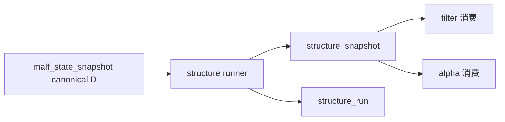

# structure 正式 snapshot 规格

日期：`2026-04-09`
状态：`生效中`

> 角色声明：本文是 `structure` 当前正式输出合同，不改写 `malf` 的纯语义核心定义。
> 当前 runner 默认直接读取 canonical `malf_state_snapshot(timeframe='D')`；bridge v1 兼容上下文与候选快照只允许在 canonical 表缺失时作为兼容回退，不代表 `malf core` 的正式语义。
> `malf core` 请读 `docs/02-spec/modules/malf/03-malf-pure-semantic-structure-ledger-spec-20260411.md`。
> 若 `structure` 需要读取 `pivot_confirmed_break_ledger` 或 `same_timeframe_stats_snapshot`，也只能按 `docs/02-spec/modules/malf/04-malf-mechanism-layer-break-confirmation-and-same-timeframe-stats-sidecar-spec-20260411.md` 作为只读机制层输入解释。

## 适用范围

本规格冻结新仓 `structure` 模块的最小正式输出合同。当前只覆盖：

1. `structure_run`
2. `structure_snapshot`
3. `structure_run_snapshot`
4. `run_structure_snapshot_build(...)`
5. `scripts/structure/run_structure_snapshot_build.py`

本规格不代表 `structure` 全部事件家族已经完成，也不代表 `filter / alpha` 已经完成正式对接实现。

## 正式输入

`structure` 当前正式输入固定为 canonical `malf` 必需输入，外加两类只读机制层可选输入：

1. 官方 canonical `malf_state_snapshot`
   - 默认读取 `asset_type='stock' + timeframe='D'`
   - 至少提供 `code / asof_bar_dt / major_state / trend_direction / current_hh_count / current_ll_count`
2. 下游兼容审计字段由 canonical 派生
   - `malf_context_4 / lifecycle_rank_high / lifecycle_rank_total / source_context_nk` 仍可写入 `structure_snapshot`
   - 这些字段现在是 canonical 到下游合同的兼容映射，不得被重写成 `malf core` 的反向定义
3. 只读机制层 `pivot_confirmed_break_ledger`
   - 若存在，只允许补充 break 是否已经获得同级别 pivot 级确认
   - 不得把它重新解释成 `major_state` 的硬确认条件
4. 只读机制层 `same_timeframe_stats_snapshot`
   - 若存在，只允许补充同级别分位、bucket 与位置读数
   - 不得把统计 bucket 写回 `malf core`

硬约束：

1. 不允许 `structure` 直接承担 filter admission。
2. 不允许 `structure` 直接输出 formal signal。
3. 不允许为方便一次 bounded smoke 而把旧兼容字段继续当作长期官方输出。
4. 不允许把 `malf_context_4 / lifecycle_rank_* / source_context_*` 反向宣称为 `malf core` 必备字段；它们只允许以 canonical-downstream 兼容审计字段身份保留。
5. `pivot_confirmed_break_ledger / same_timeframe_stats_snapshot` 只允许作为附加只读机制层输入，不得覆盖 `pivot / wave / state` 的 core 裁决。

## 正式输出

### 1. `structure_run`

用途：

1. 记录一次 `structure` bounded 物化运行
2. 固定来源、窗口、版本与摘要

最小字段：

1. `run_id`
2. `runner_name`
3. `runner_version`
4. `run_status`
5. `signal_start_date`
6. `signal_end_date`
7. `bounded_instrument_count`
8. `source_context_table`
9. `source_structure_input_table`
10. `structure_contract_version`
11. `started_at`
12. `completed_at`
13. `summary_json`

补充说明：

1. `source_context_table` 当前默认表示 canonical `malf_state_snapshot`；如发生兼容回退，它才会记录为 bridge v1 上下文来源表。
2. `pivot_confirmed_break_ledger / same_timeframe_stats_snapshot` 虽已成为正式可读机制层输入，但当前 runner 合同尚未把它们提升为必需脚本参数；后续若要把这些 sidecar 正式接入 runner，必须另开实现卡补齐显式参数与审计字段。

### 2. `structure_snapshot`

用途：

1. 作为 `filter / alpha` 的官方结构事实层
2. 回答当前这段中级波内部发生了什么结构推进或失败事实

最小字段：

1. `structure_snapshot_nk`
2. `instrument`
3. `signal_date`
4. `asof_date`
5. `malf_context_4`
6. `lifecycle_rank_high`
7. `lifecycle_rank_total`
8. `new_high_count`
9. `new_low_count`
10. `refresh_density`
11. `advancement_density`
12. `is_failed_extreme`
13. `failure_type`
14. `structure_progress_state`
15. `source_context_nk`
16. `structure_contract_version`
17. `first_seen_run_id`
18. `last_materialized_run_id`

补充说明：

1. `malf_context_4 / lifecycle_rank_high / lifecycle_rank_total / source_context_nk` 当前只允许按 canonical-downstream 兼容字段解读。
2. 这些字段服务于现阶段 runner 对接与审计，不得被视为 `structure` 对 `malf core` 的反向定义。

`structure_progress_state` 当前最小枚举固定为：

1. `advancing`
2. `stalled`
3. `failed`
4. `unknown`

自然键规则：

`structure_snapshot_nk` 当前最小固定由下列字段拼出：

1. `instrument`
2. `signal_date`
3. `asof_date`
4. `source_context_nk`
5. `structure_contract_version`

### 3. `structure_run_snapshot`

用途：

1. 桥接一次 `run` 与本次触达的 `structure_snapshot`
2. 支持 bounded readout、resume 与审计

最小字段：

1. `run_id`
2. `structure_snapshot_nk`
3. `materialization_action`
4. `structure_progress_state`
5. `recorded_at`

`materialization_action` 枚举：

1. `inserted`
2. `reused`
3. `rematerialized`

## Producer Runner 合同

### Python 入口

`run_structure_snapshot_build(...)`

### 脚本入口

`scripts/structure/run_structure_snapshot_build.py`

### 最小参数

1. `run_id`
2. `signal_start_date`
3. `signal_end_date`
4. `instrument` 或 bounded instrument 列表
5. `limit`
6. `batch_size`
7. `source_context_table`
8. `source_structure_input_table`
9. `summary_path`

补充说明：

1. `source_context_table / source_structure_input_table` 当前默认都指向 canonical `malf_state_snapshot`，`source_timeframe` 默认固定为 `D`。
2. bridge v1 兼容表只允许在 canonical 表缺失时显式或自动回退，不再是默认正式真值。

## Bounded Evidence 要求

本卡后续正式实现至少要留下：

1. 单元测试
2. bounded smoke
3. `structure_run / structure_snapshot / structure_run_snapshot` readout
4. `filter` 可消费的字段对接证据

## 当前明确不做

1. `structure` 全部 event 家族
2. `alpha` 五表族
3. `position / trade / system` 的直接结构消费

## 一句话收口

`structure` 当前最小正式目标不是更多兼容字段，而是一个可被 `filter / alpha` 稳定消费的官方 `snapshot` 事实层；bridge v1 兼容输入只允许过渡存在，不允许继续冒充 `malf core`。`

## 流程图

