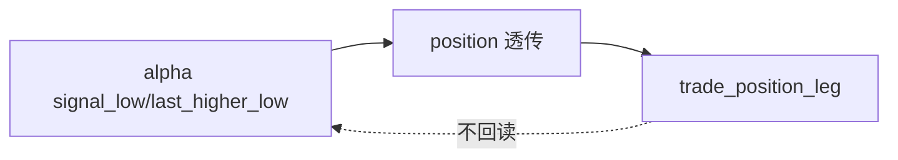

# trade signal anchor contract freeze 规格

日期：`2026-04-11`
状态：`待执行`

本规格适用于 `100-trade-signal-anchor-contract-freeze-card-20260411.md` 及其后续 evidence / record / conclusion。

## 目标

在 canonical malf 被正式裁决通过后，为 `trade` 回测运行时冻结最小价格锚点合同。

## 前置 gate

1. `55-pre-trade-upstream-data-grade-baseline-gate` 必须接受。
2. `trade` 不得在 `55` 之前恢复任何依赖 anchor 的正式 runner。

## 最小合同

1. 正式 anchor 至少包括：
   - `signal_low`
   - `last_higher_low`
   - `signal_anchor_contract_version`
2. 正式透传路径至少覆盖：
   - `alpha formal signal`
   - `position` 对应正式候选或计划层
   - `trade_execution_plan / trade_position_leg`
3. `trade` 不允许回读 `alpha` 或 `malf` 私有过程来重建 anchor。
4. 历史窗口必须支持幂等回填上述 anchor 字段。

## 流程图

