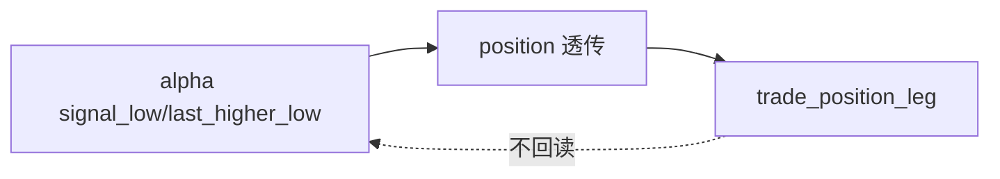

# trade signal anchor contract freeze 规格

日期：`2026-04-11`
状态：`待执行`

本规格适用于 `100-trade-signal-anchor-contract-freeze-card-20260411.md` 及其后续 evidence / record / conclusion。

## 目标

在 canonical malf 被正式裁决通过后，为 `trade` 回测运行时冻结最小价格锚点合同。

## 流程图

