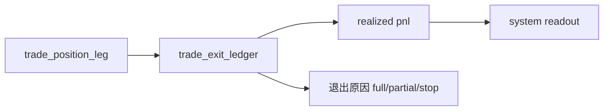

# trade exit pnl ledger bootstrap 规格

日期：`2026-04-11`
状态：`待执行`

本规格适用于 `102-trade-exit-pnl-ledger-bootstrap-card-20260411.md` 及其后续 evidence / record / conclusion。

## 流程图

```mermaid
flowchart LR
    LEG[trade_position_leg] --> EXIT[trade_exit_ledger]
    EXIT --> PNL[realized pnl]
    EXIT --> RSN[退出原因 full/partial/stop]
    PNL --> SYS[system readout]
```
