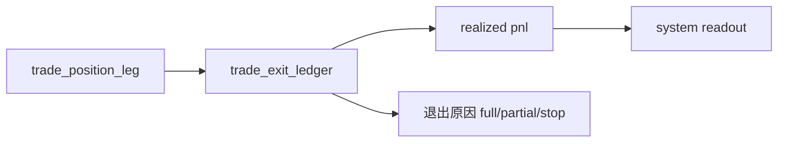

# trade exit pnl ledger bootstrap 规格

日期：`2026-04-11`
状态：`待执行`

本规格适用于 `102-trade-exit-pnl-ledger-bootstrap-card-20260411.md` 及其后续 evidence / record / conclusion。

## 最小表族

1. `trade_exit_ledger`
2. `trade_realized_pnl_ledger`

## 最小合同

1. `trade_exit_ledger` 至少记录：
   - `exit_nk`
   - `position_leg_nk`
   - `execution_plan_nk`
   - `exit_trade_date`
   - `exit_type`
   - `exit_reason`
   - `exit_weight`
   - `remaining_weight_after_exit`
2. `trade_realized_pnl_ledger` 至少记录：
   - `realized_pnl_nk`
   - `exit_nk`
   - `position_leg_nk`
   - `entry_reference_price`
   - `exit_price`
   - `realized_pnl_amount`
   - `realized_r_multiple`
3. `1R` 与退出判断只允许消费 `100 / 101` 冻结后的正式输入。
4. 历史窗口必须支持幂等回填与局部重物化。

## 流程图

