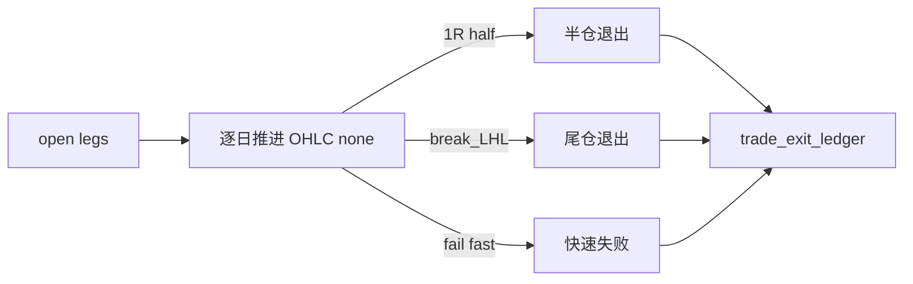

# trade backtest progression runner 规格

日期：`2026-04-11`
状态：`待执行`

本规格适用于 `103-trade-backtest-progression-runner-card-20260411.md` 及其后续 evidence / record / conclusion。

## 流程图

```mermaid
flowchart LR
    LEG[open legs] --> PROG[逐日推进 OHLC none]
    PROG -->|1R half| HALF[半仓退出]
    PROG -->|break_LHL| TAIL[尾仓退出]
    PROG -->|fail fast| STOP[快速失败]
    HALF --> EXIT[trade_exit_ledger]
    TAIL --> EXIT
    STOP --> EXIT
```
