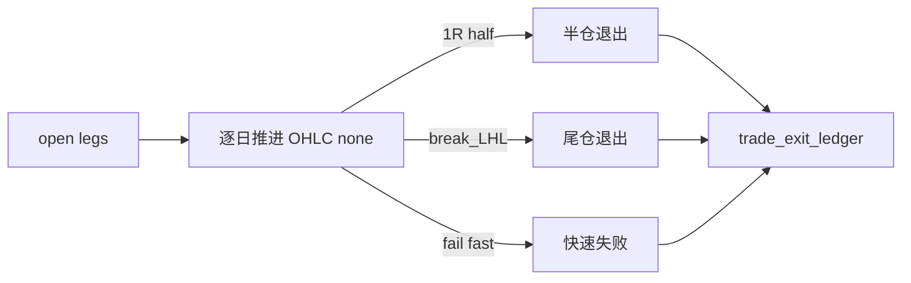

# trade backtest progression runner 规格

日期：`2026-04-11`
状态：`待执行`

本规格适用于 `103-trade-backtest-progression-runner-card-20260411.md` 及其后续 evidence / record / conclusion。

## data-grade 最小要求

1. 正式 runner 必须支持：
   - `bootstrap_mode`
   - `incremental_mode`
   - `replay_mode`
2. 正式账本至少包括：
   - `trade_work_queue`
   - `trade_checkpoint`
   - progression step ledger 或等价正式推进账本
   - `trade_freshness_audit`
3. dirty 单元至少要绑定：
   - `portfolio_id`
   - `position_leg_nk`
   - `progression_date` 或等价推进边界
4. replay/resume 不允许退化成全历史重跑。

## 流程图

