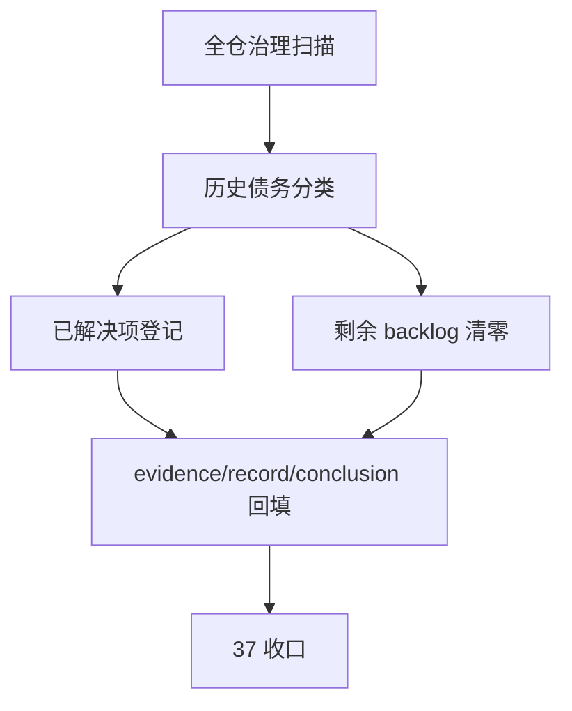

# governance historical debt backlog burndown 规格

日期：`2026-04-12`
状态：`已完成`

注：本规格已在 `37` 收口执行完毕，当前正式施工位已切换到 `100`。

本规格适用于 `37-system-governance-historical-debt-backlog-burndown-card-20260412.md` 及其后续 evidence / record / conclusion。

## 目标

将全仓历史治理债务从“隐性白名单 + 口头说明”收敛为“显式台账 + 分批清零 + 可审计收口”。

## 债务来源

1. 全仓治理扫描：`python scripts/system/check_development_governance.py`
2. 剩余历史债务登记：`scripts/system/development_governance_legacy_backlog.py`
3. 执行索引一致性检查：`python .codex/skills/lifespan-execution-discipline/scripts/check_execution_indexes.py --include-untracked`
4. 文档先行门禁：`python scripts/system/check_doc_first_gating_governance.py`

## 债务分类

### 1. 已登记已解决项

必须登记 2026-04-12 已完成的首批纠偏项，包括：

1. `src/mlq/malf/wave_life_runner.py` 超长拆分为 runner + helper 模块
2. `portfolio_plan / trade / system` 脚本与测试的中文治理补齐
3. 历史 backlog 清单显式化
4. 入口文件同步刷新
5. `new_execution_bundle.py` 的索引分栏标题与模板编号渲染修正

### 2. 待解决硬超长旧债

以 `LEGACY_HARD_OVERSIZE_BACKLOG` 为唯一剩余来源，目标是在 `37` 收口时清零。

### 3. 待解决目标超长旧债

以 `LEGACY_TARGET_OVERSIZE_BACKLOG` 为唯一剩余来源，目标是在 `37` 收口时清零。

## 执行规则

1. 任何一项历史债务只允许有一个正式登记位置：要么还在 backlog，要么已经写入 `37` 的已解决登记。
2. 每完成一项历史债务，必须同步更新：
   - 相关源码或文档
   - `scripts/system/development_governance_legacy_backlog.py`
   - `37` 的 evidence / record / conclusion
3. 若治理规则、设计口径、工具脚手架或入口文件发生变化，必须同步刷新：
   - `AGENTS.md`
   - `README.md`
   - `pyproject.toml`
4. `37` 完成时，全仓治理扫描必须满足：
   - 全仓无未登记中文治理缺口
   - backlog 只剩空元组
   - 不再依赖新增历史白名单掩盖问题

## 验收图


```
