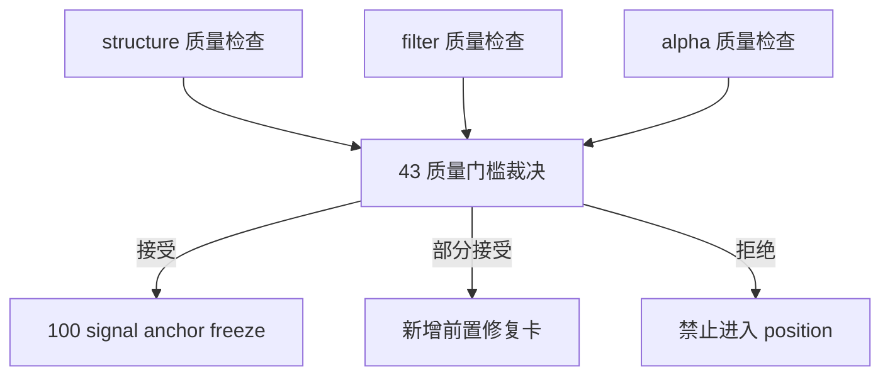

# structure / filter / alpha 达到 data-grade 质量门槛后再进入 position 规格

日期：`2026-04-13`
状态：`生效`

本规格适用于 `43-structure-filter-alpha-data-grade-quality-gate-before-position-card-20260413.md` 及其后续 evidence / record / conclusion。

## 目标

为 `structure / filter / alpha` 冻结一套进入 `position` 之前必须满足的 data-grade 质量门槛，并据此裁决是否允许恢复 `100 -> 105` 卡组。

## 必答问题

`43` 必须显式回答：

1. `structure / filter / alpha` 的官方本地 ledger 路径是否已经固定并纳入主线标准化口径
2. 三个模块当前的实体锚点、业务自然键、dirty 单元、checkpoint 颗粒度是否已经明确
3. 三个模块当前的 replay/resume 是否建立在正式 fingerprint / checkpoint 变化之上
4. 三个模块是否已经具有至少一轮基于 `H:\Lifespan-data` 的真实 official smoke / replay 证据
5. `alpha formal signal` 是否已经稳定到足以进入 `position`

## 六条历史账本约束检查清单

`43` 对每个模块至少必须逐项检查：

1. 实体锚点
2. 业务自然键
3. 批量建仓
4. 增量更新
5. 断点续跑
6. 审计账本

如果某项未满足，不允许略过，必须明确写成：

- `已满足`
- `部分满足`
- `未满足`

## 最小验收维度

### 1. `structure`

至少要验证：

1. 默认输入仅为 canonical `malf_state_snapshot`
2. `structure_work_queue / structure_checkpoint` 已在正式库上可复现
3. replay/resume 与 `malf checkpoint` 指纹一致
4. bridge-era mainline 输入无法再作为正式路径透传

### 2. `filter`

至少要验证：

1. 默认输入仅为 `structure snapshot + canonical malf`
2. `filter_work_queue / filter_checkpoint` 已在正式库上可复现
3. dirty 单元和 `structure checkpoint` 对齐
4. sidecar 仍为只读透传，不夹带下游执行逻辑

### 3. `alpha`

至少要验证：

1. `alpha trigger / family / formal signal` 都基于官方 canonical 上游
2. `alpha trigger checkpoint` 与 `filter checkpoint` 对齐
3. `family` 解释层与 `formal signal` 之间的正式稳定性已被裁决
4. `alpha formal signal` 是否已满足进入 `position` 的稳定输入合同

## 允许的后续裁决

### 1. 允许直接恢复 `100`

条件：

1. `structure / filter / alpha` 全部达到 `已满足` 或仅有不阻塞 `position` 的残余项
2. 真实官方库 smoke / replay 证据具备
3. `alpha formal signal` 的进入 `position` 合同已被认可

### 2. 允许恢复 `100`，但必须先补一张前置修复卡

条件：

1. 问题被证明集中在单一前置缺口
2. 缺口范围明显小于 `100-105` 本身
3. 修复卡可以在不改变主链冻结口径的前提下完成

### 3. 禁止进入 `position`

条件：

1. `structure / filter / alpha` 仍缺少 data-grade 级别的 replay/resume 事实依据
2. `alpha formal signal` 仍不够稳定
3. 真实官方库 smoke / replay 尚未建立

## 最小证据

`43` 至少应提供：

1. `structure / filter / alpha` 三个模块的质量清单
2. 一组真实官方库 smoke 或 replay 命令
3. 一份“允许或禁止进入 `position`”的正式裁决

## 输出要求

`43` 的 conclusion 至少必须包含：

1. 是否允许进入 `position`
2. 若允许，`100` 是否成为新的当前待施工卡
3. 若不允许，新的前置修复卡是什么

## 流程图

