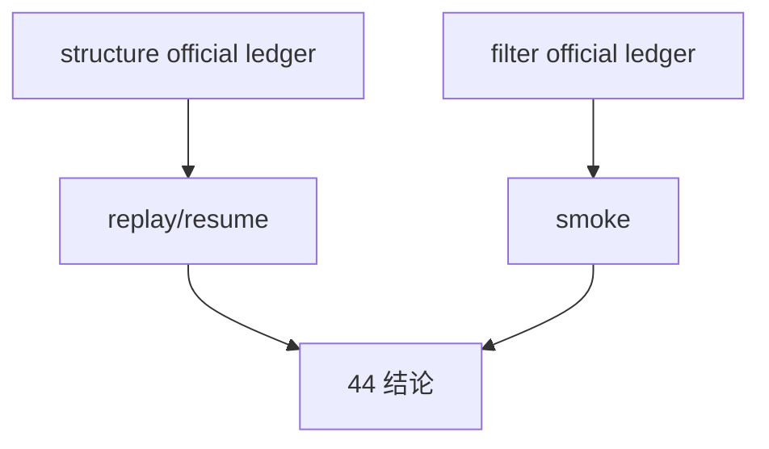

# structure / filter 官方 ledger replay 与 smoke 硬化规格

日期：`2026-04-13`
状态：`生效`

本规格适用于 `44-structure-filter-official-ledger-replay-smoke-hardening-card-20260413.md` 及其后续 evidence / record / conclusion。

## 目标

把 `structure / filter` 从“canonical downstream 已对齐”推进到“官方本地 ledger replay / smoke 已硬化”。

## 最小检查项

1. `structure` 官方库路径已明确
2. `filter` 官方库路径已明确
3. 默认无窗口运行口径建立在正式库与 queue/checkpoint 之上
4. 至少一组 replay / smoke 命令可复现
5. 审计能解释 `inserted / reused / rematerialized` 或等价 readout

## 六条历史账本约束

本卡至少必须覆盖：

1. 实体锚点：`asset_type + code + timeframe='D'`
2. 业务自然键：`snapshot_date or bar_dt + contract version + source_fingerprint`
3. 批量建仓：bounded bootstrap / official bootstrap
4. 增量更新：由 canonical upstream checkpoint 驱动
5. 断点续跑：`work_queue + checkpoint + replay/resume`
6. 审计账本：`*_run / *_checkpoint / snapshot / run_snapshot`

## 验收

1. `44` conclusion 能明确裁决 `structure / filter` 是否已具备官方 ledger replay / smoke 级稳定性
2. 若通过，允许进入 `45`
3. 若不通过，必须明确指出阻断项

## 流程图

