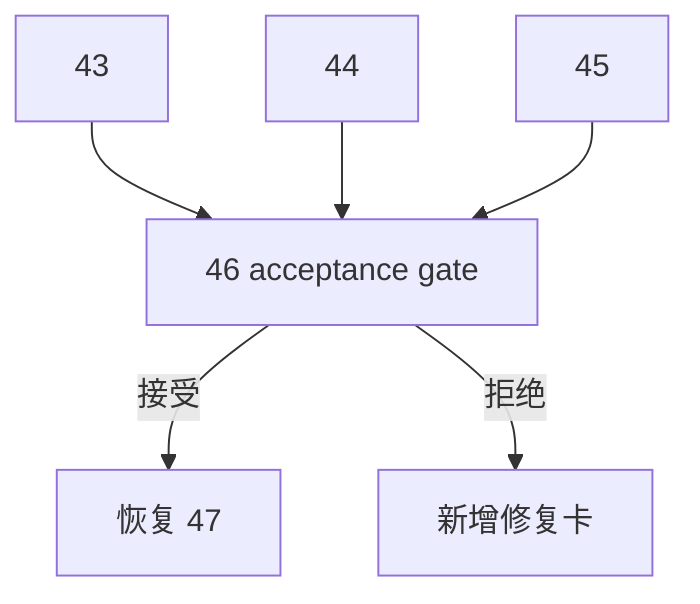

# 进入 position 前的 upstream acceptance gate 规格

日期：`2026-04-13`
状态：`生效`

本规格适用于 `46-pre-position-upstream-acceptance-gate-card-20260413.md` 及其后续 evidence / record / conclusion。

## 目标

在进入 `position` 之前，对 `structure / filter / alpha` 的上游稳定性做最终 acceptance 裁决。

## 必答问题

1. `43 / 44 / 45` 是否全部达到接受标准
2. 当前是否允许进入 `47`
3. 若允许，进入 `47` 后到 `55` 之间还剩哪些 acceptance 责任
4. 若不允许，新的前置修复卡应是什么

## 验收

1. `46` conclusion 必须明确给出接受或拒绝
2. 接受时，执行索引与路线图必须把 `47` 恢复为当前待施工卡
3. 拒绝时，执行索引与路线图必须切到新的前置修复卡
4. 无论是否接受，`100-105` 都不得在 `55` 之前恢复

## 流程图

