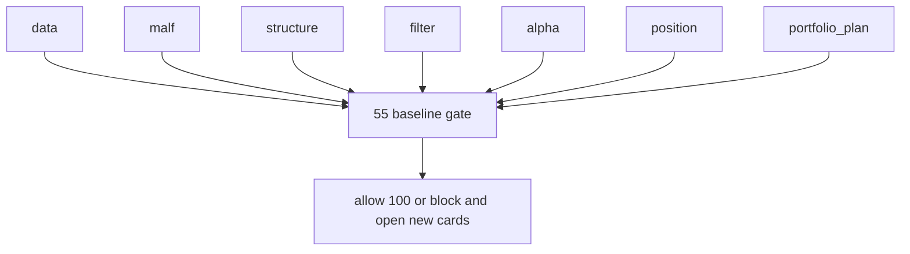

# pre-trade upstream data-grade baseline gate 规格

日期：`2026-04-13`
状态：`生效中`

## Gate 对象

`55` 必须覆盖下列正式模块：

1. `data`
2. `malf`
3. `structure`
4. `filter`
5. `alpha`
6. `position`
7. `portfolio_plan`

## Gate 判定项

每个模块都必须回答：

1. 稳定实体锚点是什么
2. 业务自然键是什么
3. 批量建仓怎么做
4. 每日增量怎么做
5. `work_queue + checkpoint + replay` 如何做
6. freshness audit 在哪里
7. 正式库是否落在 `H:\Lifespan-data`

## Gate 输出

`55` 至少要产出：

1. evidence
2. record
3. conclusion
4. 模块级 A/B/C 裁决

## Gate 结论规则

1. 只有全部达到 A 或明确进入 A-acceptance 的模块，才允许恢复 `100`
2. 如果 `position / portfolio_plan` 任一仍低于 A，必须继续开卡，不允许越过

## 图示

