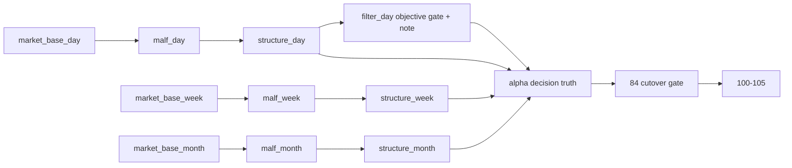

# malf alpha 双主轴与 timeframe native 重构规格

适用执行卡：

- `78-malf-alpha-dual-axis-refactor-scope-freeze-card-20260418.md`
- `79-malf-day-week-month-ledger-split-path-contract-card-20260418.md`
- `80-malf-timeframe-native-base-source-rebind-card-20260418.md`
- `81-structure-thin-projection-and-day-binding-card-20260418.md`
- `82-filter-objective-gate-and-note-sidecar-demotion-card-20260418.md`
- `83-alpha-dual-axis-decision-rebind-and-formal-cutover-card-20260418.md`
- `84-malf-alpha-official-truthfulness-and-cutover-gate-card-20260418.md`

## 1. 官方数据库路径

`malf` 正式路径改为：

1. `H:\Lifespan-data\malf\malf_day.duckdb`
2. `H:\Lifespan-data\malf\malf_week.duckdb`
3. `H:\Lifespan-data\malf\malf_month.duckdb`

`structure` 正式路径改为三库：

1. `H:\Lifespan-data\structure\structure_day.duckdb`
2. `H:\Lifespan-data\structure\structure_week.duckdb`
3. `H:\Lifespan-data\structure\structure_month.duckdb`

`filter` 在 `78` 只冻结职责边界，不冻结最终物理落库方案：

1. 语义上仍保留 `filter` 模块壳
2. `82` 必须显式裁决是否继续使用 `H:\Lifespan-data\filter\filter.duckdb`
3. 在 `82` 裁决前，任何实现都不得假定“`filter` 一定保留独立永久官方库”已经成立

`alpha` 正式路径改为五个日线 PAS 官方库：

1. `H:\Lifespan-data\alpha\alpha_bof.duckdb`
2. `H:\Lifespan-data\alpha\alpha_tst.duckdb`
3. `H:\Lifespan-data\alpha\alpha_pb.duckdb`
4. `H:\Lifespan-data\alpha\alpha_cpb.duckdb`
5. `H:\Lifespan-data\alpha\alpha_bpb.duckdb`

## 2. source contract

### 2.1 malf_day

- 来源：`market_base_day.stock_daily_adjusted(adjust_method='backward')`
- 目标：`malf_day.duckdb`
- 允许 timeframe：`D`

### 2.2 malf_week

- 来源：`market_base_week.stock_daily_adjusted(adjust_method='backward')`
- 目标：`malf_week.duckdb`
- 允许 timeframe：`W`

### 2.3 malf_month

- 来源：`market_base_month.stock_daily_adjusted(adjust_method='backward')`
- 目标：`malf_month.duckdb`
- 允许 timeframe：`M`

### 2.4 禁止事项

1. 不允许在 `malf` 内部再从 `day` 价格重采样 `W/M`。
2. 不允许把 `market_base_week/month` 再写回 `malf_day`。
3. 不允许继续把单 `malf.duckdb` 声明为默认官方库。

## 3. malf 三库表族

三库都保留正式 canonical 表族：

1. `malf_canonical_run`
2. `malf_canonical_work_queue`
3. `malf_canonical_checkpoint`
4. `malf_pivot_ledger`
5. `malf_wave_ledger`
6. `malf_extreme_progress_ledger`
7. `malf_state_snapshot`
8. `malf_same_level_stats`

兼容规则：

1. 可保留 `timeframe` 列，但每个库只允许出现单一 native timeframe。
2. 自然键仍以 `asset_type + code + native timeframe + bar_dt` 组织，不允许退化成 `run_id` 主语义。

## 4. downstream binding

### 4.1 structure

1. `structure_day` 默认只读 `malf_day.malf_state_snapshot`
2. `structure_week` 默认只读 `malf_week.malf_state_snapshot`
3. `structure_month` 默认只读 `malf_month.malf_state_snapshot`
4. 三层都只允许物化薄事实投影，不允许在 `structure` 层追加 admission verdict
5. 三层都不允许长回厚解释层或终审层

### 4.2 filter

1. 默认只读 `structure_snapshot`
2. 允许只读 `raw_market.raw_tdxquant_instrument_profile`
3. hard block 只允许来自以下 objective gate：
   - 停牌 / 未复牌
   - 风险警示 / ST
   - 退市整理
   - 证券类型不在正式宇宙
   - 市场类型不在正式宇宙
4. 产物只允许：
   - `trigger_admissible`
   - objective reject reason
   - note / risk flag
5. `structure_progress_failed / reversal_stage_pending` 只允许进入 `note / risk flag`，不允许形成结构性 hard block
6. `82` 必须给出 `filter` 是否保留独立本地库的正式裁决

### 4.3 alpha

1. `alpha` 默认按五个日线 PAS 官方库运行：`BOF / TST / PB / CPB / BPB`
2. 每个 PAS 库各自维护本族 `trigger / family / formal signal` 账本，不再把单 `alpha.duckdb` 作为默认统一真值库
3. 默认消费 `structure_day / week / month + filter_day + malf_day / week / month sidecar`
4. 允许把 objective gate 与 note sidecar 汇入 `alpha formal signal`
5. `admitted / blocked / downgraded / note_only` 主权固定在 `alpha`
6. 若需要跨 PAS 汇总，只允许在只读汇总层完成，不允许再回写成单库默认真值

## 5. replay 与 cutover

1. `79-83` 必须围绕 `2010 ~ 当前 official market_base 覆盖尾部` 完成 bounded replay。
2. `84` 必须裁决：
   - `malf_day / week / month` 是否已成为默认官方库
   - `structure_day / week / month` 是否已稳定绑定对应 `malf_*` 薄投影
   - `filter_day` 是否已完成 objective gate / note sidecar 降格并裁决独立落库方案
   - `alpha` 是否已切到五个 PAS 日线官方库
   - 是否允许恢复 `100-105`

## 6. 非目标

1. 本轮不把 `filter` 或五个 trigger 再拆成 `day/week/month` 三库；三层 `structure` 是薄投影层，不是新一轮厚解释层。
2. 本轮不恢复 `trade / system`。
3. 本轮不物理删除全部 bridge-era 表族，只取消其默认主线地位。

## 7. 流程图

