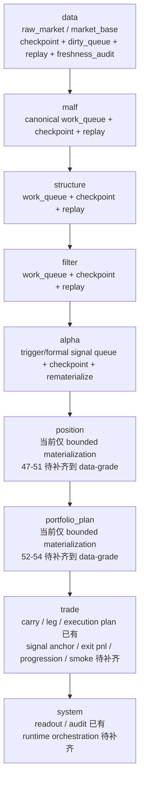
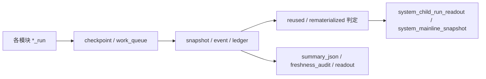

# 系统级总路线图

日期：`2026-04-09`
最近刷新：`2026-04-15`
状态：`生效中`

## 文档角色

这份文档现在同时承担两种职责：

1. 系统级进度跟踪器
2. 后半部施工的正式指挥蓝图

判断基线固定为：

1. 历史账本硬约束来自 `docs/01-design/03-historical-ledger-shared-contract-charter-20260409.md`
2. 全系统统一治理基线来自 `28-system-wide-checkpoint-and-dirty-queue-alignment-conclusion-20260411.md`
3. 当前最新生效结论锚点为 `78-malf-alpha-dual-axis-refactor-scope-freeze-conclusion-20260418.md`
4. 当前待施工卡为 `79-malf-day-week-month-ledger-split-path-contract-card-20260418.md`
5. 当前连续前置卡组为 `79 -> 80 -> 81 -> 82 -> 83 -> 84`

## 当前正式判断

1. 当前冻结主链仍是：
   `data -> malf -> structure -> filter -> alpha -> position -> portfolio_plan -> trade -> system`
2. `28` 已把 `checkpoint + dirty/work queue + replay/resume + audit` 冻结为全系统统一 data-grade 基线。
3. `29 -> 32` 已验证“先 canonical `malf`，再 data-grade runner，再 downstream rebind，再 truthfulness revalidation”是正确路径。
4. `33 -> 55` 已完成 canonical downstream 清理、checkpoint 对齐、本地 ledger 标准化、增量续跑、PAS detector、family role、quality gate、official ledger hardening、position / portfolio_plan data-grade 收口。
5. 当前后半部最薄弱链段已经切换到：
   `malf-alpha dual-axis official cutover (malf -> structure -> filter -> alpha on H:\Lifespan-data)`

## 当前施工摘要

### 已完成阶段

1. `01-06` 治理与入口基线
2. `07-15` `position / alpha / portfolio_plan / trade` 最小骨架
3. `16-28` `data / malf / system` 官方桥接与统一基线
4. `29-32` canonical `malf` 优先卡组
5. `33-44` canonical downstream 稳定化、quality gate 与 official ledger hardening

### 当前阶段

1. 当前 active 卡：`79`
2. 当前 active 卡组：`79 -> 80 -> 81 -> 82 -> 83 -> 84 -> 100 -> 101 -> 102 -> 103 -> 104 -> 105`
3. 当前系统级目标：先完成 `malf day/week/month` 三库路径、native source 与全覆盖，再完成 `structure day/week/month` 三薄层、`filter_day` 客观 gate、`alpha` 五 PAS 日线终审与 `84` cutover gate，随后才恢复 `100-105`

## 系统当前剖面图

下图以 `28` 的 data-grade 基线为观察坐标，展示当前主链各模块的实现深度分档。

```mermaid
flowchart LR
    C28["28 统一基线\ncheckpoint + dirty/work queue + replay/resume"] --> DATA

    subgraph ALIGNED["已对齐区域"]
        DATA["data\nCanonical data-grade\n39/40 已冻结官方 ledger + 增量续跑\n73/74 已补齐 backward 全历史并支持 raw/base 分批建仓"]
        MALF["malf\nCanonical data-grade\n29/30/36/63 已形成 core + sidecar + official bootstrap truth"]
        STR["structure\nOfficial ledger hardening accepted\n31/35/38/44/61 已完成 canonical rebind + replay smoke + CLI guardrail"]
        FLT["filter\nOfficial ledger hardening accepted\n31/35/38/44/61/62 已完成 canonical rebind + boundary reset"]
        ALPHA["alpha\nCanonical downstream\n41/42/45/64/65 已完成 detector/family/admission 收口"]
        POS["position\nCanonical downstream\n47-51/55 已形成 checkpoint/replay 与 alpha-owned verdict 消费"]
        PLAN["portfolio_plan\nCanonical downstream\n52-55 已形成 ledger family + checkpoint/replay/freshness"]
    end

    subgraph PENDING["待治理区域"]
        TRADE["trade\nRecovery planned\n100-104 待完成合同/exit/progression/smoke"]
        SYS["system\nBounded acceptance\n27 readout/audit 已有\n105 orchestration 待完成"]
    end

    DATA --> MALF --> STR --> FLT --> ALPHA --> POS --> PLAN --> TRADE --> SYS

    classDef aligned fill:#d5f5e3,stroke:#1e8449,color:#000;
    classDef pending fill:#f5c6cb,stroke:#c0392b,color:#000;
    class DATA,MALF,STR,FLT,ALPHA,POS,PLAN aligned;
    class TRADE,SYS pending;
```

## 后半部施工指挥蓝图

### 正式顺序

自 `28` 起，后半部正式施工顺序固定为：

1. `29 -> 30 -> 31 -> 32`
2. `33 -> 42` 稳定化与收口
3. `43 -> 44 -> 45 -> 46`
4. `47 -> 48 -> 49 -> 50 -> 51`
5. `52 -> 53 -> 54 -> 55`
6. `60 -> 61 -> 62 -> 63 -> 64 -> 65 -> 66`
7. `67`
8. `68`
9. `69`
10. `70 -> 71 -> 72`
11. `73`
12. `74`
13. `78 -> 79 -> 80 -> 81 -> 82 -> 83 -> 84`
14. `100 -> 101 -> 102 -> 103 -> 104 -> 105`

其中：

1. `29 -> 32` 是 `malf` 优先卡组
2. `43` 是进入 `position` 前的质量门槛定义卡
3. `44 -> 45` 是上游质量硬化卡组
4. `46` 是进入 `position` 前的最终 acceptance gate
5. `47 -> 51` 是 `position` A 级硬化卡组
6. `52 -> 55` 是 `portfolio_plan` A 级硬化与 pre-trade gate
7. `60 -> 66` 是 `59` 后的主线整改与恢复闸门卡组
8. `67` 是已完成的历史 file-length 治理债务重登记与清理卡
9. `68` 是已完成的执行文档目录治理恢复与固化卡
10. `69` 是冻结 `filter` 客观可交易性与标的宇宙 gate 的新增治理卡
11. `70 -> 72` 是 objective 历史源选择、实现与回补执行卡组
12. `73` 是 `market_base(backward)` 全历史修缮卡
13. `74` 是 `raw/base` 分批建仓治理与 runner 修缮卡
14. `78 -> 84` 是治理与 data 修缮收口后的 `malf-alpha` 双主轴重构与 cutover gate 卡组：`78` 冻结范围，`79` 落三库路径，`80` 只做 `malf` 全覆盖，`81` 收口 `structure day/week/month` 三薄层，`82` 收口 `filter_day objective gate + note sidecar`，`83` 切到五个 PAS 日线终审库，`84` 再做 truthfulness / cutover gate
16. `100 -> 105` 是 `trade/system` 恢复卡组
17. `105` 明确固定为最后一张后置卡

```mermaid
flowchart LR
    C28["28 data-grade 基线裁决"] --> G2932["29-32 malf 优先卡组"]
    G2932 --> G3342["33-42 稳定化与主线收口\npurge / multi-timeframe / checkpoint / local ledger / PAS / family"]
    G3342 --> G43["43 quality gate"]
    G43 --> G44["44 structure/filter hardening"]
    G44 --> G45["45 alpha producer hardening"]
    G45 --> G46["46 pre-position acceptance"]
    G46 --> G47["47 position MALF sizing/batch contract"]
    G47 --> G48["48 position risk/capacity hardening"]
    G48 --> G49["49 position batched entry/trim/partial-exit"]
    G49 --> G50["50 position data-grade runner"]
    G50 --> G51["51 pre-portfolio-plan position acceptance"]
    G51 --> G52["52 portfolio_plan ledger family freeze"]
    G52 --> G53["53 portfolio_plan decision/capacity hardening"]
    G53 --> G54["54 portfolio_plan data-grade runner"]
    G54 --> G55["55 pre-trade upstream baseline gate"]
    G55 --> G6066["60-66 mainline rectification"]
    G6066 --> G67["67 file-length debt cleanup accepted"]
    G67 --> G68["68 execution doc layout governance accepted"]
    G68 --> G69["69 filter objective gate accepted"]
    G69 --> G7072["70-72 objective historical backfill accepted"]
    G7072 --> G73["73 market_base backward full-history repair accepted"]
    G73 --> G74["74 raw/base batched bootstrap accepted"]
    G74 --> G75["75 single-db week/month expansion accepted"]
    G75 --> G76["76 day/week/month split migration"]
    G76 --> G7884["78-84 malf-alpha dual-axis refactor"]
    G7884 --> G100105["100-105 trade/system 恢复卡组"]
    G100105 --> C100["100 signal anchor freeze"]
    C100 --> C101["101 T+1 open 参考价修正"]
    C101 --> C102["102 trade exit PnL ledger"]
    C102 --> C103["103 trade backtest progression"]
    C103 --> C104["104 real-data smoke regression"]
    C104 --> C105["105 system runtime orchestration"]
```

### 当前指挥结论

1. `29-32` 不是“历史已完成就可忽略”的旧卡组，而是后半部一切恢复卡的前置逻辑顺序。
2. `43-45` 任何一张未通过前，都不允许进入 `46`。
3. `55` 接受后并不直接恢复 `100`；真实正式库主线已先经过 `60-74` 整改、治理、objective 回补、`market_base(backward)` 全历史修缮与 raw/base 分批建仓治理，随后恢复路径才是 `78-84`。
4. `100-105` 当前必须在 `84` 接受后按自然数顺排推进，不允许跳过 `100/101` 直接做 `105`。
5. `47-51` 属于 `position` 追平 `data -> malf` 事实标准的正式卡组，不允许把 `position` 继续当成 bounded skeleton 直接越过。
6. `52-54` 属于 `portfolio_plan` 追平 `data -> malf` 事实标准的正式卡组，不允许继续把组合层当成最小桥接层直接越过。
7. `66` 已正式判断无需继续追加整改前置卡；`67 -> 74` 已完成 file-length、执行文档目录、filter objective gate、objective 历史回补、`market_base(backward)` 全历史修缮与 raw/base 分批建仓治理，当前恢复 `78-84`。

## 增量更新 / 断点续跑 / 审计依赖图

## 模块纵向档案

### `data`

- 当前状态：`主线已接`
- 实现深度：`Canonical data-grade`
- 成熟度：`A`
- 实体锚点：`asset_type + code`
- 业务自然键对齐：
  以 `trade_date / adjust_method / source file or request / instrument checkpoint` 叠加在标的锚点之上；`39/40` 后官方 ledger inventory 已冻结。
- 批量建仓：
  `scripts/data/run_mainline_local_ledger_standardization_bootstrap.py`
- 增量更新：
  `scripts/data/run_mainline_local_ledger_incremental_sync.py`
- 断点续跑：
  `run / checkpoint / dirty_queue / replay / freshness_audit` 已成立
- 审计账本：
  `run / checkpoint / dirty_queue / freshness_readout`
- 当前结论：
  `17 -> 22 -> 39 -> 40 -> 73 -> 74` 已把 `data` 建成全系统 data-grade 基线定义者，并补齐 `market_base(backward)` 全历史覆盖与 raw/base 分批建仓能力
- 后续动作：
  维持官方 ledger inventory 稳定，不在执行侧恢复阶段回退到 shadow DB

### `malf`

- 当前状态：`主线已接`
- 实现深度：`Canonical data-grade`
- 成熟度：`A`
- 实体锚点：
  `asset_type + code + timeframe`
- 业务自然键对齐：
  以 `bar_dt / pivot_nk / wave_nk / semantic contract version` 叠加；`D / W / M` 独立计算，默认下游 dirty 单元投影为 `asset_type + code + timeframe='D'`
- 批量建仓：
  `scripts/malf/run_malf_canonical_build.py` 的 bounded bootstrap
- 增量更新：
  canonical `work_queue` 由官方 `market_base(backward)` 推进
- 断点续跑：
  `malf_canonical_work_queue + malf_canonical_checkpoint + tail replay` 已成立
- 审计账本：
  `malf_canonical_run` 与各 canonical ledger
- 当前结论：
  `23 / 29 / 30 / 31 / 32 / 33 / 36` 已完成 pure semantic core、canonical runner、downstream rebind 与只读 sidecar 边界
- 后续动作：
  保持 core / mechanism / wave life 的只读边界；不允许把 sidecar 回写成 `malf core`

### `structure`

- 当前状态：`主线已接`
- 实现深度：`Official ledger hardening accepted`
- 成熟度：`A-`
- 实体锚点：
  `asset_type + code + timeframe='D'`
- 业务自然键对齐：
  以 `snapshot_date or bar_dt + structure contract version` 叠加；dirty 单元与 canonical `malf` 的 `asset_type + code + timeframe='D'` 对齐
- 批量建仓：
  显式 `signal_start_date / signal_end_date / instruments` 的 bounded bootstrap 仍保留
- 增量更新：
  默认由 canonical `malf checkpoint` 驱动 queue
- 断点续跑：
  `structure_work_queue + structure_checkpoint + tail replay` 已成立
- 审计账本：
  `structure_run / snapshot / run_snapshot`
- 当前结论：
  `31 / 35 / 38 / 44 / 61` 已完成 canonical rebind、queue/checkpoint 对齐、legacy `malf` purge、official copy replay/smoke 硬化与历史窗口 CLI guardrail
- 后续动作：
  以 `61` 的显式 bounded/queue 入口作为 `78-84` 历史建库模板，禁止无参 queue

### `filter`

- 当前状态：`主线已接`
- 实现深度：`Official ledger hardening accepted`
- 成熟度：`A-`
- 实体锚点：
  `asset_type + code + timeframe='D'`
- 业务自然键对齐：
  以 `snapshot_date or bar_dt + filter contract version` 叠加；dirty 单元默认继承 `structure checkpoint` 的 `D` 级主语义
- 批量建仓：
  bounded bootstrap 仍保留为显式补跑接口
- 增量更新：
  默认由 `structure checkpoint` 驱动 queue
- 断点续跑：
  `filter_work_queue + filter_checkpoint + replay` 已成立
- 审计账本：
  `filter_run / snapshot / run_snapshot`
- 当前结论：
  `31 / 35 / 38 / 44 / 61 / 62` 已完成 canonical rebind、queue/checkpoint 对齐、bridge-era purge、official copy replay/smoke 硬化与 pre-trigger boundary reset
- 后续动作：
  保持 pre-trigger 边界与显式 bounded/queue 入口；不得把结构风险字段回抬成 `filter` hard block

### `alpha`

- 当前状态：`主线已接`
- 实现深度：`Canonical downstream`
- 成熟度：`A`
- 实体锚点：
  默认按 `asset_type + code + timeframe='D'` 对齐到上游 dirty 单元；在事件层再叠加 `trigger / family / signal` 语义
- 业务自然键对齐：
  `trigger_event / family_event / formal_signal_event` 已有正式事件自然键，但 `formal signal -> trade` 的最终 anchor 仍待 `100` 冻结
- 批量建仓：
  `run_alpha_pas_five_trigger_build.py`、`run_alpha_trigger_ledger_build.py`、`run_alpha_family_build.py`、`run_alpha_formal_signal_build.py` 的 bounded bootstrap 仍保留
- 增量更新：
  `alpha trigger` 默认由 `filter checkpoint + detector fingerprint` 驱动，`formal signal` 默认由 `alpha trigger checkpoint` 驱动
- 断点续跑：
  `work_queue + checkpoint + rematerialize` 已覆盖 `trigger / formal signal`；`family` 通过 `source_context_fingerprint` 保留重物化依据
- 审计账本：
  `alpha_*_run / event / run_event`
- 当前结论：
  `35 / 41 / 42 / 45 / 64 / 65` 已完成 queue 对齐、PAS detector、family role、formal signal producer hardening、`stage_percentile` matrix 与 alpha-owned admission authority
- 后续动作：
  以 `alpha-formal-signal-v5` 作为 `78-84` 的正式 downstream 模板，继续保持 final admission authority 在 `alpha formal signal`

### `position`

- 当前状态：`主线已接`
- 实现深度：`Canonical downstream`
- 成熟度：`A`
- 实体锚点：
  单标的主语仍以 `asset_type + code` 为基础，再叠加 `portfolio_id + signal_date / reference_trade_date + position scene`
- 业务自然键对齐：
  已固定执行参考价口径使用 `market_base(none)`；`position_candidate_nk / capacity_nk / sizing_nk` 与 `alpha formal signal` 的稳定事件语义已完成对齐
- 批量建仓：
  `position bootstrap` 与 `run_position_formal_signal_materialization.py`
- 增量更新：
  `position_work_queue` 由官方 `alpha formal signal` 与 `market_base(none)` 参考价驱动
- 断点续跑：
  `position_work_queue + position_checkpoint + replay` 已成立
- 审计账本：
  `position` 正式账本、candidate audit、capacity/sizing snapshot 与 `position` run 审计
- 当前结论：
  `47 / 48 / 49 / 50 / 51 / 55` 已完成 MALF context sizing/batch contract、risk/capacity ledger、batched leg contract、data-grade runner、acceptance gate 与 pre-trade baseline gate
- 后续动作：
  保持 `adjust_method='none'` 与 alpha-owned verdict 的消费边界；`78-84` 阶段不得回退为 bounded skeleton

### `portfolio_plan`

- 当前状态：`主线已接`
- 实现深度：`Canonical downstream`
- 成熟度：`A`
- 实体锚点：
  `portfolio_id`
- 业务自然键对齐：
  以 `portfolio_id + snapshot_date + plan scene` 叠加；官方 ledger family 与 decision/capacity 自然键已冻结
- 批量建仓：
  `scripts/portfolio_plan/run_portfolio_plan_build.py`
- 增量更新：
  `portfolio_plan_work_queue` 由官方 `position_candidate_audit / position_capacity_snapshot / position_sizing_snapshot` 驱动
- 断点续跑：
  `portfolio_plan_work_queue + portfolio_plan_checkpoint + replay + freshness` 已成立
- 审计账本：
  `portfolio_plan_run / snapshot / run_snapshot`
- 当前结论：
  `52 / 53 / 54 / 55` 已完成官方 ledger family、capacity/decision hardening、data-grade runner 与 pre-trade baseline gate
- 后续动作：
  保持 official ledger family 与 freshness contract；`78-84` 阶段不得回退为上游 bounded rematerialize 的附属层

### `trade`

- 当前状态：`主线待接`
- 实现深度：`Recovery planned`
- 成熟度：`C`
- 实体锚点：
  当前以 `portfolio_id + leg` 与执行账本对象为核心，再叠加 `snapshot_date / entry policy / carry scene`
- 业务自然键对齐：
  `portfolio_plan_snapshot + market_base(none) + trade_carry_snapshot` 的最小桥接已成立，但正式 signal anchor、exit PnL、progression 仍未冻结
- 批量建仓：
  `scripts/trade/run_trade_runtime_build.py` 的 bounded pilot
- 增量更新：
  依赖 `portfolio_plan_snapshot` 与上一轮 `trade_carry_snapshot` 驱动 runtime build
- 断点续跑：
  open leg / carry 延续已存在，但尚未形成 `100-104` 完整收口后的执行侧 data-grade 闭环
- 审计账本：
  `trade_run / trade_execution_plan / trade_position_leg / trade_carry_snapshot`
- 当前结论：
  `15` 已完成最小 runtime 骨架；`100 / 101 / 102 / 103 / 104` 仍是待收口恢复卡
- 后续动作：
  严格按 `100 -> 101 -> 102 -> 103 -> 104` 推进，不允许跳卡

### `system`

- 当前状态：`主线待接`
- 实现深度：`Bounded acceptance`
- 成熟度：`C`
- 实体锚点：
  `portfolio_id + snapshot_date + system_contract_version`
- 业务自然键对齐：
  以 `portfolio_id + snapshot_date + system scene` 与 `child_module + child_run_id` 作为系统 readout 自然键
- 批量建仓：
  `scripts/system/run_system_mainline_readout_build.py`
- 增量更新：
  当前只读消费官方 child run 与 `portfolio_plan / trade` 落表事实做 bounded acceptance readout
- 断点续跑：
  已具备 `inserted / reused / rematerialized` 审计语义，但仍不是主动 runtime/orchestration
- 审计账本：
  `system_run / system_child_run_readout / system_mainline_snapshot / system_run_snapshot`
- 当前结论：
  `27` 已完成最小 readout / audit bootstrap；`105` runtime/orchestration 仍未完成
- 后续动作：
  必须等 `100-104` 完成后再推进 `105`，避免 `system` 越位重写上游业务事实

## 当前阻塞项

### 阻塞 1：`79-84` malf-alpha 双主轴重构仍未完成

影响：

1. `67` 已把历史 file-length backlog 清零，`68` 已把执行文档目录治理恢复到正式布局，`69 -> 72` 已完成 objective gate 与历史 profile 覆盖，`73` 已把 `market_base(backward)` 补齐到全历史，`74` 已把后续 raw/base 建仓升级为分批执行，前置治理与 data 覆盖阻塞已解除
2. 当前主线阻塞重新回到 `79-84` 本身的三库 `malf`、三薄层 `structure`、`filter_day` 与五 PAS `alpha` cutover

### 阻塞 2：`100-105` 仍需等待 `84` 放行

影响：

1. `84` 之前，`malf` 全覆盖与 downstream bounded replay 还未形成统一官方 cutover 裁决
2. `100-105` 不能建立在半切换的 upstream 真值层上

### 阻塞 3：`trade` 恢复卡组仍未完成

影响：

1. signal anchor
2. exit PnL
3. progression
4. real-data smoke
5. execution-side replay

### 阻塞 4：`system` 仍停在 bounded acceptance，而不是 runtime/orchestration

影响：

1. 系统层只有 readout / audit，没有主动调度闭环
2. “可续跑、可复算、可审计” 在系统层还只完成了一半

## 当前不敢写死的点

1. `79-84` 的双主轴重构顺序，是否还会暴露新的真实库治理阻塞
2. `84` 真正执行后，真实官方库 cutover 是否会暴露新的 `position / trade / system` 合同缺口
4. `104` 真正执行后，真实官方库 smoke 是否会继续暴露新的执行侧回归问题

## 里程碑

### `M0 治理地基完成`

- 判定条件：
  五根目录、历史账本共享合同、文档先行门禁、执行闭环成立
- 当前状态：
  `已完成`
- 下一步依赖：
  无

### `M1 upstream data-grade 成立`

- 判定条件：
  `data -> malf -> structure -> filter -> alpha` 已具备官方主链与 data-grade 续跑语义
- 当前状态：
  `已完成`
- 下一步依赖：
  无

### `M2 canonical downstream 收口`

- 判定条件：
  `29-32` 完成 canonical freeze / runner / rebind / revalidation
- 当前状态：
  `已完成`
- 下一步依赖：
`78` 已收口；当前进入 `79-84` malf-alpha 双主轴重构与官方 cutover

### `M3 alpha 解释层收口`

- 判定条件：
  PAS detector、family role、`stage_percentile` matrix 与 alpha-owned admission authority 已成立
- 当前状态：
  `已完成`
- 下一步依赖：
`78-84 -> 100`

### `M4 执行侧合同与 runtime 收口`

- 判定条件：
  `100-104` 完成 signal anchor、T+1 价修正、exit PnL、progression、real-data smoke
- 当前状态：
  `未完成`
- 下一步依赖：
  `78 -> 79 -> 80 -> 81 -> 82 -> 83 -> 84 -> 100 -> 104`

### `M5 system orchestration 收口`

- 判定条件：
  `105` 完成，`system` 从 bounded acceptance 进入 runtime/orchestration 正式落点
- 当前状态：
  `未完成`
- 下一步依赖：
  `78 -> 79 -> 80 -> 81 -> 82 -> 83 -> 84 -> 104 -> 105`

## 系统审计依赖图

