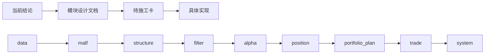

# 系统级总路线图

日期：`2026-04-10`
状态：`生效中`

## 当前进度

当前新仓已经完成地基阶段，并补齐了真正缺失的前半段主线：

`data -> malf -> structure`

截至今天，已正式成立的部分是：

1. 五根目录契约
2. 历史账本共享契约
3. 文档先行硬门禁
4. `data -> raw_market -> market_base` 最小官方桥接
5. `market_base(backward) -> malf -> structure` 最小官方桥接
6. `filter / alpha / position / portfolio_plan / trade` 的最小 bounded runner 与账本层

当前整体判断：

- 系统阶段位于 `P0 已完成，P1/P2/P3/P4/P5 已有最小正式桥接，P6 仍未开始`
- 当前最重要的事实不是“trade 已开工”，而是“前半段 `data -> malf` 已不再空缺”
- 当前仍不能宣称 `data -> malf -> structure -> filter -> alpha -> position -> portfolio_plan -> trade -> system` 已经整体系统级收口，因为 `system` 仍未开工，整链 truthfulness 也还需要专门复核

## 老仓来源分层

当前路线图背后的老仓来源，正式按下面四层理解：

### `L1 核心已验证模块`

1. `position`
2. `alpha`
3. `malf`

### `L2 支持性较强模块`

1. `data`
2. `system`

### `L3 研究偏少模块`

1. `trade`
2. `core`

### `L4 新系统正式新建边界`

1. `structure`
2. `filter`
3. `portfolio_plan`

## 系统阶段

### `P0 治理地基`

状态：`已完成`

范围：

1. 五根目录
2. 共享账本契约
3. 文档先行
4. 执行闭环
5. 最小治理脚本

### `P1 数据依据层`

状态：`最小官方桥接已成立`

范围：

1. `raw_market`
2. `market_base`
3. 文件级增量跳过
4. 历史账本自然键沉淀

### `P2 市场语义层`

状态：`最小官方桥接已成立`

范围：

1. `malf`
2. `structure`
3. `filter`

### `P3 alpha 触发层`

状态：`共享 contract 与最小正式账本已成立`

范围：

1. `alpha`
2. PAS 五表族
3. trigger ledger / family ledger / formal signal

### `P4 仓位与组合层`

状态：`最小官方桥接已成立`

范围：

1. `position`
2. `portfolio_plan`

### `P5 交易执行层`

状态：`最小 runtime 账本已成立，但不能再越过前半段宣称整链已通`

范围：

1. `trade`
2. `trade_runtime`
3. carry / entry / exit / replay

### `P6 system 总装层`

状态：`未开始`

范围：

1. `system`
2. 组合读数
3. 结果复用
4. 总装验证

## 各模块状态

| 模块 | 当前状态 | 主要来源 | 继承方式 | 置信度 | 下一步重点 |
| --- | --- | --- | --- | --- | --- |
| `core` | `主线待接` | `G:\。backups\MarketLifespan-Quant\docs\01-design\modules\core\` 与 `02-spec\modules\core\` | `只吸收经验` | `中` | ownership / checkpoint / version registry |
| `data` | `最小官方桥接已成立` | `G:\。backups\MarketLifespan-Quant\docs\01-design\modules\data\`、`02-spec\modules\data\`、`03-execution\` | `沿袭为主` | `高` | 扩股票全量覆盖、再评估指数与板块的正式下游表 |
| `malf` | `最小官方 snapshot 已成立` | `G:\。backups\EmotionQuant-gamma\gene\` + `G:\。backups\MarketLifespan-Quant\docs\01-design\modules\malf\` + `02-spec\modules\malf\` | `沿袭后改写` | `高` | 在不破坏 `structure` 上游合同前提下继续补语义表族 |
| `structure` | `最小官方 snapshot 已成立` | `G:\。backups\MarketLifespan-Quant\docs\01-design\modules\structure\` + 旧 `malf 29/30/31` 分层材料 | `全新设计` | `中` | 从最小 snapshot 扩到更细的 event / trace 家族 |
| `filter` | `最小官方 snapshot 已成立` | `G:\。backups\MarketLifespan-Quant\docs\01-design\modules\filter\` + 旧 `malf 29/31/32` 分层材料 | `全新设计` | `中` | 继续补 observation 与更细的 admission 分层，但保持少拦截 |
| `alpha` | `trigger ledger / family ledger / formal signal 三级正式账本已成立` | `G:\。backups\EmotionQuant-gamma\normandy\` + `G:\。backups\MarketLifespan-Quant\docs\01-design\modules\alpha\` + `02-spec\modules\alpha\` | `沿袭后改写` | `高` | 继续补 PAS 五表族更细 payload、trace 与专表，但不绕过 formal signal |
| `position` | `已对接 alpha 官方 formal signal` | `G:\。backups\EmotionQuant-gamma\positioning\` + `G:\。backups\MarketLifespan-Quant\docs\01-design\modules\position\` + `02-spec\modules\position\` | `沿袭后改写` | `高` | 维持单标的正式账本边界，并固定执行参考价使用 `none` |
| `portfolio_plan` | `最小官方账本已成立` | 旧 `position / system` 桥接经验与组合验收材料 | `全新设计` | `中` | 向 `trade` 输出官方组合裁决桥接，继续扩展容量与回测层 |
| `trade` | `最小 runtime 账本已成立` | `G:\。backups\MarketLifespan-Quant\docs\01-design\modules\trade\` + `02-spec\modules\trade\` + carry 桥接结论 + `G:\。backups\EmotionQuant-gamma\positioning\` / `normandy\` 交易语义说明 | `只吸收经验后新建最小账本` | `中` | 维持执行层边界，并固定执行价格使用 `none` |
| `system` | `未开始` | `G:\。backups\MarketLifespan-Quant\docs\01-design\modules\system\` + `02-spec\modules\system\` + bounded acceptance 结论 | `只吸收经验` | `中` | 系统级 readout / reuse / audit |

## 当前价格口径

1. `market_base.stock_daily_adjusted` 正式同时保存 `none / backward / forward`
2. `malf -> structure -> filter -> alpha` 默认使用 `backward`
3. `position -> trade` 默认使用 `none`
4. `forward` 当前只作为研究与展示保留，不作为正式执行口径

## 下一锤

当前不再把 `trade` 或 `system` 设为下一锤。

下一步约束为：

1. 先以 `16-data-malf-minimal-official-mainline-bridge` 结论为锚
2. 先复核整条主线是否真实成立到 `trade`
3. 只有在整链 truthfulness 复核完成后，才允许再开新的 `system` 或其他主线卡

## 阻塞项

### `阻塞 1：system 仍未正式实现`

影响：

- 当前还没有系统级 readout、reuse、audit 官方出口
- 不能宣称整条链已经系统级闭环

### `阻塞 2：整链 truthfulness 仍需专门复核`

影响：

- 虽然 `data -> malf` 已补齐，但还需要确认 `structure -> filter -> alpha -> position -> portfolio_plan -> trade` 与新上游拼接后不存在隐性旧口径

## 当前不敢写死的点

1. `alpha` 的 `bof / tst / pb / cpb / bpb` 五表族虽然方向明确，但正式桥接到 `position` 的字段合同还未写死。
2. `probe_entry / confirm_add` 虽然已有正式语义落点，但在 `trade carry` 与多腿开仓桥接冻结前仍不能默认打开。
3. `malf` 当前只冻结了最小 snapshot，不代表更细事件家族已经共同收口。
4. `system` 仍未开工，因此系统级总装结论仍不存在。

## 里程碑定义

### `M0 地基完成`

判定条件：

1. 五根目录成立
2. 共享账本契约成立
3. 文档先行硬门禁成立
4. 执行闭环成立

当前状态：`已完成`

### `M1 data-malf 官方上游成立`

判定条件：

1. `raw_market` 成立
2. `market_base` 成立
3. `malf` 能官方消费 `market_base`
4. `structure` 能官方消费 `malf`

当前状态：`已完成`

### `M2 alpha-position 正式桥接成立`

判定条件：

1. `alpha` formal signal 有正式账本出口
2. `position` 能正式消费 `alpha`
3. 有 bounded evidence

当前状态：`已完成`

### `M3 trade 最小 runtime 桥接成立`

判定条件：

1. `portfolio_plan` 有正式组合裁决账本
2. `trade_runtime` 有最小执行账本
3. bounded mainline 可复验

当前状态：`已完成`

### `M4 system 主线可复验`

判定条件：

1. `data -> malf -> structure -> filter -> alpha -> position -> portfolio_plan -> trade -> system` 形成系统级读数
2. 有可复验 evidence / record / conclusion
3. 能解释 blocked / admitted / carry / filled

当前状态：`未完成`

## 使用方式

以后你想快速了解系统推进位置，优先看这一份文档。

如果你想继续正式施工，再按下面顺序下钻：

1. 先看当前结论是否已经把下一步边界写死
2. 再看对应模块在本页的"主要来源 / 继承方式 / 置信度"
3. 打开对应模块设计文档
4. 打开当前待施工卡
5. 再进入具体实现

## 流程图

