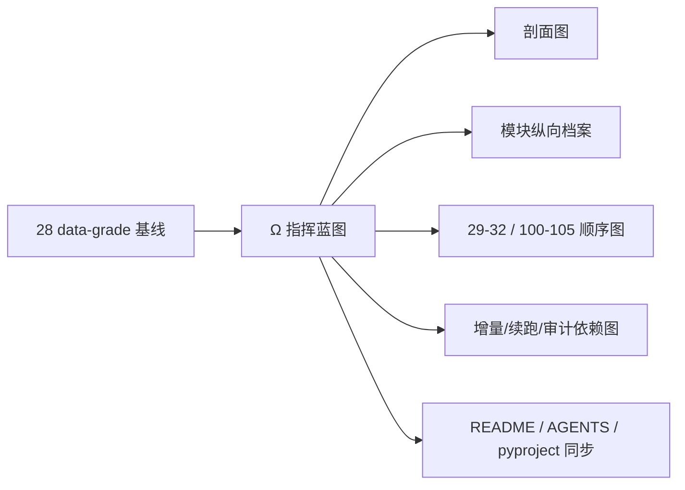

# 系统级路线图与进度跟踪器规格

日期：`2026-04-09`
最近刷新：`2026-04-13`
状态：`生效中`

## 目标

冻结系统级路线图文档的正式栏目、展示形式、状态字段与刷新纪律，使其可以稳定承担后半部施工的指挥蓝图职责。

## 权威文档

本规格对应的当前权威路线图为：

- `docs/02-spec/Ω-system-delivery-roadmap-20260409.md`

## 路线图必须包含的栏目

系统级路线图至少必须包含以下内容：

1. 当前正式锚点、当前待施工卡、当前主链冻结口径
2. `28` 之后统一采用的 data-grade 基线
3. 系统当前剖面图
4. 后半部施工顺序图
5. 模块纵向档案
6. 增量更新 / 断点续跑 / 审计依赖图
7. 当前阻塞项
8. 里程碑定义
9. 当前不敢写死的点

## 展示形式硬规则

### 1. 禁止宽表主导

路线图中的模块跟踪信息，不得再以“超过 4 个数据列的横向宽表”作为主要载体。

允许：

1. 纵向模块列表
2. 键值对清单
3. 小型二维对照表
4. 图示

不允许：

1. 需要横向滚动才能读完的模块总表
2. 把实体锚点、自然键、checkpoint、审计账本塞进同一张宽表

### 2. 模块档案必须纵向展示

路线图对每个正式模块至少必须显式列出以下字段：

1. 模块名
2. 当前状态
3. 实现深度
4. 成熟度
5. 实体锚点
6. 业务自然键对齐
7. 批量建仓
8. 增量更新
9. 断点续跑
10. 审计账本
11. 当前结论
12. 后续动作

其中第 `5-10` 项必须与历史账本共享合同的六条声明逐项对应。

## 模块状态枚举

模块状态统一使用以下 6 个离散值：

1. `未开始`
2. `设计中`
3. `建设中`
4. `局部可验`
5. `主线待接`
6. `主线已接`

## 实现深度枚举

路线图对每个模块还必须补一项“实现深度”，统一使用以下离散值：

1. `Canonical data-grade`
2. `Canonical downstream`
3. `Bounded materialization`
4. `Bounded acceptance`
5. `Recovery planned`

含义：

- `Canonical data-grade`
  - 正式真值与 `checkpoint + dirty/work queue + replay/resume` 已成立
- `Canonical downstream`
  - 默认输入已切到 canonical 正式上游，且下游续跑语义已对齐
- `Bounded materialization`
  - 有正式 runner 与账本，但仍主要依赖 bounded 物化，不具备完整独立续跑治理
- `Bounded acceptance`
  - 已具备官方 readout / audit 能力，但还不是主动 runtime/orchestration
- `Recovery planned`
  - 已有边界和卡组，但当前恢复施工尚未收口

## 模块继承方式枚举

路线图对每个模块至少还应补一项“继承方式”，统一使用以下 4 个离散值：

1. `沿袭为主`
2. `沿袭后改写`
3. `只吸收经验`
4. `全新设计`

## 模块成熟度枚举

路线图对每个模块至少还应补一项“成熟度”，统一使用以下离散值：

1. `A`
2. `B+`
3. `B`
4. `C+`
5. `C`

成熟度不是代码质量评分，而是“离 `可续跑 / 可复算 / 可审计` 目标还有多远”的系统级档位。

## 六条历史账本约束展示规则

路线图中的每个模块都必须显式回答以下六条：

1. 实体锚点是什么
2. 业务自然键如何对齐
3. 批量建仓如何做
4. 增量更新如何做
5. 断点续跑如何做
6. 审计账本落在哪里

如果某模块暂时不满足其中任一项，不允许省略；必须明确写成“待补齐”或“仅 bounded 具备”。

## 图示硬规则

`Ω` 文档至少必须包含以下 3 张 Mermaid 图：

1. 系统当前剖面图
2. 后半部施工顺序图
3. 增量更新 / 断点续跑 / 审计依赖图

如涉及实现深度分档，图中必须能看出：

1. 已对齐区域
2. 部分对齐区域
3. 待治理区域

## 当前进度栏要求

“当前进度”必须至少回答：

1. 当前最新生效结论锚点
2. 当前待施工卡
3. `29-32` 是否已经完成
4. `100-105` 当前推进到了哪一张
5. 当前后半部最薄弱链段是哪一段

## 指挥蓝图栏要求

“指挥蓝图”必须明确：

1. `28` 是统一 data-grade 基线
2. `29 -> 30 -> 31 -> 32` 是 `malf` 优先卡组
3. `100 -> 101 -> 102 -> 103 -> 104 -> 105` 是后置 `trade/system` 恢复卡组
4. 若 `33-42` 等稳定化收口已完成，必须显式标明其位于两组卡之间的历史收口位置

## 阻塞项栏要求

阻塞项必须按系统级真实影响组织，至少应覆盖：

1. 正式信号锚点未冻结
2. 独立 checkpoint / dirty queue / replay 未补齐
3. 全链真实数据回归未完成
4. `system` runtime/orchestration 未完成

## 里程碑要求

里程碑必须同时写清楚：

1. 名称
2. 判定条件
3. 当前状态
4. 下一步依赖

后半部路线图至少应覆盖：

1. upstream data-grade 已成立
2. canonical `malf` downstream 已成立
3. `alpha` 家族解释层已收口
4. 执行侧合同与 runtime 收口
5. `system` orchestration 收口

## 刷新时机

出现以下情况时，路线图应同步刷新：

1. 当前待施工卡从 `100-105` 中切到下一张
2. 某个模块的实现深度跨级变化
3. 某个模块首次补齐六条历史账本约束中的缺口
4. 主线冻结口径发生变化
5. 当前系统级最薄弱链段发生变化

## 与入口文件联动

路线图或其设计/规格发生正式变化时，应同步检查并必要时刷新：

1. `AGENTS.md`
2. `README.md`
3. `pyproject.toml`

## 流程图

